MtMutSpectre
================

``` r
# For PCA analysis:
library("irlba")
```

    ## Loading required package: Matrix

``` r
library("jackstraw")  # check significant PCs
# library("logisticPCA")  # May be used to explore presence/absence some type of subst. I've add it in case of our zeros-completion of NA.
# For data-wrangling:
library("tidyverse")
```

    ## ── Attaching packages ────────────────────

    ## ✔ ggplot2 2.2.1.9000     ✔ purrr   0.2.4     
    ## ✔ tibble  1.4.2          ✔ dplyr   0.7.4     
    ## ✔ tidyr   0.8.0          ✔ stringr 1.3.0     
    ## ✔ readr   1.1.1          ✔ forcats 0.3.0

    ## ── Conflicts ──── tidyverse_conflicts() ──
    ## ✖ tidyr::expand() masks Matrix::expand()
    ## ✖ dplyr::filter() masks stats::filter()
    ## ✖ dplyr::lag()    masks stats::lag()
    ## ✖ dplyr::vars()   masks ggplot2::vars()

``` r
library("broom")
# For ploting:
library("gplots")
```

    ## 
    ## Attaching package: 'gplots'

    ## The following object is masked from 'package:stats':
    ## 
    ##     lowess

``` r
library("factoextra")
```

    ## Welcome! Want to learn more? See two factoextra-related books at https://goo.gl/ve3WBa

``` r
library("corrplot")
```

    ## corrplot 0.84 loaded

``` r
library("cowplot")
```

    ## 
    ## Attaching package: 'cowplot'

    ## The following object is masked from 'package:ggplot2':
    ## 
    ##     ggsave

``` r
library("ggrepel")

source("./funDimReduction.R")
```

``` r
METHOD <- 'MAXLIKELIHOOD'

options(stringsAsFactors = FALSE)
if (METHOD == 'MAXLIKELIHOOD') {MUT <- read_table2('2_Derived/Table_fixed.txt')}
```

    ## Parsed with column specification:
    ## cols(
    ##   Species = col_character(),
    ##   Gene = col_character(),
    ##   AncestralSeqName = col_integer(),
    ##   DescendantSeqName = col_character(),
    ##   Branch = col_character(),
    ##   CodonPosition = col_integer(),
    ##   PreviousAncCodon = col_character(),
    ##   AncestorCodon = col_character(),
    ##   NextAncCodon = col_character(),
    ##   PreviousDesCodon = col_character(),
    ##   DescendantCodon = col_character(),
    ##   NextDesCodon = col_character(),
    ##   AncestralAA = col_character(),
    ##   DescendantAA = col_character(),
    ##   Subs = col_character()
    ## )

``` r
nrow(MUT)  # 506179
```

    ## [1] 506179

``` r
length(unique(MUT$Species))  # 2404
```

    ## [1] 2404

``` r
VecOfNormalSubstitutions <- c('A_C','C_A',
                              'A_G','G_A',
                              'C_G','G_C',
                              'C_T','T_C',
                              'G_T','T_G',
                              'T_A','A_T')
nrow(MUT)  # 158771
```

    ## [1] 506179

``` r
MUT %>% count(Species, sort = TRUE) -> cs
hist(cs$n, breaks = 50)
```

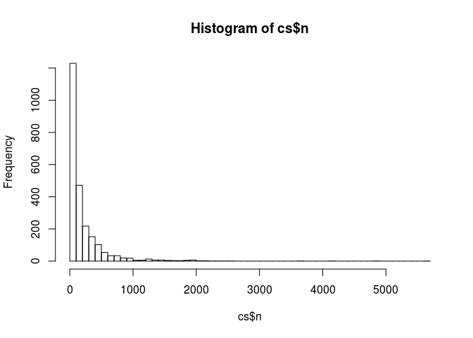

``` r
MUT2 <- MUT %>% 
    mutate(NormS = Subs %in% VecOfNormalSubstitutions) %>%
    group_by(Species) %>% 
    summarise(prop_of_normal = mean(NormS))
MUT2
```

    ## # A tibble: 2,404 x 2
    ##    Species                 prop_of_normal
    ##    <chr>                            <dbl>
    ##  1 Abbottina_obtusirostris          1.00 
    ##  2 Abbottina_rivularis              1.00 
    ##  3 Abramis_brama                    1.00 
    ##  4 Abrothrix_longipilis             1.00 
    ##  5 Abrothrix_olivaceus              0.800
    ##  6 Abudefduf_saxatilis              0.800
    ##  7 Abudefduf_sparoides              1.00 
    ##  8 Abudefduf_vaigiensis             1.00 
    ##  9 Acanthocybium_solandri           0.946
    ## 10 Acanthogobius_hasta              1.00 
    ## # ... with 2,394 more rows

``` r
hist(MUT2$prop_of_normal, breaks = 100)
```

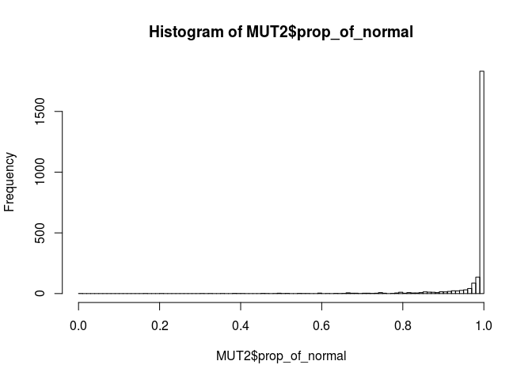

``` r
cs2 <- filter(MUT2, prop_of_normal < .9) %>% inner_join(cs)
```

    ## Joining, by = "Species"

``` r
hist(cs2$n)
```

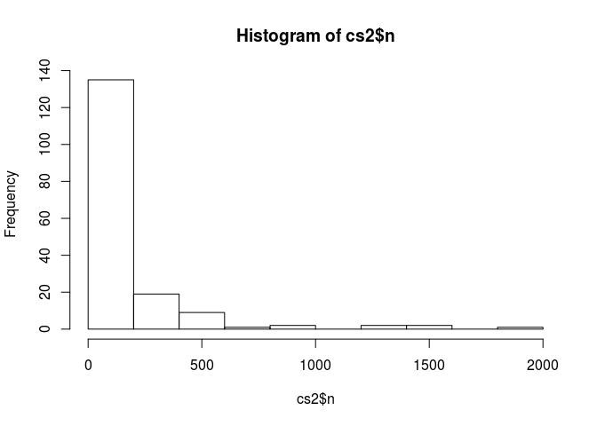

``` r
qplot(x = cs2$prop_of_normal, y = cs2$n)
```

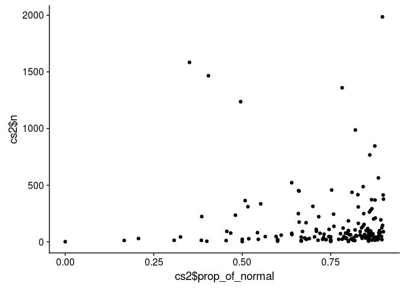

``` r
knitr::kable(arrange(cs2, prop_of_normal), "pandoc")  # to see table of 81 species
```

| Species                        |  prop\_of\_normal|     n|
|:-------------------------------|-----------------:|-----:|
| Takifugu\_ocellatus            |         0.0000000|     1|
| Alligator\_mississippiensis    |         0.1666667|    12|
| Mulloidichthys\_martinicus     |         0.2068966|    29|
| Catopuma\_badia                |         0.3076923|    13|
| Forcipiger\_flavissimus        |         0.3255814|    43|
| Chaenogobius\_annularis        |         0.3510101|  1584|
| Anodorhynchus\_hyacinthinus    |         0.3846154|    13|
| Diodon\_holocanthus            |         0.3856502|   223|
| Testudo\_kleinmanni            |         0.4000000|     5|
| Stenella\_attenuata            |         0.4045020|  1466|
| Cichla\_ocellaris              |         0.4545455|    11|
| Mammuthus\_columbi             |         0.4565217|    92|
| Myripristis\_berndti           |         0.4675325|    77|
| Crotalus\_oreganus             |         0.4808511|   235|
| Mammuthus\_primigenius         |         0.4955538|  1237|
| Istiompax\_indica              |         0.5000000|     2|
| Octodon\_degus                 |         0.5000000|    22|
| Cnemotriccus\_fuscatus         |         0.5082418|   364|
| Thylacinus\_cynocephalus       |         0.5161290|   310|
| Falco\_cherrug                 |         0.5185185|    27|
| Mulloidichthys\_vanicolensis   |         0.5432099|    81|
| Motacilla\_cinerea             |         0.5454545|    22|
| Mammuthus\_sp                  |         0.5522388|   335|
| Lynx\_pardinus                 |         0.5652174|    46|
| Mulloidichthys\_dentatus       |         0.5957447|    47|
| Chrysolampis\_mosquitus        |         0.6000000|     5|
| Mogera\_robusta                |         0.6000000|    20|
| Ostracion\_meleagris           |         0.6000000|    15|
| Wiedomys\_cerradensis          |         0.6101695|    59|
| Sphenodon\_punctatus           |         0.6398467|   522|
| Hippotragus\_niger             |         0.6400000|    75|
| Redunca\_fulvorufula           |         0.6406250|    64|
| Pandion\_haliaetus             |         0.6586345|   249|
| Bison\_priscus                 |         0.6592920|   452|
| Ictidomys\_parvidens           |         0.6607143|   448|
| Hypentelium\_nigricans         |         0.6609195|   174|
| Acanthurus\_nigricans          |         0.6666667|    42|
| Dipturus\_kwangtungensis       |         0.6666667|     6|
| Lepidodactylus\_lugubris       |         0.6666667|    12|
| Parachromis\_managuensis       |         0.6666667|     9|
| Phylloscopus\_cebuensis        |         0.6703297|    91|
| Scarus\_rubroviolaceus         |         0.6764706|    34|
| Cobitis\_choii                 |         0.6800000|    25|
| Physeter\_catodon              |         0.6804734|   169|
| Sarcophilus\_harrisii          |         0.6818182|    22|
| Malurus\_leucopterus           |         0.6896552|    29|
| Ictidomys\_tridecemlineatus    |         0.6996805|   313|
| Mungotictis\_decemlineata      |         0.7045455|    44|
| Metallura\_tyrianthina         |         0.7090909|   110|
| Vireo\_atricapilla             |         0.7096774|    93|
| Otis\_tarda                    |         0.7142857|    14|
| Melanogrammus\_aeglefinus      |         0.7162162|   222|
| Dendrocopos\_major             |         0.7200000|    75|
| Lampetra\_appendix             |         0.7272727|    22|
| Pionus\_menstruus              |         0.7297297|    37|
| Falco\_tinnunculus             |         0.7313433|    67|
| Pteroglossus\_inscriptus       |         0.7368421|    19|
| Pteropus\_seychellensis        |         0.7368421|    19|
| Vireo\_altiloquus              |         0.7446809|    47|
| Hieraaetus\_fasciatus          |         0.7454545|   110|
| Cnemaspis\_limi                |         0.7500000|     8|
| Eopsaltria\_georgiana          |         0.7500000|    12|
| Foudia\_aldabrana              |         0.7500000|    20|
| Mobula\_japanica               |         0.7500000|    44|
| Padda\_oryzivora               |         0.7500000|     4|
| Prosthemadera\_novaeseelandiae |         0.7500000|     4|
| Mesoplodon\_densirostris       |         0.7527352|   457|
| Chlamydosaurus\_kingii         |         0.7581967|   244|
| Falco\_peregrinus              |         0.7591241|   137|
| Petenia\_splendida             |         0.7727273|    22|
| Aegithalos\_caudatus           |         0.7777778|    72|
| Prionailurus\_bengalensis      |         0.7823529|  1360|
| Archilochus\_colubris          |         0.7826087|    23|
| Falco\_naumanni                |         0.7851240|   121|
| Noturus\_albater               |         0.7872340|    47|
| Iridosornis\_analis            |         0.7894737|    38|
| Capra\_caucasica               |         0.7922078|    77|
| Pardofelis\_marmorata          |         0.7931034|    29|
| Coelodonta\_antiquitatis       |         0.7941176|    34|
| Ctenomys\_rionegrensis         |         0.7972973|    74|
| Abrothrix\_olivaceus           |         0.8000000|   100|
| Abudefduf\_saxatilis           |         0.8000000|     5|
| Myotis\_siligorensis           |         0.8000000|    95|
| Neoceratodus\_forsteri         |         0.8000000|    10|
| Oncorhynchus\_tshawytscha      |         0.8000000|     5|
| Pimelodus\_maculatus           |         0.8000000|     5|
| Sciurus\_vulgaris              |         0.8000000|   185|
| Vipera\_berus                  |         0.8032787|    61|
| Elephas\_maximus               |         0.8064516|    62|
| Andinoacara\_rivulatus         |         0.8076923|    26|
| Hynobius\_nebulosus            |         0.8100686|   437|
| Hypsiglena\_unaocularus        |         0.8125000|    16|
| Leuciscus\_waleckii            |         0.8125000|    16|
| Myiarchus\_ferox               |         0.8125000|    16|
| Isurus\_oxyrinchus             |         0.8157895|    38|
| Leopardus\_geoffroyi           |         0.8181818|    11|
| Merlangius\_merlangus          |         0.8190476|   105|
| Balaenoptera\_physalus         |         0.8196555|   987|
| Cirrhitichthys\_oxycephalus    |         0.8214286|    56|
| Forpus\_passerinus             |         0.8235294|    51|
| Orcinus\_orca                  |         0.8269231|   416|
| Corvus\_macrorhynchos          |         0.8279221|   308|
| Andinoacara\_coeruleopunctatus |         0.8282209|   163|
| Pongo\_abelii                  |         0.8333333|    90|
| Tangara\_cyanicollis           |         0.8333333|    60|
| Brachyphylla\_cavernarum       |         0.8367347|    49|
| Camelus\_dromedarius           |         0.8373984|   123|
| Gazella\_arabica               |         0.8387097|    31|
| Corvus\_corone                 |         0.8417266|   139|
| Panthera\_tigris               |         0.8418891|   487|
| Chlorophanes\_spiza            |         0.8431373|    51|
| Rhacodactylus\_auriculatus     |         0.8433735|   249|
| Collocalia\_esculenta          |         0.8441558|   154|
| Alosa\_alosa                   |         0.8461538|    65|
| Thalasseus\_sandvicensis       |         0.8484848|    33|
| Heterandria\_formosa           |         0.8500000|   100|
| Leopardus\_tigrinus            |         0.8541667|    48|
| Motacilla\_flava               |         0.8547009|   117|
| Antilope\_cervicapra           |         0.8571429|    28|
| Bubo\_virginianus              |         0.8571429|    14|
| Champsocephalus\_gunnari       |         0.8571429|    21|
| Lagenorhynchus\_albirostris    |         0.8571429|     7|
| Lanius\_meridionalis           |         0.8571429|    14|
| Petroica\_phoenicea            |         0.8571429|     7|
| Pollachius\_pollachius         |         0.8571429|    14|
| Sabanejewia\_balcanica         |         0.8571429|    63|
| Thunnus\_albacares             |         0.8571429|    84|
| Nomascus\_leucogenys           |         0.8585859|    99|
| Amatitlania\_nigrofasciata     |         0.8593156|   263|
| Cacajao\_calvus                |         0.8600000|    50|
| Prochilodus\_nigricans         |         0.8604651|    43|
| Jaculus\_jaculus               |         0.8604954|   767|
| Garrulax\_poecilorhynchus      |         0.8620690|    58|
| Gerbillus\_henleyi             |         0.8623188|   276|
| Gazella\_gazella               |         0.8631579|    95|
| Ectopistes\_migratorius        |         0.8648649|    74|
| Ursus\_spelaeus                |         0.8655914|   372|
| Amazona\_ochrocephala          |         0.8664384|   292|
| Cobitis\_melanoleuca\_granoei  |         0.8666667|    15|
| Scarus\_ghobban                |         0.8666667|    60|
| Lagothrix\_lagotricha          |         0.8695652|    69|
| Lampetra\_fluviatilis          |         0.8695652|    69|
| Cobitis\_taenia                |         0.8709677|    31|
| Rhipidura\_cyaniceps           |         0.8712871|   202|
| Stenella\_longirostris         |         0.8747045|   846|
| Bos\_primigenius               |         0.8750000|    16|
| Larus\_novaehollandiae         |         0.8750000|    16|
| Meda\_fulgida                  |         0.8750000|    40|
| Micrurus\_fulvius              |         0.8750000|    24|
| Mulloidichthys\_flavolineatus  |         0.8750000|    40|
| Micropterus\_punctulatus       |         0.8753388|   369|
| Richardsonius\_balteatus       |         0.8761905|   210|
| Tragelaphus\_oryx              |         0.8780488|    41|
| Chiropotes\_israelita          |         0.8823529|    17|
| Trematomus\_bernacchii         |         0.8837209|    43|
| Chrysolophus\_pictus           |         0.8846154|    26|
| Megaptera\_novaeangliae        |         0.8846154|    26|
| Talpa\_europaea                |         0.8847518|   564|
| Rhipidura\_superciliaris       |         0.8860759|    79|
| Tanakia\_latimarginata         |         0.8870968|    62|
| Bungarus\_candidus             |         0.8877551|    98|
| Acomys\_dimidiatus             |         0.8902439|    82|
| Poecile\_palustris             |         0.8917526|   194|
| Carcharhinus\_obscurus         |         0.8936170|    47|
| Lemur\_catta                   |         0.8943089|   123|
| Carcharhinus\_amblyrhynchoides |         0.8947368|    19|
| Muntiacus\_sp                  |         0.8962739|  1986|
| Corallus\_hortulanus           |         0.8965517|   145|
| Bison\_bonasus                 |         0.8983051|   413|
| Pygoscelis\_adeliae            |         0.8988764|    89|
| Mionectes\_oleagineus          |         0.8992042|   377|

``` r
MUT2 <- filter(MUT2, prop_of_normal >= .9)
hist(MUT2$prop_of_normal)
```

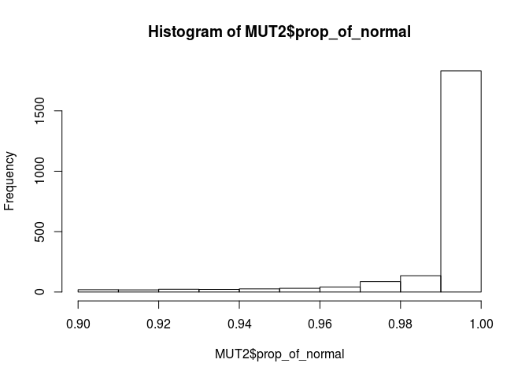

``` r
MUT <- MUT %>% filter(Subs %in% VecOfNormalSubstitutions, Species %in% MUT2$Species)
rm(cs, cs2, MUT2)
nrow(MUT)
```

    ## [1] 476261

``` r
MUT <- MUT %>% filter(AncestralAA == DescendantAA)
nrow(MUT)  # old = 132477 new = 121203
```

    ## [1] 407558

``` r
VecOfSynFourFoldDegenerateSites <- c('CTT', 'CTC', 'CTA', 'CTG', 
                                     'GTT', 'GTC', 'GTA', 'GTG', 
                                     'TCT', 'TCC', 'TCA', 'TCG', 
                                     'CCT', 'CCC', 'CCA', 'CCG', 
                                     'ACT', 'ACC', 'ACA', 'ACG', 
                                     'GCT', 'GCC', 'GCA', 'GCG', 
                                     'CGT', 'CGC', 'CGA', 'CGG', 
                                     'GGT', 'GGC', 'GGA', 'GGG')
length(unique(VecOfSynFourFoldDegenerateSites)) # 32
```

    ## [1] 32

``` r
MUT <- MUT %>% filter(AncestorCodon   %in% VecOfSynFourFoldDegenerateSites,
                      DescendantCodon %in% VecOfSynFourFoldDegenerateSites)
nrow(MUT)  # old = 62635 new = 57367
```

    ## [1] 215310

``` r
table(MUT$Gene)
```

    ## 
    ##   ATP6   ATP8   COX1   COX2   COX3   CytB    ND1    ND2    ND3    ND4 
    ##  10682    671  13449   4418   5054 112073  14561  34907   2683  14726 
    ##   ND4L 
    ##   2086

``` r
MUT <- MUT %>% filter(Gene == "CytB")
nrow(MUT)  # 36517
```

    ## [1] 112073

``` r
MUT %>% count(Species, sort = TRUE) -> cs
hist(cs$n)
```

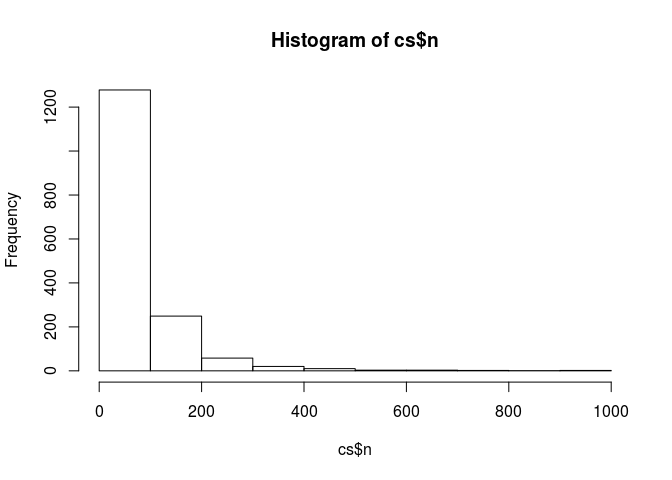

``` r
summary(cs$n)
```

    ##    Min. 1st Qu.  Median    Mean 3rd Qu.    Max. 
    ##    1.00   14.25   40.00   68.93   87.00  956.00

``` r
# now quantile .15 = 13  and .25 = 21  substitutions
# so  quantile .15 = 433 and .25 = 383 species
quantile(cs$n, .15)
```

    ## 15% 
    ##   9

``` r
quantile(cs$n, .25)
```

    ##   25% 
    ## 14.25

``` r
ListOfSpeciesWithManySubst <- 
    filter(cs, n >= quantile(n, .15)) %>% 
    select(Species) %>% 
    as_vector()
MUT <- MUT %>% filter(Species %in% ListOfSpeciesWithManySubst)
rm(ListOfSpeciesWithManySubst)
nrow(MUT)  # 36517
```

    ## [1] 110983

DERIVE MUTATIONAL SPECTRUM
--------------------------

### NORMALIZATION of the 'NumberOfSynMutPerSpecies' by ancestral nucleotide count in the third position of four-fold synonymous substitutions:

``` r
NUC <- 
    read_table2('2_Derived/ATGC_counts_in_SYN_codons_wit_full_gene.txt') %>% 
    separate(Species, into = c("Species", "Gene"), sep = "[.]") %>% 
    gather(`CountA_Syn`, 
           `CountC_Syn`, 
           `CountG_Syn`, 
           `CountT_Syn`, 
           key = "Nucleotide", value = "Count_Syn") %>% 
    mutate(AncestralNuc = str_sub(Nucleotide, 6, 6)) %>%
    select(Species, Gene, AncestralNuc, Count_Syn)  # in case normalisation for synonymus it's better to shape long table
```

    ## Parsed with column specification:
    ## cols(
    ##   Species = col_character(),
    ##   CountA = col_integer(),
    ##   CountC = col_integer(),
    ##   CountG = col_integer(),
    ##   CountT = col_integer(),
    ##   CountA_Syn = col_integer(),
    ##   CountC_Syn = col_integer(),
    ##   CountG_Syn = col_integer(),
    ##   CountT_Syn = col_integer()
    ## )

    ## Warning: Expected 2 pieces. Additional pieces discarded in 1 rows [3564].

``` r
MUT %>% mutate(AncestralNuc = str_extract(Subs, "^.")) -> MUT
glimpse(MUT)
```

    ## Observations: 110,983
    ## Variables: 16
    ## $ Species           <chr> "Abbottina_rivularis", "Abbottina_rivularis"...
    ## $ Gene              <chr> "CytB", "CytB", "CytB", "CytB", "CytB", "Cyt...
    ## $ AncestralSeqName  <int> 16, 16, 16, 16, 16, 16, 16, 16, 16, 16, 16, ...
    ## $ DescendantSeqName <chr> "RN_13", "RN_13", "RN_13", "RN_13", "RN_13",...
    ## $ Branch            <chr> "External", "External", "External", "Externa...
    ## $ CodonPosition     <int> 121, 143, 200, 204, 247, 305, 319, 336, 339,...
    ## $ PreviousAncCodon  <chr> "CTT", "GGG", "TTC", "ACA", "TCC", "GTG", "C...
    ## $ AncestorCodon     <chr> "CTG", "GCC", "CTG", "GGG", "CCC", "CCG", "C...
    ## $ NextAncCodon      <chr> "CTA", "ACA", "CAC", "TCA", "AAC", "ATT", "A...
    ## $ PreviousDesCodon  <chr> "CTT", "GGG", "TTC", "ACA", "TCC", "GTG", "C...
    ## $ DescendantCodon   <chr> "CTC", "GCT", "CTT", "GGA", "CCT", "CCA", "C...
    ## $ NextDesCodon      <chr> "CTA", "ACA", "CAC", "TCA", "AAC", "ATT", "A...
    ## $ AncestralAA       <chr> "L", "A", "L", "G", "P", "P", "P", "T", "G",...
    ## $ DescendantAA      <chr> "L", "A", "L", "G", "P", "P", "P", "T", "G",...
    ## $ Subs              <chr> "G_C", "C_T", "G_T", "G_A", "C_T", "G_A", "G...
    ## $ AncestralNuc      <chr> "G", "C", "G", "G", "C", "G", "G", "G", "G",...

``` r
MUT <- inner_join(MUT, NUC,  by = c("Species", "Gene", "AncestralNuc"))
nrow(MUT)  # 36517
```

    ## [1] 107344

### Same normalisation for Syn\_subst

``` r
mod_fun <- function(df){
    df %>% count(Count_Syn, sort = TRUE) -> cs
    syn <- unique(df$Count_Syn)
    cs$n / syn
}

nMUT <- 
    MUT %>% 
    group_by(AncestralNuc, Species) %>% 
    nest() %>% 
    mutate(Normalise = map_dbl(data, mod_fun)) %>% 
    group_by(Species) %>% 
    mutate(TotalMutRate = sum(Normalise)) %>% 
    unnest() %>% 
    group_by(Species, Subs) %>% 
    nest() %>% 
    mutate(MutTypeRate = map_dbl(data, mod_fun)) %>% 
    unnest() %>% 
    mutate(Fraction = MutTypeRate / TotalMutRate)
```

Complete matrix by zeros

``` r
cMUT <- 
    complete(nMUT, Species, Subs) %>% 
    replace_na(list(MutTypeRate = 0, Fraction = 0))
```

``` r
sMUT <- 
    select(cMUT, Species, Subs, Fraction) %>% 
    distinct()
p_subs <- ggplot(sMUT) + geom_histogram(aes(Fraction)) + facet_wrap("Subs", ncol = 3)
p_subs
```

    ## `stat_bin()` using `bins = 30`. Pick better value with `binwidth`.

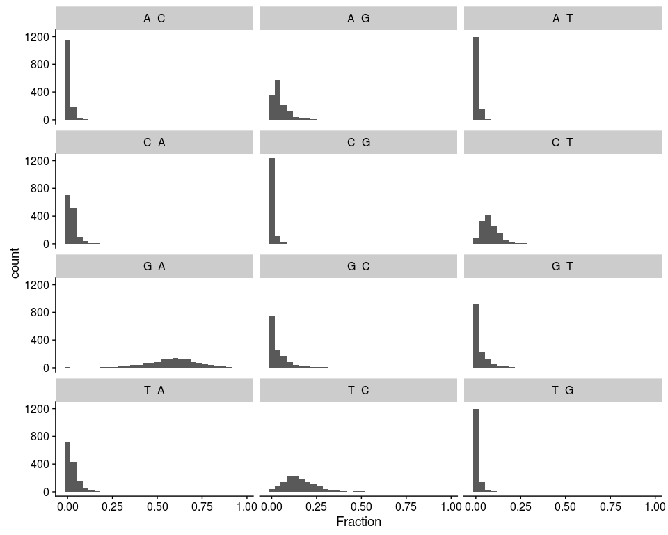

``` r
p_subs2 <- ggplot(sMUT) + geom_freqpoly(aes(Fraction, colour = Subs, alpha = .3))
p_subs2
```

    ## `stat_bin()` using `bins = 30`. Pick better value with `binwidth`.


### create matrix for PCA

``` r
TABLE <- 
    sMUT %>% 
    spread(Subs, Fraction) %>% 
    rename("AC" = "A_C", "AG" = "A_G", "AT" = "A_T", 
           "CA" = "C_A", "CG" = "C_G", "CT" = "C_T", 
           "GA" = "G_A", "GC" = "G_C", "GT" = "G_T", 
           "TA" = "T_A", "TC" = "T_C", "TG" = "T_G")
TABLE %>% as.data.frame() %>% column_to_rownames("Species") -> mtx
psych::describe(mtx)
```

    ##    vars    n mean   sd median trimmed  mad min  max range  skew kurtosis
    ## AC    1 1370 0.01 0.02   0.00    0.01 0.01   0 0.17  0.17  3.75    21.05
    ## AG    2 1370 0.05 0.05   0.03    0.04 0.03   0 0.91  0.91  4.93    59.82
    ## AT    3 1370 0.01 0.01   0.00    0.01 0.01   0 0.17  0.17  4.11    36.28
    ## CA    4 1370 0.02 0.03   0.02    0.02 0.02   0 0.29  0.29  2.96    15.17
    ## CG    5 1370 0.01 0.01   0.00    0.00 0.00   0 0.21  0.21  6.00    58.04
    ## CT    6 1370 0.08 0.06   0.07    0.08 0.04   0 0.60  0.60  2.39    12.25
    ## GA    7 1370 0.57 0.16   0.59    0.58 0.14   0 0.97  0.97 -0.72     1.23
    ## GC    8 1370 0.04 0.06   0.00    0.02 0.00   0 0.41  0.41  2.42     7.62
    ## GT    9 1370 0.02 0.04   0.00    0.01 0.00   0 0.36  0.36  3.06    12.55
    ## TA   10 1370 0.03 0.03   0.02    0.02 0.02   0 0.31  0.31  2.79    12.47
    ## TC   11 1370 0.16 0.10   0.15    0.15 0.08   0 0.81  0.81  1.49     4.70
    ## TG   12 1370 0.01 0.02   0.00    0.00 0.00   0 0.21  0.21  5.71    51.16
    ##    se
    ## AC  0
    ## AG  0
    ## AT  0
    ## CA  0
    ## CG  0
    ## CT  0
    ## GA  0
    ## GC  0
    ## GT  0
    ## TA  0
    ## TC  0
    ## TG  0

### Check correspondence (contingency tables and chi-squre test)

``` r
# Check correspondence (contingency tables and chi-squre test)
# it's too large for nice visualisation,
# but at least you can use vcd::assoc() on subset
# cntgTable <- as.table(as.matrix(mtx))
# balloonplot(t(cntgTable), main = "Substitutions",
#             xlab = "", ylab = "", label = FALSE, 
#             show.margins = FALSE)
# mosaicplot(mtx, shade = TRUE, las = 2, main = "Substitutions")
# vcd::assoc(head(cntgTable, 10), shade = TRUE, las = 3)
chisq <- chisq.test(mtx, simulate.p.value = TRUE, B = 1e4)
tidy(chisq)  # not significant
```

    ##   statistic p.value parameter
    ## 1  783.6062       1        NA
    ##                                                                              method
    ## 1 Pearson's Chi-squared test with simulated p-value\n\t (based on 10000 replicates)

#### Contribution in percentage (%) of cell to Chi-square score:

``` r
contrib <- 100 * (chisq$residuals^2 / chisq$statistic)
for (i in seq_along(colnames(contrib))) {
    hist(contrib[, i], main = colnames(contrib)[i], breaks = 50)
}  # here we see group of strangers on GA hist with large conribution
```

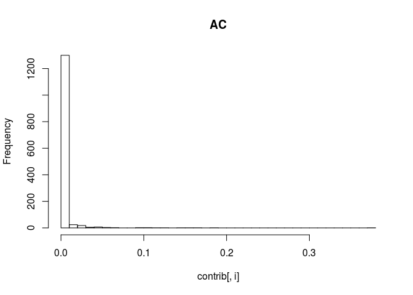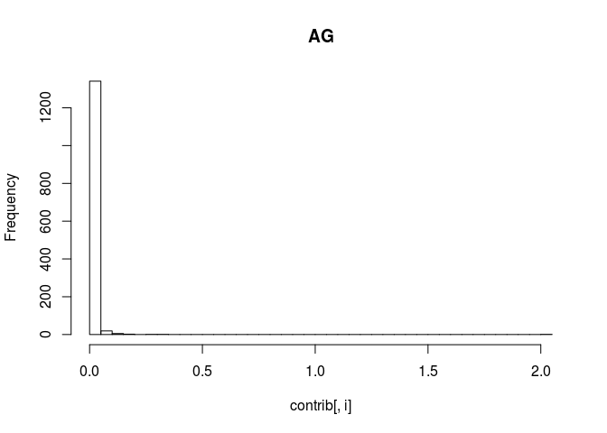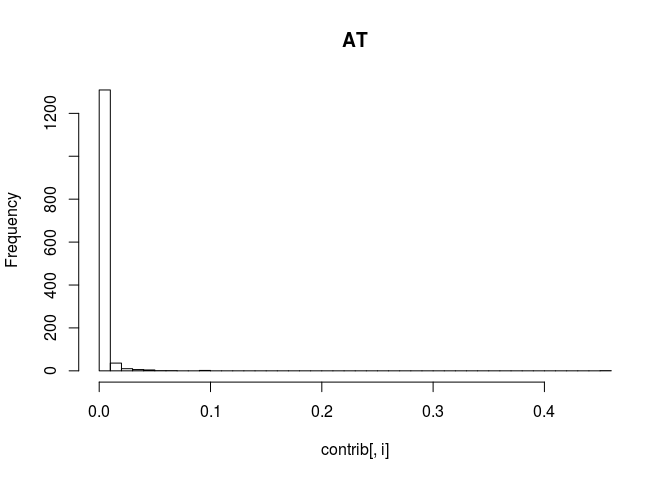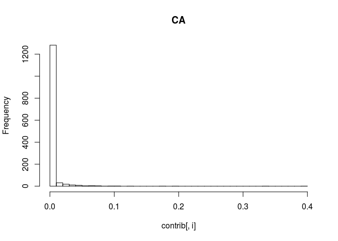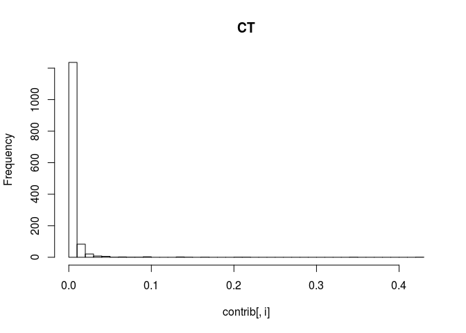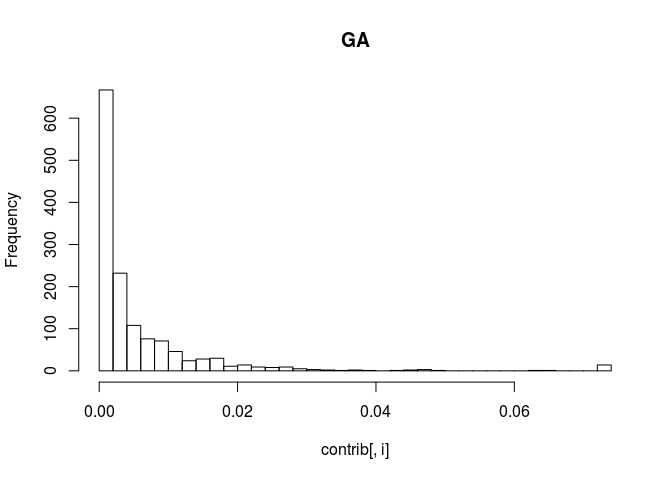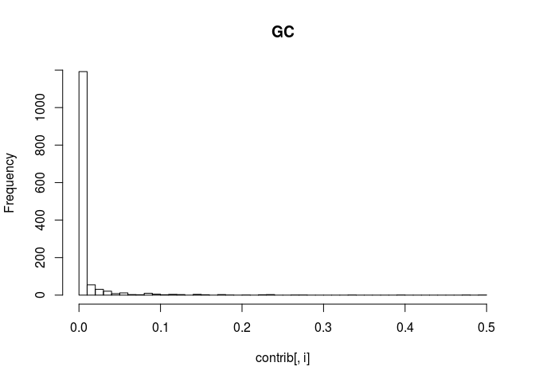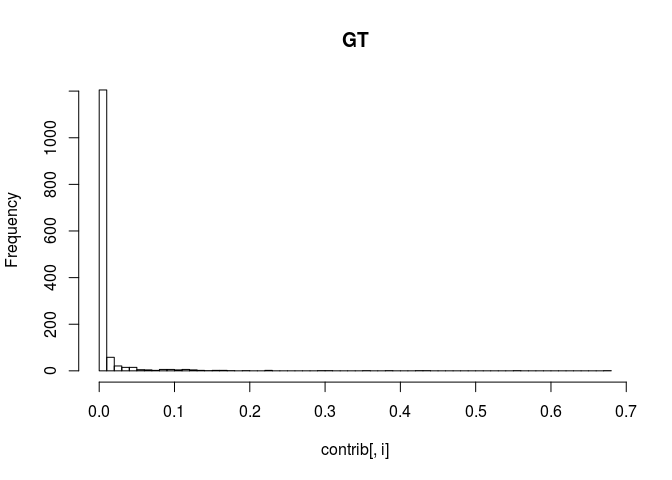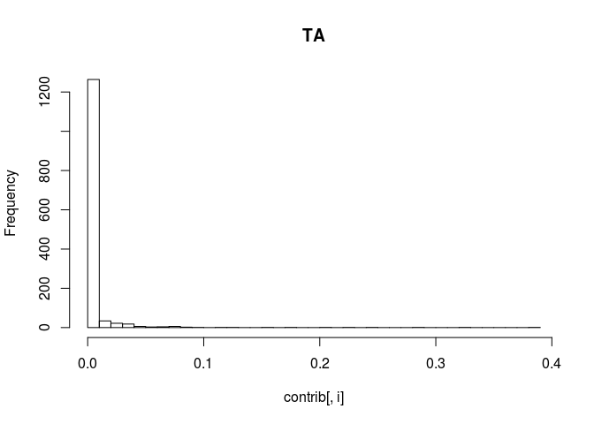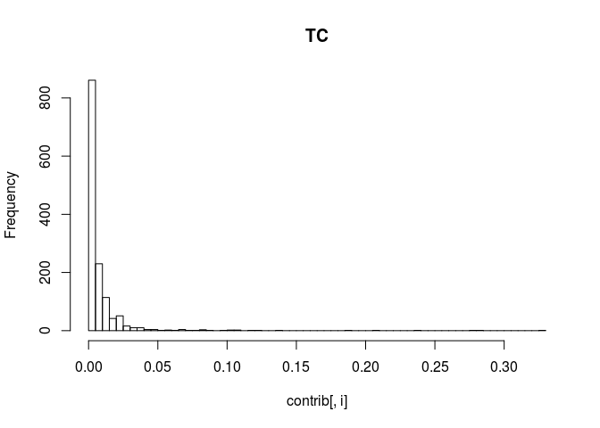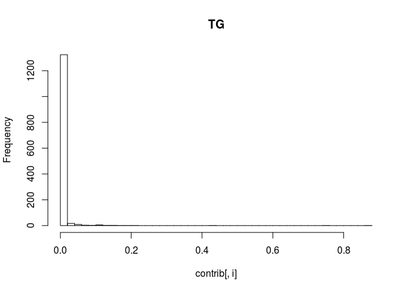

PCA
---

``` r
ICA <- calculatePcaReduction(data.use = TABLE, nPcs = 10, center = TRUE, weight.by.var = FALSE, rev.pca = FALSE, seed.use = 42, reduction.name = "ICA")
```

    ## Warning in irlba(A = data.use, nv = nPcs, center = cm, right_only =
    ## FALSE, : You're computing too large a percentage of total singular values,
    ## use a standard svd instead.

    ## Deflation FastICA using logcosh approx. to neg-entropy function

    ## Component 1

    ## Iteration 1 tol = 0.7569238

    ## Iteration 2 tol = 0.06666683

    ## Iteration 3 tol = 8.617235e-05

    ## Component 2

    ## Iteration 1 tol = 0.02225527

    ## Iteration 2 tol = 0.04326915

    ## Iteration 3 tol = 0.08382538

    ## Iteration 4 tol = 0.1368042

    ## Iteration 5 tol = 0.1763651

    ## Iteration 6 tol = 0.1935152

    ## Iteration 7 tol = 0.1961973

    ## Iteration 8 tol = 0.1952278

    ## Iteration 9 tol = 0.1937374

    ## Iteration 10 tol = 0.192295

    ## Iteration 11 tol = 0.1911734

    ## Iteration 12 tol = 0.1901149

    ## Iteration 13 tol = 0.1893621

    ## Iteration 14 tol = 0.1885894

    ## Iteration 15 tol = 0.1880871

    ## Iteration 16 tol = 0.1875196

    ## Iteration 17 tol = 0.1871864

    ## Iteration 18 tol = 0.1867682

    ## Iteration 19 tol = 0.1865493

    ## Iteration 20 tol = 0.1862398

    ## Iteration 21 tol = 0.1860978

    ## Iteration 22 tol = 0.1858675

    ## Iteration 23 tol = 0.1857768

    ## Iteration 24 tol = 0.1856042

    ## Iteration 25 tol = 0.1855475

    ## Iteration 26 tol = 0.185417

    ## Iteration 27 tol = 0.1853825

    ## Iteration 28 tol = 0.1852828

    ## Iteration 29 tol = 0.1852627

    ## Iteration 30 tol = 0.1851856

    ## Iteration 31 tol = 0.1851745

    ## Iteration 32 tol = 0.1851142

    ## Iteration 33 tol = 0.1851087

    ## Iteration 34 tol = 0.1850609

    ## Iteration 35 tol = 0.1850586

    ## Iteration 36 tol = 0.1850201

    ## Iteration 37 tol = 0.1850195

    ## Iteration 38 tol = 0.184988

    ## Iteration 39 tol = 0.1849882

    ## Iteration 40 tol = 0.1849621

    ## Iteration 41 tol = 0.1849625

    ## Iteration 42 tol = 0.1849403

    ## Iteration 43 tol = 0.1849406

    ## Iteration 44 tol = 0.1849215

    ## Iteration 45 tol = 0.1849214

    ## Iteration 46 tol = 0.1849047

    ## Iteration 47 tol = 0.1849041

    ## Iteration 48 tol = 0.1848892

    ## Iteration 49 tol = 0.1848881

    ## Iteration 50 tol = 0.1848745

    ## Iteration 51 tol = 0.1848729

    ## Iteration 52 tol = 0.1848604

    ## Iteration 53 tol = 0.1848582

    ## Iteration 54 tol = 0.1848465

    ## Iteration 55 tol = 0.1848438

    ## Iteration 56 tol = 0.1848327

    ## Iteration 57 tol = 0.1848296

    ## Iteration 58 tol = 0.1848189

    ## Iteration 59 tol = 0.1848154

    ## Iteration 60 tol = 0.184805

    ## Iteration 61 tol = 0.1848011

    ## Iteration 62 tol = 0.1847909

    ## Iteration 63 tol = 0.1847866

    ## Iteration 64 tol = 0.1847765

    ## Iteration 65 tol = 0.1847719

    ## Iteration 66 tol = 0.1847619

    ## Iteration 67 tol = 0.1847569

    ## Iteration 68 tol = 0.1847469

    ## Iteration 69 tol = 0.1847417

    ## Iteration 70 tol = 0.1847316

    ## Iteration 71 tol = 0.1847261

    ## Iteration 72 tol = 0.184716

    ## Iteration 73 tol = 0.1847102

    ## Iteration 74 tol = 0.1846999

    ## Iteration 75 tol = 0.1846939

    ## Iteration 76 tol = 0.1846835

    ## Iteration 77 tol = 0.1846772

    ## Iteration 78 tol = 0.1846667

    ## Iteration 79 tol = 0.1846602

    ## Iteration 80 tol = 0.1846495

    ## Iteration 81 tol = 0.1846427

    ## Iteration 82 tol = 0.1846318

    ## Iteration 83 tol = 0.1846249

    ## Iteration 84 tol = 0.1846138

    ## Iteration 85 tol = 0.1846066

    ## Iteration 86 tol = 0.1845952

    ## Iteration 87 tol = 0.1845878

    ## Iteration 88 tol = 0.1845763

    ## Iteration 89 tol = 0.1845687

    ## Iteration 90 tol = 0.1845569

    ## Iteration 91 tol = 0.1845491

    ## Iteration 92 tol = 0.184537

    ## Iteration 93 tol = 0.184529

    ## Iteration 94 tol = 0.1845167

    ## Iteration 95 tol = 0.1845084

    ## Iteration 96 tol = 0.1844959

    ## Iteration 97 tol = 0.1844874

    ## Iteration 98 tol = 0.1844746

    ## Iteration 99 tol = 0.1844659

    ## Iteration 100 tol = 0.1844529

    ## Iteration 101 tol = 0.1844439

    ## Iteration 102 tol = 0.1844306

    ## Iteration 103 tol = 0.1844215

    ## Iteration 104 tol = 0.1844079

    ## Iteration 105 tol = 0.1843985

    ## Iteration 106 tol = 0.1843846

    ## Iteration 107 tol = 0.184375

    ## Iteration 108 tol = 0.1843608

    ## Iteration 109 tol = 0.184351

    ## Iteration 110 tol = 0.1843365

    ## Iteration 111 tol = 0.1843265

    ## Iteration 112 tol = 0.1843117

    ## Iteration 113 tol = 0.1843014

    ## Iteration 114 tol = 0.1842864

    ## Iteration 115 tol = 0.1842758

    ## Iteration 116 tol = 0.1842605

    ## Iteration 117 tol = 0.1842497

    ## Iteration 118 tol = 0.1842341

    ## Iteration 119 tol = 0.184223

    ## Iteration 120 tol = 0.1842071

    ## Iteration 121 tol = 0.1841958

    ## Iteration 122 tol = 0.1841795

    ## Iteration 123 tol = 0.184168

    ## Iteration 124 tol = 0.1841514

    ## Iteration 125 tol = 0.1841397

    ## Iteration 126 tol = 0.1841228

    ## Iteration 127 tol = 0.1841108

    ## Iteration 128 tol = 0.1840935

    ## Iteration 129 tol = 0.1840813

    ## Iteration 130 tol = 0.1840637

    ## Iteration 131 tol = 0.1840512

    ## Iteration 132 tol = 0.1840333

    ## Iteration 133 tol = 0.1840205

    ## Iteration 134 tol = 0.1840024

    ## Iteration 135 tol = 0.1839893

    ## Iteration 136 tol = 0.1839708

    ## Iteration 137 tol = 0.1839575

    ## Iteration 138 tol = 0.1839386

    ## Iteration 139 tol = 0.183925

    ## Iteration 140 tol = 0.1839059

    ## Iteration 141 tol = 0.183892

    ## Iteration 142 tol = 0.1838725

    ## Iteration 143 tol = 0.1838584

    ## Iteration 144 tol = 0.1838385

    ## Iteration 145 tol = 0.1838242

    ## Iteration 146 tol = 0.183804

    ## Iteration 147 tol = 0.1837893

    ## Iteration 148 tol = 0.1837688

    ## Iteration 149 tol = 0.1837539

    ## Iteration 150 tol = 0.183733

    ## Iteration 151 tol = 0.1837178

    ## Iteration 152 tol = 0.1836966

    ## Iteration 153 tol = 0.1836811

    ## Iteration 154 tol = 0.1836596

    ## Iteration 155 tol = 0.1836439

    ## Iteration 156 tol = 0.183622

    ## Iteration 157 tol = 0.183606

    ## Iteration 158 tol = 0.1835838

    ## Iteration 159 tol = 0.1835675

    ## Iteration 160 tol = 0.1835449

    ## Iteration 161 tol = 0.1835284

    ## Iteration 162 tol = 0.1835055

    ## Iteration 163 tol = 0.1834886

    ## Iteration 164 tol = 0.1834654

    ## Iteration 165 tol = 0.1834483

    ## Iteration 166 tol = 0.1834248

    ## Iteration 167 tol = 0.1834074

    ## Iteration 168 tol = 0.1833835

    ## Iteration 169 tol = 0.1833658

    ## Iteration 170 tol = 0.1833416

    ## Iteration 171 tol = 0.1833237

    ## Iteration 172 tol = 0.1832992

    ## Iteration 173 tol = 0.183281

    ## Iteration 174 tol = 0.1832561

    ## Iteration 175 tol = 0.1832377

    ## Iteration 176 tol = 0.1832125

    ## Iteration 177 tol = 0.1831938

    ## Iteration 178 tol = 0.1831683

    ## Iteration 179 tol = 0.1831493

    ## Iteration 180 tol = 0.1831235

    ## Iteration 181 tol = 0.1831043

    ## Iteration 182 tol = 0.1830781

    ## Iteration 183 tol = 0.1830587

    ## Iteration 184 tol = 0.1830322

    ## Iteration 185 tol = 0.1830125

    ## Iteration 186 tol = 0.1829858

    ## Iteration 187 tol = 0.1829658

    ## Iteration 188 tol = 0.1829387

    ## Iteration 189 tol = 0.1829185

    ## Iteration 190 tol = 0.1828912

    ## Iteration 191 tol = 0.1828708

    ## Iteration 192 tol = 0.1828431

    ## Iteration 193 tol = 0.1828225

    ## Iteration 194 tol = 0.1827946

    ## Iteration 195 tol = 0.1827736

    ## Iteration 196 tol = 0.1827455

    ## Iteration 197 tol = 0.1827243

    ## Iteration 198 tol = 0.1826959

    ## Iteration 199 tol = 0.1826746

    ## Component 3

    ## Iteration 1 tol = 0.06565584

    ## Iteration 2 tol = 0.1071535

    ## Iteration 3 tol = 0.1502094

    ## Iteration 4 tol = 0.1711842

    ## Iteration 5 tol = 0.178993

    ## Iteration 6 tol = 0.1784135

    ## Iteration 7 tol = 0.1750112

    ## Iteration 8 tol = 0.1721397

    ## Iteration 9 tol = 0.1679113

    ## Iteration 10 tol = 0.1646212

    ## Iteration 11 tol = 0.1601653

    ## Iteration 12 tol = 0.1565809

    ## Iteration 13 tol = 0.1520413

    ## Iteration 14 tol = 0.1483624

    ## Iteration 15 tol = 0.143977

    ## Iteration 16 tol = 0.140446

    ## Iteration 17 tol = 0.1364462

    ## Iteration 18 tol = 0.1332629

    ## Iteration 19 tol = 0.1298036

    ## Iteration 20 tol = 0.127085

    ## Iteration 21 tol = 0.1242255

    ## Iteration 22 tol = 0.1220058

    ## Iteration 23 tol = 0.1197272

    ## Iteration 24 tol = 0.1179792

    ## Iteration 25 tol = 0.1162148

    ## Iteration 26 tol = 0.1148769

    ## Iteration 27 tol = 0.1135402

    ## Iteration 28 tol = 0.1125388

    ## Iteration 29 tol = 0.1115423

    ## Iteration 30 tol = 0.1108054

    ## Iteration 31 tol = 0.1100708

    ## Iteration 32 tol = 0.1095354

    ## Iteration 33 tol = 0.108998

    ## Iteration 34 tol = 0.1086126

    ## Iteration 35 tol = 0.108221

    ## Iteration 36 tol = 0.1079452

    ## Iteration 37 tol = 0.1076602

    ## Iteration 38 tol = 0.1074637

    ## Iteration 39 tol = 0.1072561

    ## Iteration 40 tol = 0.1071162

    ## Iteration 41 tol = 0.1069645

    ## Iteration 42 tol = 0.106865

    ## Iteration 43 tol = 0.1067536

    ## Iteration 44 tol = 0.1066825

    ## Iteration 45 tol = 0.1066003

    ## Iteration 46 tol = 0.1065495

    ## Iteration 47 tol = 0.1064883

    ## Iteration 48 tol = 0.1064517

    ## Iteration 49 tol = 0.1064058

    ## Iteration 50 tol = 0.1063794

    ## Iteration 51 tol = 0.1063447

    ## Iteration 52 tol = 0.1063254

    ## Iteration 53 tol = 0.106299

    ## Iteration 54 tol = 0.1062848

    ## Iteration 55 tol = 0.1062645

    ## Iteration 56 tol = 0.106254

    ## Iteration 57 tol = 0.1062383

    ## Iteration 58 tol = 0.1062304

    ## Iteration 59 tol = 0.1062181

    ## Iteration 60 tol = 0.1062121

    ## Iteration 61 tol = 0.1062024

    ## Iteration 62 tol = 0.1061978

    ## Iteration 63 tol = 0.1061901

    ## Iteration 64 tol = 0.1061865

    ## Iteration 65 tol = 0.1061804

    ## Iteration 66 tol = 0.1061776

    ## Iteration 67 tol = 0.1061726

    ## Iteration 68 tol = 0.1061704

    ## Iteration 69 tol = 0.1061664

    ## Iteration 70 tol = 0.1061646

    ## Iteration 71 tol = 0.1061613

    ## Iteration 72 tol = 0.1061599

    ## Iteration 73 tol = 0.1061572

    ## Iteration 74 tol = 0.106156

    ## Iteration 75 tol = 0.1061538

    ## Iteration 76 tol = 0.1061528

    ## Iteration 77 tol = 0.106151

    ## Iteration 78 tol = 0.1061501

    ## Iteration 79 tol = 0.1061486

    ## Iteration 80 tol = 0.1061479

    ## Iteration 81 tol = 0.1061467

    ## Iteration 82 tol = 0.1061461

    ## Iteration 83 tol = 0.106145

    ## Iteration 84 tol = 0.1061445

    ## Iteration 85 tol = 0.1061436

    ## Iteration 86 tol = 0.1061432

    ## Iteration 87 tol = 0.1061425

    ## Iteration 88 tol = 0.1061421

    ## Iteration 89 tol = 0.1061415

    ## Iteration 90 tol = 0.1061412

    ## Iteration 91 tol = 0.1061406

    ## Iteration 92 tol = 0.1061403

    ## Iteration 93 tol = 0.1061399

    ## Iteration 94 tol = 0.1061397

    ## Iteration 95 tol = 0.1061393

    ## Iteration 96 tol = 0.1061391

    ## Iteration 97 tol = 0.1061387

    ## Iteration 98 tol = 0.1061386

    ## Iteration 99 tol = 0.1061383

    ## Iteration 100 tol = 0.1061381

    ## Iteration 101 tol = 0.1061379

    ## Iteration 102 tol = 0.1061377

    ## Iteration 103 tol = 0.1061375

    ## Iteration 104 tol = 0.1061374

    ## Iteration 105 tol = 0.1061372

    ## Iteration 106 tol = 0.1061371

    ## Iteration 107 tol = 0.106137

    ## Iteration 108 tol = 0.1061369

    ## Iteration 109 tol = 0.1061368

    ## Iteration 110 tol = 0.1061367

    ## Iteration 111 tol = 0.1061366

    ## Iteration 112 tol = 0.1061365

    ## Iteration 113 tol = 0.1061364

    ## Iteration 114 tol = 0.1061363

    ## Iteration 115 tol = 0.1061362

    ## Iteration 116 tol = 0.1061362

    ## Iteration 117 tol = 0.1061361

    ## Iteration 118 tol = 0.1061361

    ## Iteration 119 tol = 0.106136

    ## Iteration 120 tol = 0.1061359

    ## Iteration 121 tol = 0.1061359

    ## Iteration 122 tol = 0.1061359

    ## Iteration 123 tol = 0.1061358

    ## Iteration 124 tol = 0.1061358

    ## Iteration 125 tol = 0.1061357

    ## Iteration 126 tol = 0.1061357

    ## Iteration 127 tol = 0.1061357

    ## Iteration 128 tol = 0.1061356

    ## Iteration 129 tol = 0.1061356

    ## Iteration 130 tol = 0.1061356

    ## Iteration 131 tol = 0.1061356

    ## Iteration 132 tol = 0.1061355

    ## Iteration 133 tol = 0.1061355

    ## Iteration 134 tol = 0.1061355

    ## Iteration 135 tol = 0.1061355

    ## Iteration 136 tol = 0.1061354

    ## Iteration 137 tol = 0.1061354

    ## Iteration 138 tol = 0.1061354

    ## Iteration 139 tol = 0.1061354

    ## Iteration 140 tol = 0.1061354

    ## Iteration 141 tol = 0.1061354

    ## Iteration 142 tol = 0.1061354

    ## Iteration 143 tol = 0.1061353

    ## Iteration 144 tol = 0.1061353

    ## Iteration 145 tol = 0.1061353

    ## Iteration 146 tol = 0.1061353

    ## Iteration 147 tol = 0.1061353

    ## Iteration 148 tol = 0.1061353

    ## Iteration 149 tol = 0.1061353

    ## Iteration 150 tol = 0.1061353

    ## Iteration 151 tol = 0.1061353

    ## Iteration 152 tol = 0.1061353

    ## Iteration 153 tol = 0.1061353

    ## Iteration 154 tol = 0.1061353

    ## Iteration 155 tol = 0.1061353

    ## Iteration 156 tol = 0.1061352

    ## Iteration 157 tol = 0.1061352

    ## Iteration 158 tol = 0.1061352

    ## Iteration 159 tol = 0.1061352

    ## Iteration 160 tol = 0.1061352

    ## Iteration 161 tol = 0.1061352

    ## Iteration 162 tol = 0.1061352

    ## Iteration 163 tol = 0.1061352

    ## Iteration 164 tol = 0.1061352

    ## Iteration 165 tol = 0.1061352

    ## Iteration 166 tol = 0.1061352

    ## Iteration 167 tol = 0.1061352

    ## Iteration 168 tol = 0.1061352

    ## Iteration 169 tol = 0.1061352

    ## Iteration 170 tol = 0.1061352

    ## Iteration 171 tol = 0.1061352

    ## Iteration 172 tol = 0.1061352

    ## Iteration 173 tol = 0.1061352

    ## Iteration 174 tol = 0.1061352

    ## Iteration 175 tol = 0.1061352

    ## Iteration 176 tol = 0.1061352

    ## Iteration 177 tol = 0.1061352

    ## Iteration 178 tol = 0.1061352

    ## Iteration 179 tol = 0.1061352

    ## Iteration 180 tol = 0.1061352

    ## Iteration 181 tol = 0.1061352

    ## Iteration 182 tol = 0.1061352

    ## Iteration 183 tol = 0.1061352

    ## Iteration 184 tol = 0.1061352

    ## Iteration 185 tol = 0.1061352

    ## Iteration 186 tol = 0.1061352

    ## Iteration 187 tol = 0.1061352

    ## Iteration 188 tol = 0.1061352

    ## Iteration 189 tol = 0.1061352

    ## Iteration 190 tol = 0.1061352

    ## Iteration 191 tol = 0.1061352

    ## Iteration 192 tol = 0.1061352

    ## Iteration 193 tol = 0.1061352

    ## Iteration 194 tol = 0.1061352

    ## Iteration 195 tol = 0.1061352

    ## Iteration 196 tol = 0.1061352

    ## Iteration 197 tol = 0.1061352

    ## Iteration 198 tol = 0.1061352

    ## Iteration 199 tol = 0.1061352

    ## Component 4

    ## Iteration 1 tol = 0.05328949

    ## Iteration 2 tol = 0.09178974

    ## Iteration 3 tol = 0.1356944

    ## Iteration 4 tol = 0.1625354

    ## Iteration 5 tol = 0.1725767

    ## Iteration 6 tol = 0.1718631

    ## Iteration 7 tol = 0.1705219

    ## Iteration 8 tol = 0.168552

    ## Iteration 9 tol = 0.1673448

    ## Iteration 10 tol = 0.1661659

    ## Iteration 11 tol = 0.1654262

    ## Iteration 12 tol = 0.1646511

    ## Iteration 13 tol = 0.164166

    ## Iteration 14 tol = 0.1636125

    ## Iteration 15 tol = 0.1632835

    ## Iteration 16 tol = 0.1628802

    ## Iteration 17 tol = 0.1626603

    ## Iteration 18 tol = 0.1623694

    ## Iteration 19 tol = 0.1622298

    ## Iteration 20 tol = 0.1620257

    ## Iteration 21 tol = 0.1619457

    ## Iteration 22 tol = 0.1618085

    ## Iteration 23 tol = 0.1617728

    ## Iteration 24 tol = 0.161687

    ## Iteration 25 tol = 0.1616835

    ## Iteration 26 tol = 0.1616368

    ## Iteration 27 tol = 0.1616563

    ## Iteration 28 tol = 0.1616386

    ## Iteration 29 tol = 0.1616735

    ## Iteration 30 tol = 0.1616767

    ## Iteration 31 tol = 0.1617205

    ## Iteration 32 tol = 0.1617377

    ## Iteration 33 tol = 0.1617848

    ## Iteration 34 tol = 0.1618099

    ## Iteration 35 tol = 0.1618548

    ## Iteration 36 tol = 0.1618822

    ## Iteration 37 tol = 0.1619196

    ## Iteration 38 tol = 0.1619438

    ## Iteration 39 tol = 0.1619681

    ## Iteration 40 tol = 0.1619837

    ## Iteration 41 tol = 0.161989

    ## Iteration 42 tol = 0.1619902

    ## Iteration 43 tol = 0.16197

    ## Iteration 44 tol = 0.1619508

    ## Iteration 45 tol = 0.1618979

    ## Iteration 46 tol = 0.1618519

    ## Iteration 47 tol = 0.1617585

    ## Iteration 48 tol = 0.1616786

    ## Iteration 49 tol = 0.1615364

    ## Iteration 50 tol = 0.1614153

    ## Iteration 51 tol = 0.1612153

    ## Iteration 52 tol = 0.1610453

    ## Iteration 53 tol = 0.1607784

    ## Iteration 54 tol = 0.1605518

    ## Iteration 55 tol = 0.160209

    ## Iteration 56 tol = 0.1599185

    ## Iteration 57 tol = 0.1594917

    ## Iteration 58 tol = 0.1591307

    ## Iteration 59 tol = 0.1586132

    ## Iteration 60 tol = 0.1581767

    ## Iteration 61 tol = 0.157564

    ## Iteration 62 tol = 0.157049

    ## Iteration 63 tol = 0.1563398

    ## Iteration 64 tol = 0.155746

    ## Iteration 65 tol = 0.1549427

    ## Iteration 66 tol = 0.154273

    ## Iteration 67 tol = 0.1533823

    ## Iteration 68 tol = 0.1526433

    ## Iteration 69 tol = 0.1516761

    ## Iteration 70 tol = 0.1508777

    ## Iteration 71 tol = 0.149849

    ## Iteration 72 tol = 0.1490043

    ## Iteration 73 tol = 0.1479321

    ## Iteration 74 tol = 0.1470562

    ## Iteration 75 tol = 0.1459605

    ## Iteration 76 tol = 0.1450701

    ## Iteration 77 tol = 0.1439713

    ## Iteration 78 tol = 0.1430829

    ## Iteration 79 tol = 0.1420008

    ## Iteration 80 tol = 0.1411301

    ## Iteration 81 tol = 0.1400819

    ## Iteration 82 tol = 0.1392426

    ## Iteration 83 tol = 0.138243

    ## Iteration 84 tol = 0.1374463

    ## Iteration 85 tol = 0.1365063

    ## Iteration 86 tol = 0.1357605

    ## Iteration 87 tol = 0.1348876

    ## Iteration 88 tol = 0.1341983

    ## Iteration 89 tol = 0.1333967

    ## Iteration 90 tol = 0.1327667

    ## Iteration 91 tol = 0.1320377

    ## Iteration 92 tol = 0.1314675

    ## Iteration 93 tol = 0.1308102

    ## Iteration 94 tol = 0.1302987

    ## Iteration 95 tol = 0.1297101

    ## Iteration 96 tol = 0.1292546

    ## Iteration 97 tol = 0.1287308

    ## Iteration 98 tol = 0.1283277

    ## Iteration 99 tol = 0.1278638

    ## Iteration 100 tol = 0.1275091

    ## Iteration 101 tol = 0.1270999

    ## Iteration 102 tol = 0.1267891

    ## Iteration 103 tol = 0.1264293

    ## Iteration 104 tol = 0.126158

    ## Iteration 105 tol = 0.1258424

    ## Iteration 106 tol = 0.1256061

    ## Iteration 107 tol = 0.1253298

    ## Iteration 108 tol = 0.1251246

    ## Iteration 109 tol = 0.1248829

    ## Iteration 110 tol = 0.124705

    ## Iteration 111 tol = 0.1244937

    ## Iteration 112 tol = 0.1243396

    ## Iteration 113 tol = 0.124155

    ## Iteration 114 tol = 0.1240216

    ## Iteration 115 tol = 0.1238602

    ## Iteration 116 tol = 0.1237448

    ## Iteration 117 tol = 0.1236036

    ## Iteration 118 tol = 0.1235038

    ## Iteration 119 tol = 0.1233802

    ## Iteration 120 tol = 0.1232938

    ## Iteration 121 tol = 0.1231856

    ## Iteration 122 tol = 0.1231107

    ## Iteration 123 tol = 0.1230158

    ## Iteration 124 tol = 0.1229509

    ## Iteration 125 tol = 0.1228675

    ## Iteration 126 tol = 0.1228112

    ## Iteration 127 tol = 0.1227379

    ## Iteration 128 tol = 0.1226889

    ## Iteration 129 tol = 0.1226244

    ## Iteration 130 tol = 0.1225818

    ## Iteration 131 tol = 0.1225248

    ## Iteration 132 tol = 0.1224877

    ## Iteration 133 tol = 0.1224374

    ## Iteration 134 tol = 0.122405

    ## Iteration 135 tol = 0.1223605

    ## Iteration 136 tol = 0.1223322

    ## Iteration 137 tol = 0.1222927

    ## Iteration 138 tol = 0.1222679

    ## Iteration 139 tol = 0.1222328

    ## Iteration 140 tol = 0.1222111

    ## Iteration 141 tol = 0.1221799

    ## Iteration 142 tol = 0.1221608

    ## Iteration 143 tol = 0.122133

    ## Iteration 144 tol = 0.1221162

    ## Iteration 145 tol = 0.1220914

    ## Iteration 146 tol = 0.1220766

    ## Iteration 147 tol = 0.1220545

    ## Iteration 148 tol = 0.1220414

    ## Iteration 149 tol = 0.1220216

    ## Iteration 150 tol = 0.12201

    ## Iteration 151 tol = 0.1219922

    ## Iteration 152 tol = 0.1219819

    ## Iteration 153 tol = 0.121966

    ## Iteration 154 tol = 0.1219569

    ## Iteration 155 tol = 0.1219426

    ## Iteration 156 tol = 0.1219345

    ## Iteration 157 tol = 0.1219217

    ## Iteration 158 tol = 0.1219144

    ## Iteration 159 tol = 0.1219029

    ## Iteration 160 tol = 0.1218964

    ## Iteration 161 tol = 0.121886

    ## Iteration 162 tol = 0.1218802

    ## Iteration 163 tol = 0.1218708

    ## Iteration 164 tol = 0.1218657

    ## Iteration 165 tol = 0.1218572

    ## Iteration 166 tol = 0.1218525

    ## Iteration 167 tol = 0.1218449

    ## Iteration 168 tol = 0.1218407

    ## Iteration 169 tol = 0.1218338

    ## Iteration 170 tol = 0.1218301

    ## Iteration 171 tol = 0.1218238

    ## Iteration 172 tol = 0.1218205

    ## Iteration 173 tol = 0.1218148

    ## Iteration 174 tol = 0.1218118

    ## Iteration 175 tol = 0.1218066

    ## Iteration 176 tol = 0.1218039

    ## Iteration 177 tol = 0.1217992

    ## Iteration 178 tol = 0.1217968

    ## Iteration 179 tol = 0.1217926

    ## Iteration 180 tol = 0.1217903

    ## Iteration 181 tol = 0.1217865

    ## Iteration 182 tol = 0.1217845

    ## Iteration 183 tol = 0.121781

    ## Iteration 184 tol = 0.1217792

    ## Iteration 185 tol = 0.121776

    ## Iteration 186 tol = 0.1217744

    ## Iteration 187 tol = 0.1217715

    ## Iteration 188 tol = 0.12177

    ## Iteration 189 tol = 0.1217674

    ## Iteration 190 tol = 0.1217661

    ## Iteration 191 tol = 0.1217637

    ## Iteration 192 tol = 0.1217625

    ## Iteration 193 tol = 0.1217603

    ## Iteration 194 tol = 0.1217592

    ## Iteration 195 tol = 0.1217572

    ## Iteration 196 tol = 0.1217562

    ## Iteration 197 tol = 0.1217544

    ## Iteration 198 tol = 0.1217535

    ## Iteration 199 tol = 0.1217519

    ## Component 5

    ## Iteration 1 tol = 0.4874715

    ## Iteration 2 tol = 0.03801302

    ## Iteration 3 tol = 0.09707615

    ## Iteration 4 tol = 0.2050246

    ## Iteration 5 tol = 0.3246447

    ## Iteration 6 tol = 0.3663313

    ## Iteration 7 tol = 0.3600187

    ## Iteration 8 tol = 0.3462867

    ## Iteration 9 tol = 0.3146274

    ## Iteration 10 tol = 0.2744989

    ## Iteration 11 tol = 0.234887

    ## Iteration 12 tol = 0.208439

    ## Iteration 13 tol = 0.1887165

    ## Iteration 14 tol = 0.1755809

    ## Iteration 15 tol = 0.1669292

    ## Iteration 16 tol = 0.1599468

    ## Iteration 17 tol = 0.155296

    ## Iteration 18 tol = 0.1508857

    ## Iteration 19 tol = 0.1476779

    ## Iteration 20 tol = 0.1442461

    ## Iteration 21 tol = 0.1414984

    ## Iteration 22 tol = 0.1384154

    ## Iteration 23 tol = 0.135809

    ## Iteration 24 tol = 0.1329077

    ## Iteration 25 tol = 0.1304136

    ## Iteration 26 tol = 0.1277178

    ## Iteration 27 tol = 0.1254041

    ## Iteration 28 tol = 0.1229828

    ## Iteration 29 tol = 0.1209207

    ## Iteration 30 tol = 0.1188226

    ## Iteration 31 tol = 0.1170511

    ## Iteration 32 tol = 0.115288

    ## Iteration 33 tol = 0.1138107

    ## Iteration 34 tol = 0.112364

    ## Iteration 35 tol = 0.1111594

    ## Iteration 36 tol = 0.1099927

    ## Iteration 37 tol = 0.1090263

    ## Iteration 38 tol = 0.1080965

    ## Iteration 39 tol = 0.1073296

    ## Iteration 40 tol = 0.1065941

    ## Iteration 41 tol = 0.1059897

    ## Iteration 42 tol = 0.1054105

    ## Iteration 43 tol = 0.1049359

    ## Iteration 44 tol = 0.1044805

    ## Iteration 45 tol = 0.1041083

    ## Iteration 46 tol = 0.1037503

    ## Iteration 47 tol = 0.1034584

    ## Iteration 48 tol = 0.1031766

    ## Iteration 49 tol = 0.1029473

    ## Iteration 50 tol = 0.1027251

    ## Iteration 51 tol = 0.1025446

    ## Iteration 52 tol = 0.102369

    ## Iteration 53 tol = 0.1022266

    ## Iteration 54 tol = 0.1020875

    ## Iteration 55 tol = 0.1019748

    ## Iteration 56 tol = 0.1018644

    ## Iteration 57 tol = 0.101775

    ## Iteration 58 tol = 0.1016871

    ## Iteration 59 tol = 0.101616

    ## Iteration 60 tol = 0.1015459

    ## Iteration 61 tol = 0.1014892

    ## Iteration 62 tol = 0.1014332

    ## Iteration 63 tol = 0.101388

    ## Iteration 64 tol = 0.1013432

    ## Iteration 65 tol = 0.101307

    ## Iteration 66 tol = 0.1012711

    ## Iteration 67 tol = 0.1012421

    ## Iteration 68 tol = 0.1012133

    ## Iteration 69 tol = 0.1011901

    ## Iteration 70 tol = 0.101167

    ## Iteration 71 tol = 0.1011483

    ## Iteration 72 tol = 0.1011297

    ## Iteration 73 tol = 0.1011147

    ## Iteration 74 tol = 0.1010998

    ## Iteration 75 tol = 0.1010877

    ## Iteration 76 tol = 0.1010757

    ## Iteration 77 tol = 0.101066

    ## Iteration 78 tol = 0.1010563

    ## Iteration 79 tol = 0.1010485

    ## Iteration 80 tol = 0.1010407

    ## Iteration 81 tol = 0.1010344

    ## Iteration 82 tol = 0.1010281

    ## Iteration 83 tol = 0.1010231

    ## Iteration 84 tol = 0.101018

    ## Iteration 85 tol = 0.1010139

    ## Iteration 86 tol = 0.1010099

    ## Iteration 87 tol = 0.1010066

    ## Iteration 88 tol = 0.1010033

    ## Iteration 89 tol = 0.1010006

    ## Iteration 90 tol = 0.100998

    ## Iteration 91 tol = 0.1009958

    ## Iteration 92 tol = 0.1009937

    ## Iteration 93 tol = 0.100992

    ## Iteration 94 tol = 0.1009903

    ## Iteration 95 tol = 0.1009889

    ## Iteration 96 tol = 0.1009875

    ## Iteration 97 tol = 0.1009864

    ## Iteration 98 tol = 0.1009852

    ## Iteration 99 tol = 0.1009843

    ## Iteration 100 tol = 0.1009834

    ## Iteration 101 tol = 0.1009827

    ## Iteration 102 tol = 0.100982

    ## Iteration 103 tol = 0.1009814

    ## Iteration 104 tol = 0.1009808

    ## Iteration 105 tol = 0.1009803

    ## Iteration 106 tol = 0.1009799

    ## Iteration 107 tol = 0.1009795

    ## Iteration 108 tol = 0.1009791

    ## Iteration 109 tol = 0.1009788

    ## Iteration 110 tol = 0.1009785

    ## Iteration 111 tol = 0.1009782

    ## Iteration 112 tol = 0.100978

    ## Iteration 113 tol = 0.1009778

    ## Iteration 114 tol = 0.1009776

    ## Iteration 115 tol = 0.1009774

    ## Iteration 116 tol = 0.1009773

    ## Iteration 117 tol = 0.1009771

    ## Iteration 118 tol = 0.100977

    ## Iteration 119 tol = 0.1009769

    ## Iteration 120 tol = 0.1009768

    ## Iteration 121 tol = 0.1009767

    ## Iteration 122 tol = 0.1009766

    ## Iteration 123 tol = 0.1009765

    ## Iteration 124 tol = 0.1009765

    ## Iteration 125 tol = 0.1009764

    ## Iteration 126 tol = 0.1009764

    ## Iteration 127 tol = 0.1009763

    ## Iteration 128 tol = 0.1009763

    ## Iteration 129 tol = 0.1009762

    ## Iteration 130 tol = 0.1009762

    ## Iteration 131 tol = 0.1009762

    ## Iteration 132 tol = 0.1009761

    ## Iteration 133 tol = 0.1009761

    ## Iteration 134 tol = 0.1009761

    ## Iteration 135 tol = 0.1009761

    ## Iteration 136 tol = 0.1009761

    ## Iteration 137 tol = 0.100976

    ## Iteration 138 tol = 0.100976

    ## Iteration 139 tol = 0.100976

    ## Iteration 140 tol = 0.100976

    ## Iteration 141 tol = 0.100976

    ## Iteration 142 tol = 0.100976

    ## Iteration 143 tol = 0.100976

    ## Iteration 144 tol = 0.100976

    ## Iteration 145 tol = 0.100976

    ## Iteration 146 tol = 0.100976

    ## Iteration 147 tol = 0.100976

    ## Iteration 148 tol = 0.1009759

    ## Iteration 149 tol = 0.1009759

    ## Iteration 150 tol = 0.1009759

    ## Iteration 151 tol = 0.1009759

    ## Iteration 152 tol = 0.1009759

    ## Iteration 153 tol = 0.1009759

    ## Iteration 154 tol = 0.1009759

    ## Iteration 155 tol = 0.1009759

    ## Iteration 156 tol = 0.1009759

    ## Iteration 157 tol = 0.1009759

    ## Iteration 158 tol = 0.1009759

    ## Iteration 159 tol = 0.1009759

    ## Iteration 160 tol = 0.1009759

    ## Iteration 161 tol = 0.1009759

    ## Iteration 162 tol = 0.1009759

    ## Iteration 163 tol = 0.1009759

    ## Iteration 164 tol = 0.1009759

    ## Iteration 165 tol = 0.1009759

    ## Iteration 166 tol = 0.1009759

    ## Iteration 167 tol = 0.1009759

    ## Iteration 168 tol = 0.1009759

    ## Iteration 169 tol = 0.1009759

    ## Iteration 170 tol = 0.1009759

    ## Iteration 171 tol = 0.1009759

    ## Iteration 172 tol = 0.1009759

    ## Iteration 173 tol = 0.1009759

    ## Iteration 174 tol = 0.1009759

    ## Iteration 175 tol = 0.1009759

    ## Iteration 176 tol = 0.1009759

    ## Iteration 177 tol = 0.1009759

    ## Iteration 178 tol = 0.1009759

    ## Iteration 179 tol = 0.1009759

    ## Iteration 180 tol = 0.1009759

    ## Iteration 181 tol = 0.1009759

    ## Iteration 182 tol = 0.1009759

    ## Iteration 183 tol = 0.1009759

    ## Iteration 184 tol = 0.1009759

    ## Iteration 185 tol = 0.1009759

    ## Iteration 186 tol = 0.1009759

    ## Iteration 187 tol = 0.1009759

    ## Iteration 188 tol = 0.1009759

    ## Iteration 189 tol = 0.1009759

    ## Iteration 190 tol = 0.1009759

    ## Iteration 191 tol = 0.1009759

    ## Iteration 192 tol = 0.1009759

    ## Iteration 193 tol = 0.1009759

    ## Iteration 194 tol = 0.1009759

    ## Iteration 195 tol = 0.1009759

    ## Iteration 196 tol = 0.1009759

    ## Iteration 197 tol = 0.1009759

    ## Iteration 198 tol = 0.1009759

    ## Iteration 199 tol = 0.1009759

    ## Component 6

    ## Iteration 1 tol = 0.3166834

    ## Iteration 2 tol = 0.1962172

    ## Iteration 3 tol = 0.1704357

    ## Iteration 4 tol = 0.1507197

    ## Iteration 5 tol = 0.1361903

    ## Iteration 6 tol = 0.1273353

    ## Iteration 7 tol = 0.1204722

    ## Iteration 8 tol = 0.1164185

    ## Iteration 9 tol = 0.1130893

    ## Iteration 10 tol = 0.1111179

    ## Iteration 11 tol = 0.1094358

    ## Iteration 12 tol = 0.1084347

    ## Iteration 13 tol = 0.1075559

    ## Iteration 14 tol = 0.1070302

    ## Iteration 15 tol = 0.1065572

    ## Iteration 16 tol = 0.1062726

    ## Iteration 17 tol = 0.1060107

    ## Iteration 18 tol = 0.1058521

    ## Iteration 19 tol = 0.1057032

    ## Iteration 20 tol = 0.1056125

    ## Iteration 21 tol = 0.1055259

    ## Iteration 22 tol = 0.1054729

    ## Iteration 23 tol = 0.1054215

    ## Iteration 24 tol = 0.1053899

    ## Iteration 25 tol = 0.1053589

    ## Iteration 26 tol = 0.1053398

    ## Iteration 27 tol = 0.105321

    ## Iteration 28 tol = 0.1053093

    ## Iteration 29 tol = 0.1052978

    ## Iteration 30 tol = 0.1052906

    ## Iteration 31 tol = 0.1052835

    ## Iteration 32 tol = 0.1052791

    ## Iteration 33 tol = 0.1052746

    ## Iteration 34 tol = 0.1052719

    ## Iteration 35 tol = 0.1052692

    ## Iteration 36 tol = 0.1052675

    ## Iteration 37 tol = 0.1052658

    ## Iteration 38 tol = 0.1052647

    ## Iteration 39 tol = 0.1052636

    ## Iteration 40 tol = 0.105263

    ## Iteration 41 tol = 0.1052623

    ## Iteration 42 tol = 0.1052619

    ## Iteration 43 tol = 0.1052615

    ## Iteration 44 tol = 0.1052613

    ## Iteration 45 tol = 0.105261

    ## Iteration 46 tol = 0.1052608

    ## Iteration 47 tol = 0.1052607

    ## Iteration 48 tol = 0.1052606

    ## Iteration 49 tol = 0.1052605

    ## Iteration 50 tol = 0.1052604

    ## Iteration 51 tol = 0.1052604

    ## Iteration 52 tol = 0.1052603

    ## Iteration 53 tol = 0.1052603

    ## Iteration 54 tol = 0.1052603

    ## Iteration 55 tol = 0.1052602

    ## Iteration 56 tol = 0.1052602

    ## Iteration 57 tol = 0.1052602

    ## Iteration 58 tol = 0.1052602

    ## Iteration 59 tol = 0.1052602

    ## Iteration 60 tol = 0.1052602

    ## Iteration 61 tol = 0.1052602

    ## Iteration 62 tol = 0.1052602

    ## Iteration 63 tol = 0.1052602

    ## Iteration 64 tol = 0.1052602

    ## Iteration 65 tol = 0.1052602

    ## Iteration 66 tol = 0.1052602

    ## Iteration 67 tol = 0.1052602

    ## Iteration 68 tol = 0.1052602

    ## Iteration 69 tol = 0.1052602

    ## Iteration 70 tol = 0.1052602

    ## Iteration 71 tol = 0.1052602

    ## Iteration 72 tol = 0.1052602

    ## Iteration 73 tol = 0.1052602

    ## Iteration 74 tol = 0.1052602

    ## Iteration 75 tol = 0.1052602

    ## Iteration 76 tol = 0.1052602

    ## Iteration 77 tol = 0.1052602

    ## Iteration 78 tol = 0.1052602

    ## Iteration 79 tol = 0.1052602

    ## Iteration 80 tol = 0.1052602

    ## Iteration 81 tol = 0.1052602

    ## Iteration 82 tol = 0.1052602

    ## Iteration 83 tol = 0.1052602

    ## Iteration 84 tol = 0.1052602

    ## Iteration 85 tol = 0.1052602

    ## Iteration 86 tol = 0.1052602

    ## Iteration 87 tol = 0.1052602

    ## Iteration 88 tol = 0.1052602

    ## Iteration 89 tol = 0.1052602

    ## Iteration 90 tol = 0.1052602

    ## Iteration 91 tol = 0.1052602

    ## Iteration 92 tol = 0.1052602

    ## Iteration 93 tol = 0.1052602

    ## Iteration 94 tol = 0.1052602

    ## Iteration 95 tol = 0.1052602

    ## Iteration 96 tol = 0.1052602

    ## Iteration 97 tol = 0.1052602

    ## Iteration 98 tol = 0.1052602

    ## Iteration 99 tol = 0.1052602

    ## Iteration 100 tol = 0.1052602

    ## Iteration 101 tol = 0.1052602

    ## Iteration 102 tol = 0.1052602

    ## Iteration 103 tol = 0.1052602

    ## Iteration 104 tol = 0.1052602

    ## Iteration 105 tol = 0.1052602

    ## Iteration 106 tol = 0.1052602

    ## Iteration 107 tol = 0.1052602

    ## Iteration 108 tol = 0.1052602

    ## Iteration 109 tol = 0.1052602

    ## Iteration 110 tol = 0.1052602

    ## Iteration 111 tol = 0.1052602

    ## Iteration 112 tol = 0.1052602

    ## Iteration 113 tol = 0.1052602

    ## Iteration 114 tol = 0.1052602

    ## Iteration 115 tol = 0.1052602

    ## Iteration 116 tol = 0.1052602

    ## Iteration 117 tol = 0.1052602

    ## Iteration 118 tol = 0.1052602

    ## Iteration 119 tol = 0.1052602

    ## Iteration 120 tol = 0.1052602

    ## Iteration 121 tol = 0.1052602

    ## Iteration 122 tol = 0.1052602

    ## Iteration 123 tol = 0.1052602

    ## Iteration 124 tol = 0.1052602

    ## Iteration 125 tol = 0.1052602

    ## Iteration 126 tol = 0.1052602

    ## Iteration 127 tol = 0.1052602

    ## Iteration 128 tol = 0.1052602

    ## Iteration 129 tol = 0.1052602

    ## Iteration 130 tol = 0.1052602

    ## Iteration 131 tol = 0.1052602

    ## Iteration 132 tol = 0.1052602

    ## Iteration 133 tol = 0.1052602

    ## Iteration 134 tol = 0.1052602

    ## Iteration 135 tol = 0.1052602

    ## Iteration 136 tol = 0.1052602

    ## Iteration 137 tol = 0.1052602

    ## Iteration 138 tol = 0.1052602

    ## Iteration 139 tol = 0.1052602

    ## Iteration 140 tol = 0.1052602

    ## Iteration 141 tol = 0.1052602

    ## Iteration 142 tol = 0.1052602

    ## Iteration 143 tol = 0.1052602

    ## Iteration 144 tol = 0.1052602

    ## Iteration 145 tol = 0.1052602

    ## Iteration 146 tol = 0.1052602

    ## Iteration 147 tol = 0.1052602

    ## Iteration 148 tol = 0.1052602

    ## Iteration 149 tol = 0.1052602

    ## Iteration 150 tol = 0.1052602

    ## Iteration 151 tol = 0.1052602

    ## Iteration 152 tol = 0.1052602

    ## Iteration 153 tol = 0.1052602

    ## Iteration 154 tol = 0.1052602

    ## Iteration 155 tol = 0.1052602

    ## Iteration 156 tol = 0.1052602

    ## Iteration 157 tol = 0.1052602

    ## Iteration 158 tol = 0.1052602

    ## Iteration 159 tol = 0.1052602

    ## Iteration 160 tol = 0.1052602

    ## Iteration 161 tol = 0.1052602

    ## Iteration 162 tol = 0.1052602

    ## Iteration 163 tol = 0.1052602

    ## Iteration 164 tol = 0.1052602

    ## Iteration 165 tol = 0.1052602

    ## Iteration 166 tol = 0.1052602

    ## Iteration 167 tol = 0.1052602

    ## Iteration 168 tol = 0.1052602

    ## Iteration 169 tol = 0.1052602

    ## Iteration 170 tol = 0.1052602

    ## Iteration 171 tol = 0.1052602

    ## Iteration 172 tol = 0.1052602

    ## Iteration 173 tol = 0.1052602

    ## Iteration 174 tol = 0.1052602

    ## Iteration 175 tol = 0.1052602

    ## Iteration 176 tol = 0.1052602

    ## Iteration 177 tol = 0.1052602

    ## Iteration 178 tol = 0.1052602

    ## Iteration 179 tol = 0.1052602

    ## Iteration 180 tol = 0.1052602

    ## Iteration 181 tol = 0.1052602

    ## Iteration 182 tol = 0.1052602

    ## Iteration 183 tol = 0.1052602

    ## Iteration 184 tol = 0.1052602

    ## Iteration 185 tol = 0.1052602

    ## Iteration 186 tol = 0.1052602

    ## Iteration 187 tol = 0.1052602

    ## Iteration 188 tol = 0.1052602

    ## Iteration 189 tol = 0.1052602

    ## Iteration 190 tol = 0.1052602

    ## Iteration 191 tol = 0.1052602

    ## Iteration 192 tol = 0.1052602

    ## Iteration 193 tol = 0.1052602

    ## Iteration 194 tol = 0.1052602

    ## Iteration 195 tol = 0.1052602

    ## Iteration 196 tol = 0.1052602

    ## Iteration 197 tol = 0.1052602

    ## Iteration 198 tol = 0.1052602

    ## Iteration 199 tol = 0.1052602

    ## Component 7

    ## Iteration 1 tol = 0.1537509

    ## Iteration 2 tol = 0.1792604

    ## Iteration 3 tol = 0.2032013

    ## Iteration 4 tol = 0.2148938

    ## Iteration 5 tol = 0.2270969

    ## Iteration 6 tol = 0.230005

    ## Iteration 7 tol = 0.229446

    ## Iteration 8 tol = 0.2206488

    ## Iteration 9 tol = 0.2036539

    ## Iteration 10 tol = 0.192549

    ## Iteration 11 tol = 0.1774739

    ## Iteration 12 tol = 0.1718573

    ## Iteration 13 tol = 0.1653077

    ## Iteration 14 tol = 0.1630259

    ## Iteration 15 tol = 0.1604019

    ## Iteration 16 tol = 0.1594009

    ## Iteration 17 tol = 0.1581814

    ## Iteration 18 tol = 0.1576245

    ## Iteration 19 tol = 0.1569416

    ## Iteration 20 tol = 0.1565709

    ## Iteration 21 tol = 0.1561397

    ## Iteration 22 tol = 0.1558779

    ## Iteration 23 tol = 0.155592

    ## Iteration 24 tol = 0.1554072

    ## Iteration 25 tol = 0.1552153

    ## Iteration 26 tol = 0.155087

    ## Iteration 27 tol = 0.1549585

    ## Iteration 28 tol = 0.1548709

    ## Iteration 29 tol = 0.1547852

    ## Iteration 30 tol = 0.1547262

    ## Iteration 31 tol = 0.1546695

    ## Iteration 32 tol = 0.1546301

    ## Iteration 33 tol = 0.1545926

    ## Iteration 34 tol = 0.1545666

    ## Iteration 35 tol = 0.1545419

    ## Iteration 36 tol = 0.1545247

    ## Iteration 37 tol = 0.1545086

    ## Iteration 38 tol = 0.1544973

    ## Iteration 39 tol = 0.1544867

    ## Iteration 40 tol = 0.1544793

    ## Iteration 41 tol = 0.1544723

    ## Iteration 42 tol = 0.1544675

    ## Iteration 43 tol = 0.154463

    ## Iteration 44 tol = 0.1544598

    ## Iteration 45 tol = 0.1544568

    ## Iteration 46 tol = 0.1544548

    ## Iteration 47 tol = 0.1544528

    ## Iteration 48 tol = 0.1544515

    ## Iteration 49 tol = 0.1544502

    ## Iteration 50 tol = 0.1544493

    ## Iteration 51 tol = 0.1544485

    ## Iteration 52 tol = 0.1544479

    ## Iteration 53 tol = 0.1544474

    ## Iteration 54 tol = 0.154447

    ## Iteration 55 tol = 0.1544467

    ## Iteration 56 tol = 0.1544464

    ## Iteration 57 tol = 0.1544462

    ## Iteration 58 tol = 0.154446

    ## Iteration 59 tol = 0.1544459

    ## Iteration 60 tol = 0.1544458

    ## Iteration 61 tol = 0.1544457

    ## Iteration 62 tol = 0.1544456

    ## Iteration 63 tol = 0.1544456

    ## Iteration 64 tol = 0.1544455

    ## Iteration 65 tol = 0.1544455

    ## Iteration 66 tol = 0.1544454

    ## Iteration 67 tol = 0.1544454

    ## Iteration 68 tol = 0.1544454

    ## Iteration 69 tol = 0.1544454

    ## Iteration 70 tol = 0.1544454

    ## Iteration 71 tol = 0.1544453

    ## Iteration 72 tol = 0.1544453

    ## Iteration 73 tol = 0.1544453

    ## Iteration 74 tol = 0.1544453

    ## Iteration 75 tol = 0.1544453

    ## Iteration 76 tol = 0.1544453

    ## Iteration 77 tol = 0.1544453

    ## Iteration 78 tol = 0.1544453

    ## Iteration 79 tol = 0.1544453

    ## Iteration 80 tol = 0.1544453

    ## Iteration 81 tol = 0.1544453

    ## Iteration 82 tol = 0.1544453

    ## Iteration 83 tol = 0.1544453

    ## Iteration 84 tol = 0.1544453

    ## Iteration 85 tol = 0.1544453

    ## Iteration 86 tol = 0.1544453

    ## Iteration 87 tol = 0.1544453

    ## Iteration 88 tol = 0.1544453

    ## Iteration 89 tol = 0.1544453

    ## Iteration 90 tol = 0.1544453

    ## Iteration 91 tol = 0.1544453

    ## Iteration 92 tol = 0.1544453

    ## Iteration 93 tol = 0.1544453

    ## Iteration 94 tol = 0.1544453

    ## Iteration 95 tol = 0.1544453

    ## Iteration 96 tol = 0.1544453

    ## Iteration 97 tol = 0.1544453

    ## Iteration 98 tol = 0.1544453

    ## Iteration 99 tol = 0.1544453

    ## Iteration 100 tol = 0.1544453

    ## Iteration 101 tol = 0.1544453

    ## Iteration 102 tol = 0.1544453

    ## Iteration 103 tol = 0.1544453

    ## Iteration 104 tol = 0.1544453

    ## Iteration 105 tol = 0.1544453

    ## Iteration 106 tol = 0.1544453

    ## Iteration 107 tol = 0.1544453

    ## Iteration 108 tol = 0.1544453

    ## Iteration 109 tol = 0.1544453

    ## Iteration 110 tol = 0.1544453

    ## Iteration 111 tol = 0.1544453

    ## Iteration 112 tol = 0.1544453

    ## Iteration 113 tol = 0.1544453

    ## Iteration 114 tol = 0.1544453

    ## Iteration 115 tol = 0.1544453

    ## Iteration 116 tol = 0.1544453

    ## Iteration 117 tol = 0.1544453

    ## Iteration 118 tol = 0.1544453

    ## Iteration 119 tol = 0.1544453

    ## Iteration 120 tol = 0.1544453

    ## Iteration 121 tol = 0.1544453

    ## Iteration 122 tol = 0.1544453

    ## Iteration 123 tol = 0.1544453

    ## Iteration 124 tol = 0.1544453

    ## Iteration 125 tol = 0.1544453

    ## Iteration 126 tol = 0.1544453

    ## Iteration 127 tol = 0.1544453

    ## Iteration 128 tol = 0.1544453

    ## Iteration 129 tol = 0.1544453

    ## Iteration 130 tol = 0.1544453

    ## Iteration 131 tol = 0.1544453

    ## Iteration 132 tol = 0.1544453

    ## Iteration 133 tol = 0.1544453

    ## Iteration 134 tol = 0.1544453

    ## Iteration 135 tol = 0.1544453

    ## Iteration 136 tol = 0.1544453

    ## Iteration 137 tol = 0.1544453

    ## Iteration 138 tol = 0.1544453

    ## Iteration 139 tol = 0.1544453

    ## Iteration 140 tol = 0.1544453

    ## Iteration 141 tol = 0.1544453

    ## Iteration 142 tol = 0.1544453

    ## Iteration 143 tol = 0.1544453

    ## Iteration 144 tol = 0.1544453

    ## Iteration 145 tol = 0.1544453

    ## Iteration 146 tol = 0.1544453

    ## Iteration 147 tol = 0.1544453

    ## Iteration 148 tol = 0.1544453

    ## Iteration 149 tol = 0.1544453

    ## Iteration 150 tol = 0.1544453

    ## Iteration 151 tol = 0.1544453

    ## Iteration 152 tol = 0.1544453

    ## Iteration 153 tol = 0.1544453

    ## Iteration 154 tol = 0.1544453

    ## Iteration 155 tol = 0.1544453

    ## Iteration 156 tol = 0.1544453

    ## Iteration 157 tol = 0.1544453

    ## Iteration 158 tol = 0.1544453

    ## Iteration 159 tol = 0.1544453

    ## Iteration 160 tol = 0.1544453

    ## Iteration 161 tol = 0.1544453

    ## Iteration 162 tol = 0.1544453

    ## Iteration 163 tol = 0.1544453

    ## Iteration 164 tol = 0.1544453

    ## Iteration 165 tol = 0.1544453

    ## Iteration 166 tol = 0.1544453

    ## Iteration 167 tol = 0.1544453

    ## Iteration 168 tol = 0.1544453

    ## Iteration 169 tol = 0.1544453

    ## Iteration 170 tol = 0.1544453

    ## Iteration 171 tol = 0.1544453

    ## Iteration 172 tol = 0.1544453

    ## Iteration 173 tol = 0.1544453

    ## Iteration 174 tol = 0.1544453

    ## Iteration 175 tol = 0.1544453

    ## Iteration 176 tol = 0.1544453

    ## Iteration 177 tol = 0.1544453

    ## Iteration 178 tol = 0.1544453

    ## Iteration 179 tol = 0.1544453

    ## Iteration 180 tol = 0.1544453

    ## Iteration 181 tol = 0.1544453

    ## Iteration 182 tol = 0.1544453

    ## Iteration 183 tol = 0.1544453

    ## Iteration 184 tol = 0.1544453

    ## Iteration 185 tol = 0.1544453

    ## Iteration 186 tol = 0.1544453

    ## Iteration 187 tol = 0.1544453

    ## Iteration 188 tol = 0.1544453

    ## Iteration 189 tol = 0.1544453

    ## Iteration 190 tol = 0.1544453

    ## Iteration 191 tol = 0.1544453

    ## Iteration 192 tol = 0.1544453

    ## Iteration 193 tol = 0.1544453

    ## Iteration 194 tol = 0.1544453

    ## Iteration 195 tol = 0.1544453

    ## Iteration 196 tol = 0.1544453

    ## Iteration 197 tol = 0.1544453

    ## Iteration 198 tol = 0.1544453

    ## Iteration 199 tol = 0.1544453

    ## Component 8

    ## Iteration 1 tol = 0.4610957

    ## Iteration 2 tol = 0.06014963

    ## Iteration 3 tol = 0.03641489

    ## Iteration 4 tol = 0.02341801

    ## Iteration 5 tol = 0.01492975

    ## Iteration 6 tol = 0.009893026

    ## Iteration 7 tol = 0.006582405

    ## Iteration 8 tol = 0.004508474

    ## Iteration 9 tol = 0.003114226

    ## Iteration 10 tol = 0.002200584

    ## Iteration 11 tol = 0.001570121

    ## Iteration 12 tol = 0.001141185

    ## Iteration 13 tol = 0.0008376399

    ## Component 9

    ## Iteration 1 tol = 0.3272739

    ## Iteration 2 tol = 0.02812545

    ## Iteration 3 tol = 0.03747719

    ## Iteration 4 tol = 0.04973597

    ## Iteration 5 tol = 0.06286492

    ## Iteration 6 tol = 0.0785875

    ## Iteration 7 tol = 0.09254217

    ## Iteration 8 tol = 0.1073266

    ## Iteration 9 tol = 0.1177683

    ## Iteration 10 tol = 0.1275718

    ## Iteration 11 tol = 0.1332034

    ## Iteration 12 tol = 0.138064

    ## Iteration 13 tol = 0.1405036

    ## Iteration 14 tol = 0.1425198

    ## Iteration 15 tol = 0.1434664

    ## Iteration 16 tol = 0.1442343

    ## Iteration 17 tol = 0.144585

    ## Iteration 18 tol = 0.1448674

    ## Iteration 19 tol = 0.1449951

    ## Iteration 20 tol = 0.1450976

    ## Iteration 21 tol = 0.1451438

    ## Iteration 22 tol = 0.1451808

    ## Iteration 23 tol = 0.1451975

    ## Iteration 24 tol = 0.1452108

    ## Iteration 25 tol = 0.1452168

    ## Iteration 26 tol = 0.1452216

    ## Iteration 27 tol = 0.1452238

    ## Iteration 28 tol = 0.1452255

    ## Iteration 29 tol = 0.1452263

    ## Iteration 30 tol = 0.1452269

    ## Iteration 31 tol = 0.1452272

    ## Iteration 32 tol = 0.1452274

    ## Iteration 33 tol = 0.1452275

    ## Iteration 34 tol = 0.1452276

    ## Iteration 35 tol = 0.1452277

    ## Iteration 36 tol = 0.1452277

    ## Iteration 37 tol = 0.1452277

    ## Iteration 38 tol = 0.1452277

    ## Iteration 39 tol = 0.1452277

    ## Iteration 40 tol = 0.1452277

    ## Iteration 41 tol = 0.1452277

    ## Iteration 42 tol = 0.1452277

    ## Iteration 43 tol = 0.1452277

    ## Iteration 44 tol = 0.1452277

    ## Iteration 45 tol = 0.1452277

    ## Iteration 46 tol = 0.1452277

    ## Iteration 47 tol = 0.1452277

    ## Iteration 48 tol = 0.1452277

    ## Iteration 49 tol = 0.1452277

    ## Iteration 50 tol = 0.1452277

    ## Iteration 51 tol = 0.1452277

    ## Iteration 52 tol = 0.1452277

    ## Iteration 53 tol = 0.1452277

    ## Iteration 54 tol = 0.1452277

    ## Iteration 55 tol = 0.1452277

    ## Iteration 56 tol = 0.1452277

    ## Iteration 57 tol = 0.1452277

    ## Iteration 58 tol = 0.1452277

    ## Iteration 59 tol = 0.1452277

    ## Iteration 60 tol = 0.1452277

    ## Iteration 61 tol = 0.1452277

    ## Iteration 62 tol = 0.1452277

    ## Iteration 63 tol = 0.1452277

    ## Iteration 64 tol = 0.1452277

    ## Iteration 65 tol = 0.1452277

    ## Iteration 66 tol = 0.1452277

    ## Iteration 67 tol = 0.1452277

    ## Iteration 68 tol = 0.1452277

    ## Iteration 69 tol = 0.1452277

    ## Iteration 70 tol = 0.1452277

    ## Iteration 71 tol = 0.1452277

    ## Iteration 72 tol = 0.1452277

    ## Iteration 73 tol = 0.1452277

    ## Iteration 74 tol = 0.1452277

    ## Iteration 75 tol = 0.1452277

    ## Iteration 76 tol = 0.1452277

    ## Iteration 77 tol = 0.1452277

    ## Iteration 78 tol = 0.1452277

    ## Iteration 79 tol = 0.1452277

    ## Iteration 80 tol = 0.1452277

    ## Iteration 81 tol = 0.1452277

    ## Iteration 82 tol = 0.1452277

    ## Iteration 83 tol = 0.1452277

    ## Iteration 84 tol = 0.1452277

    ## Iteration 85 tol = 0.1452277

    ## Iteration 86 tol = 0.1452277

    ## Iteration 87 tol = 0.1452277

    ## Iteration 88 tol = 0.1452277

    ## Iteration 89 tol = 0.1452277

    ## Iteration 90 tol = 0.1452277

    ## Iteration 91 tol = 0.1452277

    ## Iteration 92 tol = 0.1452277

    ## Iteration 93 tol = 0.1452277

    ## Iteration 94 tol = 0.1452277

    ## Iteration 95 tol = 0.1452277

    ## Iteration 96 tol = 0.1452277

    ## Iteration 97 tol = 0.1452277

    ## Iteration 98 tol = 0.1452277

    ## Iteration 99 tol = 0.1452277

    ## Iteration 100 tol = 0.1452277

    ## Iteration 101 tol = 0.1452277

    ## Iteration 102 tol = 0.1452277

    ## Iteration 103 tol = 0.1452277

    ## Iteration 104 tol = 0.1452277

    ## Iteration 105 tol = 0.1452277

    ## Iteration 106 tol = 0.1452277

    ## Iteration 107 tol = 0.1452277

    ## Iteration 108 tol = 0.1452277

    ## Iteration 109 tol = 0.1452277

    ## Iteration 110 tol = 0.1452277

    ## Iteration 111 tol = 0.1452277

    ## Iteration 112 tol = 0.1452277

    ## Iteration 113 tol = 0.1452277

    ## Iteration 114 tol = 0.1452277

    ## Iteration 115 tol = 0.1452277

    ## Iteration 116 tol = 0.1452277

    ## Iteration 117 tol = 0.1452277

    ## Iteration 118 tol = 0.1452277

    ## Iteration 119 tol = 0.1452277

    ## Iteration 120 tol = 0.1452277

    ## Iteration 121 tol = 0.1452277

    ## Iteration 122 tol = 0.1452277

    ## Iteration 123 tol = 0.1452277

    ## Iteration 124 tol = 0.1452277

    ## Iteration 125 tol = 0.1452277

    ## Iteration 126 tol = 0.1452277

    ## Iteration 127 tol = 0.1452277

    ## Iteration 128 tol = 0.1452277

    ## Iteration 129 tol = 0.1452277

    ## Iteration 130 tol = 0.1452277

    ## Iteration 131 tol = 0.1452277

    ## Iteration 132 tol = 0.1452277

    ## Iteration 133 tol = 0.1452277

    ## Iteration 134 tol = 0.1452277

    ## Iteration 135 tol = 0.1452277

    ## Iteration 136 tol = 0.1452277

    ## Iteration 137 tol = 0.1452277

    ## Iteration 138 tol = 0.1452277

    ## Iteration 139 tol = 0.1452277

    ## Iteration 140 tol = 0.1452277

    ## Iteration 141 tol = 0.1452277

    ## Iteration 142 tol = 0.1452277

    ## Iteration 143 tol = 0.1452277

    ## Iteration 144 tol = 0.1452277

    ## Iteration 145 tol = 0.1452277

    ## Iteration 146 tol = 0.1452277

    ## Iteration 147 tol = 0.1452277

    ## Iteration 148 tol = 0.1452277

    ## Iteration 149 tol = 0.1452277

    ## Iteration 150 tol = 0.1452277

    ## Iteration 151 tol = 0.1452277

    ## Iteration 152 tol = 0.1452277

    ## Iteration 153 tol = 0.1452277

    ## Iteration 154 tol = 0.1452277

    ## Iteration 155 tol = 0.1452277

    ## Iteration 156 tol = 0.1452277

    ## Iteration 157 tol = 0.1452277

    ## Iteration 158 tol = 0.1452277

    ## Iteration 159 tol = 0.1452277

    ## Iteration 160 tol = 0.1452277

    ## Iteration 161 tol = 0.1452277

    ## Iteration 162 tol = 0.1452277

    ## Iteration 163 tol = 0.1452277

    ## Iteration 164 tol = 0.1452277

    ## Iteration 165 tol = 0.1452277

    ## Iteration 166 tol = 0.1452277

    ## Iteration 167 tol = 0.1452277

    ## Iteration 168 tol = 0.1452277

    ## Iteration 169 tol = 0.1452277

    ## Iteration 170 tol = 0.1452277

    ## Iteration 171 tol = 0.1452277

    ## Iteration 172 tol = 0.1452277

    ## Iteration 173 tol = 0.1452277

    ## Iteration 174 tol = 0.1452277

    ## Iteration 175 tol = 0.1452277

    ## Iteration 176 tol = 0.1452277

    ## Iteration 177 tol = 0.1452277

    ## Iteration 178 tol = 0.1452277

    ## Iteration 179 tol = 0.1452277

    ## Iteration 180 tol = 0.1452277

    ## Iteration 181 tol = 0.1452277

    ## Iteration 182 tol = 0.1452277

    ## Iteration 183 tol = 0.1452277

    ## Iteration 184 tol = 0.1452277

    ## Iteration 185 tol = 0.1452277

    ## Iteration 186 tol = 0.1452277

    ## Iteration 187 tol = 0.1452277

    ## Iteration 188 tol = 0.1452277

    ## Iteration 189 tol = 0.1452277

    ## Iteration 190 tol = 0.1452277

    ## Iteration 191 tol = 0.1452277

    ## Iteration 192 tol = 0.1452277

    ## Iteration 193 tol = 0.1452277

    ## Iteration 194 tol = 0.1452277

    ## Iteration 195 tol = 0.1452277

    ## Iteration 196 tol = 0.1452277

    ## Iteration 197 tol = 0.1452277

    ## Iteration 198 tol = 0.1452277

    ## Iteration 199 tol = 0.1452277

    ## Component 10

    ## Iteration 1 tol = 0

``` r
TABLE <- calculatePcaReduction(data.use = TABLE, nPcs = 10, center = TRUE, weight.by.var = FALSE, rev.pca = FALSE, seed.use = 42)
```

    ## Warning in irlba(A = data.use, nv = nPcs, center = cm, right_only =
    ## FALSE, : You're computing too large a percentage of total singular values,
    ## use a standard svd instead.

#### PCA plot of Substitutions' loading

``` r
p_subs3 <- ggplot(as.data.frame(subs.loadings), aes(x = PC1, y = PC2, color = Subs)) +
    geom_text(aes(label = Subs)) +
    xlab("PC1") +
    ylab("PC2") 
p_subs4 <- ggplot(as.data.frame(subs.loadings), aes(x = PC3, y = PC4, color = Subs)) +
    geom_text(aes(label = Subs)) +
    xlab("PC3") +
    ylab("PC4") 
pSubs <- plot_grid(p_subs, p_subs2, p_subs3, p_subs4, 
                   align = 'v', labels = LETTERS[1:4], 
                   scale = c(c(1, 1), c(1, 1), c(1, 1), c(1, 1)), 
                   hjust = -1, ncol = 2, axis = 't', rel_heights = c(1, 1.3))
```

    ## `stat_bin()` using `bins = 30`. Pick better value with `binwidth`.
    ## `stat_bin()` using `bins = 30`. Pick better value with `binwidth`.

``` r
pSubs
```

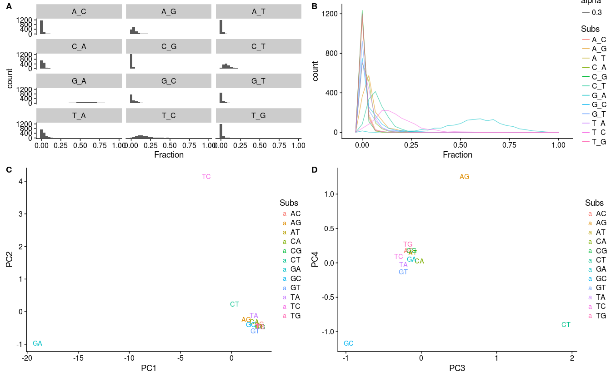

``` r
if (!dir.exists("./4_Figures")) {
    dir.create("./4_Figures")
}
save_plot("./4_Figures/Substitutions_PCA_full.pdf", pSubs, base_height = 11, base_aspect_ratio = 1.1)
```

#### ICA plot of Substitutions' loading

``` r
ICA.tab <- as.data.frame(ICA) %>% rownames_to_column("Subs")
p_subs5 <- ggplot(as.data.frame(ICA.tab), aes(x = IC1, y = IC2, color = Subs)) +
    geom_text(aes(label = Subs)) +
    xlab("IC1") +
    ylab("IC2") 
p_subs6 <- ggplot(as.data.frame(ICA.tab), aes(x = IC3, y = IC4, color = Subs)) +
    geom_text(aes(label = Subs)) +
    xlab("IC3") +
    ylab("IC4") 
pSubs_MVA <- plot_grid(p_subs3, p_subs4, p_subs5, p_subs6, 
                   align = 'v', labels = LETTERS[1:4], 
                   scale = c(c(1, 1), c(1, 1), c(1, 1), c(1, 1)), 
                   hjust = -1, ncol = 2, axis = 't', rel_heights = c(1, 1.3))
pSubs_MVA
```

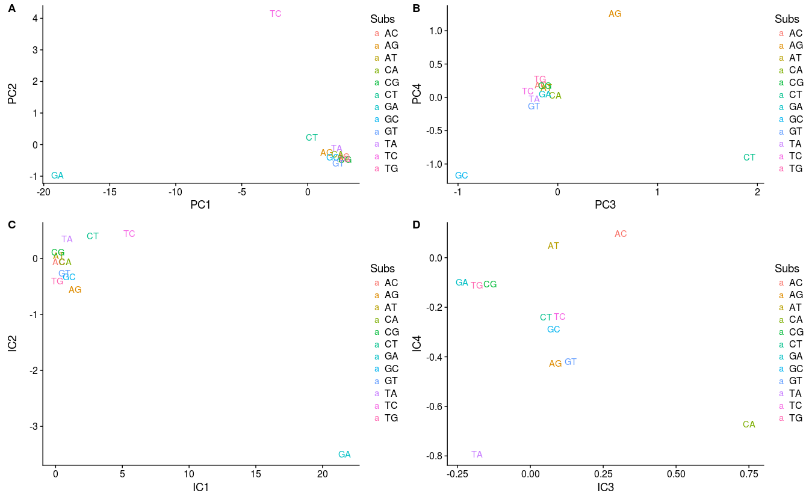

``` r
if (!dir.exists("./4_Figures")) {
    dir.create("./4_Figures")
}
save_plot("./4_Figures/Substitutions_PCA_ICA_full.pdf", pSubs_MVA, base_height = 11, base_aspect_ratio = 1.1)
```

### EXTREMES

``` r
TABLE %>% filter(PC1 < quantile(PC1, .05)) %>% select(Species)
```

    ##                             Species
    ## 1          Achondrostoma_oligolepis
    ## 2               Agelaius_phoeniceus
    ## 3           Amblyrhynchus_cristatus
    ## 4             Anguilla_celebesensis
    ## 5                 Anguilla_rostrata
    ## 6                Apodemus_argenteus
    ## 7                   Barbus_plebejus
    ## 8                Budorcas_taxicolor
    ## 9                 Caiman_crocodilus
    ## 10 Campylomormyrus_compressirostris
    ## 11                      Canis_lupus
    ## 12           Carasobarbus_fritschii
    ## 13        Carassius_auratus_auratus
    ## 14                  Chrysemys_picta
    ## 15                 Crocidura_beatus
    ## 16             Crocidura_orientalis
    ## 17                 Ctenomys_minutus
    ## 18           Cyprinus_carpio_carpio
    ## 19              Gadus_chalcogrammus
    ## 20              Galago_senegalensis
    ## 21              Gerbillus_pyramidum
    ## 22            Handleyomys_rostratus
    ## 23              Hemiechinus_auritus
    ## 24         Hippoglossoides_robustus
    ## 25               Hynobius_amjiensis
    ## 26                 Hynobius_leechii
    ## 27            Hyperoglyphe_japonica
    ## 28                 Ictalurus_pricei
    ## 29                Jinshaia_sinensis
    ## 30                      Kobus_leche
    ## 31                 Larus_argentatus
    ## 32          Leptonychotes_weddellii
    ## 33               Lophura_nycthemera
    ## 34                   Macaca_mulatta
    ## 35               Marmota_himalayana
    ## 36          Mastacembelus_brichardi
    ## 37          Metachirus_nudicaudatus
    ## 38           Microcebus_griseorufus
    ## 39               Microcebus_murinus
    ## 40     Microphysogobio_brevirostris
    ## 41             Muntiacus_crinifrons
    ## 42             Nannospalax_leucodon
    ## 43                 Niviventer_bukit
    ## 44           Nycticebus_bengalensis
    ## 45                Oryzomys_texensis
    ## 46                   Paguma_larvata
    ## 47          Paleosuchus_palpebrosus
    ## 48         Paramormyrops_gabonensis
    ## 49             Pipistrellus_abramus
    ## 50              Plagiodontia_aedium
    ## 51             Poeciliopsis_monacha
    ## 52               Polypterus_weeksii
    ## 53             Propithecus_edwardsi
    ## 54             Psammodromus_algirus
    ## 55         Pseudexostoma_yunnanense
    ## 56             Rastrelliger_faughni
    ## 57             Rhynchonycteris_naso
    ## 58                Seriola_rivoliana
    ## 59                    Sorex_araneus
    ## 60              Spheniscus_demersus
    ## 61                  Sturnira_tildae
    ## 62         Symphalangus_syndactylus
    ## 63        Symphysodon_aequifasciata
    ## 64                  Tamias_dorsalis
    ## 65                   Tamias_minimus
    ## 66               Thamnophis_validus
    ## 67          Trimeresurus_albolabris
    ## 68              Urocitellus_parryii
    ## 69                Xantusia_arizonae

``` r
TABLE %>% filter(PC1 > quantile(PC1, .95)) %>% select(Species)
```

    ##                            Species
    ## 1         Acanthopagrus_schlegelii
    ## 2                 Alouatta_guariba
    ## 3            Ambloplites_rupestris
    ## 4                 Ateles_geoffroyi
    ## 5         Beaufortia_kweichowensis
    ## 6           Branchiostoma_belcheri
    ## 7           Branchiostoma_floridae
    ## 8        Branchiostoma_lanceolatum
    ## 9                Cirrhinus_mrigala
    ## 10              Clarias_gariepinus
    ## 11            Cobitis_elongatoides
    ## 12            Cynomys_ludovicianus
    ## 13               Deltistes_luxatus
    ## 14            Dicentrarchus_labrax
    ## 15         Dicentrarchus_punctatus
    ## 16            Dormitator_maculatus
    ## 17                Dryomys_nitedula
    ## 18       Epigonichthys_maldivensis
    ## 19          Epinephelus_marginatus
    ## 20                     Equus_zebra
    ## 21          Eretmochelys_imbricata
    ## 22           Etheostoma_spectabile
    ## 23                Falco_sparverius
    ## 24               Genetta_servalina
    ## 25                   Grus_antigone
    ## 26              Hippocampus_ingens
    ## 27 Iberochondrostoma_olisiponensis
    ## 28                    Labeo_rohita
    ## 29            Lagocephalus_lunaris
    ## 30                Lampetra_planeri
    ## 31           Lepidochelys_olivacea
    ## 32                Lepomis_gibbosus
    ## 33         Lepturichthys_fimbriata
    ## 34       Lethenteron_camtschaticum
    ## 35         Lycengraulis_grossidens
    ## 36         Microcebus_mittermeieri
    ## 37               Mullus_surmuletus
    ## 38               Oncorhynchus_keta
    ## 39              Oryzomys_palustris
    ## 40              Pagellus_bogaraveo
    ## 41             Palea_steindachneri
    ## 42                 Passer_montanus
    ## 43                 Percina_burtoni
    ## 44          Phoxinus_steindachneri
    ## 45             Pinicola_enucleator
    ## 46          Platypharodon_extremus
    ## 47           Pleuronectes_platessa
    ## 48       Poeciliopsis_occidentalis
    ## 49    Pseudopleuronectes_yokohamae
    ## 50             Quiscalus_mexicanus
    ## 51                    Raja_pulchra
    ## 52                Rana_catesbeiana
    ## 53                  Rana_dybowskii
    ## 54                  Rattus_exulans
    ## 55      Rhodeus_ocellatus_kurumeus
    ## 56                Rhombomys_opimus
    ## 57                Seriola_dumerili
    ## 58               Serranus_cabrilla
    ## 59                Siganus_virgatus
    ## 60             Squalidus_japonicus
    ## 61               Syngnathus_typhle
    ## 62              Syrmaticus_ellioti
    ## 63            Takydromus_amurensis
    ## 64                 Tamias_striatus
    ## 65           Thrichomys_laurenteus
    ## 66                Thunnus_maccoyii
    ## 67              Thunnus_orientalis
    ## 68              Trachurus_declivis
    ## 69                      Zeus_faber

``` r
TABLE %>% filter(PC2 < quantile(PC2, .05)) %>% select(Species)
```

    ##                             Species
    ## 1                     Abramis_brama
    ## 2          Achondrostoma_oligolepis
    ## 3                 Anguilla_anguilla
    ## 4         Anguilla_bicolor_pacifica
    ## 5             Anguilla_celebesensis
    ## 6            Antidorcas_marsupialis
    ## 7                Balistes_capriscus
    ## 8                 Barbus_balcanicus
    ## 9                   Barbus_plebejus
    ## 10               Budorcas_taxicolor
    ## 11 Campylomormyrus_compressirostris
    ## 12                      Canis_lupus
    ## 13           Canis_lupus_familiaris
    ## 14           Carasobarbus_fritschii
    ## 15        Carassius_auratus_auratus
    ## 16                  Channa_asiatica
    ## 17               Chondrostoma_nasus
    ## 18                  Chrysemys_picta
    ## 19             Comephorus_dybowskii
    ## 20             Crocidura_orientalis
    ## 21                 Ctenomys_minutus
    ## 22             Elaphe_quadrivirgata
    ## 23              Gadus_chalcogrammus
    ## 24                     Gadus_morhua
    ## 25          Galaxiella_nigrostriata
    ## 26              Gerbillus_pyramidum
    ## 27           Gobiomorphus_australis
    ## 28                  Grus_canadensis
    ## 29              Hemiechinus_auritus
    ## 30         Hippoglossoides_robustus
    ## 31               Hynobius_amjiensis
    ## 32                 Hynobius_leechii
    ## 33                 Ictalurus_pricei
    ## 34                   Lepus_coreanus
    ## 35             Liobagrus_marginatus
    ## 36               Marmota_himalayana
    ## 37          Mastacembelus_brichardi
    ## 38             Melanotaenia_praecox
    ## 39          Metachirus_nudicaudatus
    ## 40           Microcebus_griseorufus
    ## 41       Microphysogobio_alticorpus
    ## 42     Microphysogobio_brevirostris
    ## 43             Muntiacus_crinifrons
    ## 44          Mus_musculus_molossinus
    ## 45                    Myotis_keaysi
    ## 46           Myxocyprinus_asiaticus
    ## 47             Nannospalax_leucodon
    ## 48                 Niviventer_bukit
    ## 49               Nocomis_biguttatus
    ## 50              Oncorhynchus_mykiss
    ## 51                     Oryx_gazella
    ## 52                  Ovis_canadensis
    ## 53                 Pachytriton_feii
    ## 54          Paleosuchus_palpebrosus
    ## 55                     Pan_paniscus
    ## 56         Pseudexostoma_yunnanense
    ## 57               Pseudobagrus_ondon
    ## 58     Pseudopungtungia_tenuicorpus
    ## 59        Pseudoxiphophorus_jonesii
    ## 60           Salangichthys_microdon
    ## 61               Salvelinus_alpinus
    ## 62        Schizothorax_richardsonii
    ## 63              Spheniscus_demersus
    ## 64                  Sturnira_tildae
    ## 65             Takifugu_stictonotus
    ## 66               Thamnophis_validus
    ## 67              Trachurus_trachurus
    ## 68                 Uragus_sibiricus
    ## 69                   Vireo_cassinii

``` r
TABLE %>% filter(PC2 > quantile(PC2, .95)) %>% select(Species)
```

    ##                        Species
    ## 1     Acrocephalus_brevipennis
    ## 2             Alouatta_guariba
    ## 3         Ambloplites_ariommus
    ## 4        Ambloplites_rupestris
    ## 5  Anguilla_australis_schmidti
    ## 6            Bagarius_yarrelli
    ## 7        Brotogeris_cyanoptera
    ## 8              Capra_falconeri
    ## 9                  Catla_catla
    ## 10                Corvus_corax
    ## 11             Crocuta_crocuta
    ## 12        Cuora_flavomarginata
    ## 13        Cynomys_ludovicianus
    ## 14 Diplomystes_nahuelbutaensis
    ## 15      Epinephelus_marginatus
    ## 16              Equus_hemionus
    ## 17      Eretmochelys_imbricata
    ## 18            Falco_sparverius
    ## 19                 Felis_catus
    ## 20          Gazella_leptoceros
    ## 21           Genetta_servalina
    ## 22               Grus_antigone
    ## 23      Hemidactylus_alkiyumii
    ## 24     Henicorhina_leucosticta
    ## 25         Hipposideros_caffer
    ## 26        Kobus_ellipsiprymnus
    ## 27                Labeo_rohita
    ## 28        Lagocephalus_lunaris
    ## 29           Lanius_bucephalus
    ## 30          Lanius_tephronotus
    ## 31          Lepilemur_dorsalis
    ## 32        Lepisosteus_oculatus
    ## 33            Lepomis_gibbosus
    ## 34     Lepturichthys_fimbriata
    ## 35     Lycengraulis_grossidens
    ## 36                  Lynx_rufus
    ## 37          Melanosuchus_niger
    ## 38     Microcebus_mittermeieri
    ## 39    Microcerculus_marginatus
    ## 40      Mus_musculus_castaneus
    ## 41                 Mus_spretus
    ## 42           Nandinia_binotata
    ## 43    Neophocaena_phocaenoides
    ## 44          Ochotona_rufescens
    ## 45                Otus_elegans
    ## 46      Paleosuchus_trigonatus
    ## 47       Parabramis_pekinensis
    ## 48             Passer_montanus
    ## 49      Phacochoerus_africanus
    ## 50              Phoca_vitulina
    ## 51                Piaya_cayana
    ## 52         Pinicola_enucleator
    ## 53      Plectropomus_leopardus
    ## 54     Polypterus_ornatipinnis
    ## 55         Quiscalus_mexicanus
    ## 56                Raja_pulchra
    ## 57              Rattus_exulans
    ## 58  Rhodeus_ocellatus_kurumeus
    ## 59  Rousettus_madagascariensis
    ## 60        Schizothorax_waltoni
    ## 61          Sorex_minutissimus
    ## 62          Stachyris_ruficeps
    ## 63              Sturnira_luisi
    ## 64          Syrmaticus_ellioti
    ## 65        Turdus_rufopalliatus
    ## 66            Ursus_americanus
    ## 67                Ursus_arctos
    ## 68            Ursus_thibetanus
    ## 69         Zosterops_japonicus

``` r
TABLE %>% filter(PC3 < quantile(PC3, .05)) %>% select(Species)
```

    ##                         Species
    ## 1        Acanthocybium_solandri
    ## 2         Adelomyia_melanogenys
    ## 3        Agkistrodon_piscivorus
    ## 4       Amphilophus_citrinellus
    ## 5          Amphiprion_ocellaris
    ## 6     Anguilla_bicolor_pacifica
    ## 7             Anguilla_japonica
    ## 8      Arachnothera_longirostra
    ## 9           Artibeus_fimbriatus
    ## 10              Beryx_splendens
    ## 11 Brachyhypopomus_occidentalis
    ## 12        Brotogeris_cyanoptera
    ## 13     Campylomormyrus_numenius
    ## 14             Carollia_sowelli
    ## 15              Cavia_porcellus
    ## 16           Clarias_gariepinus
    ## 17        Coreoperca_kawamebari
    ## 18                Cottus_pollux
    ## 19              Crocuta_crocuta
    ## 20         Cuora_flavomarginata
    ## 21          Ficedula_hyperythra
    ## 22           Glaucomys_sabrinus
    ## 23              Grus_canadensis
    ## 24  Gymnodiptychus_pachycheilus
    ## 25             Hypomesus_olidus
    ## 26           Ithaginis_cruentus
    ## 27                 Labeo_rohita
    ## 28         Lagocephalus_inermis
    ## 29        Lateolabrax_japonicus
    ## 30          Lethrinus_olivaceus
    ## 31            Lissemys_punctata
    ## 32            Marmosops_bishopi
    ## 33              Martes_melampus
    ## 34       Melanotaenia_australis
    ## 35     Monodelphis_brevicaudata
    ## 36          Mugilogobius_chulae
    ## 37            Myotis_mystacinus
    ## 38          Notropis_stramineus
    ## 39        Oryctolagus_cuniculus
    ## 40                 Otus_elegans
    ## 41                   Otus_scops
    ## 42        Oxyeleotris_lineolata
    ## 43           Pagellus_bogaraveo
    ## 44          Palea_steindachneri
    ## 45       Paleosuchus_trigonatus
    ## 46                 Pan_paniscus
    ## 47           Pantodon_buchholzi
    ## 48 Petrocephalus_microphthalmus
    ## 49       Plectropomus_leopardus
    ## 50    Pomatorhinus_ferruginosus
    ## 51     Poropuntius_bolovenensis
    ## 52            Procypris_rabaudi
    ## 53       Pseudobagrus_truncatus
    ## 54             Pygoscelis_papua
    ## 55                 Raja_pulchra
    ## 56         Rhinogobius_giurinus
    ## 57             Rhodeus_sinensis
    ## 58           Salvelinus_alpinus
    ## 59       Scartelaos_histophorus
    ## 60         Schedophilus_velaini
    ## 61       Schizothorax_biddulphi
    ## 62             Siganus_virgatus
    ## 63          Snyderichthys_copei
    ## 64            Syngnathus_typhle
    ## 65         Takydromus_amurensis
    ## 66        Thrichomys_laurenteus
    ## 67           Trachurus_declivis
    ## 68          Trinomys_dimidiatus
    ## 69               Vipera_lotievi

``` r
TABLE %>% filter(PC3 > quantile(PC3, .95)) %>% select(Species)
```

    ##                            Species
    ## 1                 Alouatta_guariba
    ## 2               Ambystoma_barbouri
    ## 3                    Bos_grunniens
    ## 4           Branchiostoma_belcheri
    ## 5           Branchiostoma_floridae
    ## 6        Branchiostoma_lanceolatum
    ## 7           Bubalus_depressicornis
    ## 8               Camelus_bactrianus
    ## 9             Coregonus_autumnalis
    ## 10              Ctenomys_torquatus
    ## 11               Cuora_trifasciata
    ## 12             Dasyurus_hallucatus
    ## 13        Discogobio_tetrabarbatus
    ## 14        Distoechodon_tumirostris
    ## 15              Dremomys_rufigenis
    ## 16       Epigonichthys_maldivensis
    ## 17                     Equus_zebra
    ## 18              Eumetopias_jubatus
    ## 19                     Felis_catus
    ## 20           Fundulus_heteroclitus
    ## 21             Gadus_macrocephalus
    ## 22               Galeocerdo_cuvier
    ## 23        Gerbilliscus_leucogaster
    ## 24         Hippocampus_abdominalis
    ## 25              Hippocampus_ingens
    ## 26        Hippocampus_trimaculatus
    ## 27                 Hylomys_suillus
    ## 28              Hynobius_yiwuensis
    ## 29 Iberochondrostoma_olisiponensis
    ## 30                Lampetra_planeri
    ## 31              Leopardus_pardalis
    ## 32           Lepidochelys_olivacea
    ## 33      Lepidorhombus_whiffiagonis
    ## 34       Lethenteron_camtschaticum
    ## 35         Lycengraulis_grossidens
    ## 36                Marmosa_mexicana
    ## 37                Martes_americana
    ## 38                    Martes_foina
    ## 39         Microcebus_mittermeieri
    ## 40         Microtus_pennsylvanicus
    ## 41            Misgurnus_bipartitus
    ## 42             Misgurnus_nikolskyi
    ## 43             Moschus_berezovskii
    ## 44                   Myotis_keaysi
    ## 45              Oryzomys_palustris
    ## 46         Paradoxornis_nipalensis
    ## 47         Paramisgurnus_dabryanus
    ## 48                 Perca_schrenkii
    ## 49               Phyllomys_pattoni
    ## 50          Platypharodon_extremus
    ## 51           Pleuronectes_platessa
    ## 52          Polypterus_endlicherii
    ## 53         Polypterus_ornatipinnis
    ## 54                Rhinogobio_typus
    ## 55                Rhombomys_opimus
    ## 56        Sarcocheilichthys_parvus
    ## 57        Schizopygopsis_thermalis
    ## 58    Schizopygopsis_younghusbandi
    ## 59           Schizothorax_oconnori
    ## 60           Schizothorax_prenanti
    ## 61       Schizothorax_wangchiachii
    ## 62                     Sciurus_lis
    ## 63                     Sorex_asper
    ## 64               Thylamys_pusillus
    ## 65               Thylamys_venustus
    ## 66            Tragelaphus_imberbis
    ## 67                Uragus_sibiricus
    ## 68                   Vulpes_vulpes
    ## 69                 Xenotoca_eiseni

### GENERATION LENGTH and PCA

``` r
GenerTime <- read_tsv('1_Raw/GenerationLenghtforMammals.xlsx.txt', 
                      na = c("", "NA", "no information")) %>% 
    mutate(Species = str_replace(Scientific_name, " ", "_")) %>% 
    select(-starts_with("Sources"), -Genus, -Scientific_name, -Data_AFR)
```

    ## Parsed with column specification:
    ## cols(
    ##   Genus = col_character(),
    ##   Scientific_name = col_character(),
    ##   AdultBodyMass_g = col_double(),
    ##   Sources_AdultBodyMass = col_character(),
    ##   Max_longevity_d = col_double(),
    ##   Sources_Max_longevity = col_character(),
    ##   Rspan_d = col_double(),
    ##   AFR_d = col_double(),
    ##   Data_AFR = col_character(),
    ##   Calculated_GL_d = col_double(),
    ##   GenerationLength_d = col_double(),
    ##   Sources_GL = col_character()
    ## )

``` r
AnAge = read_tsv('1_Raw/anage_data.tsv')
```

    ## Parsed with column specification:
    ## cols(
    ##   .default = col_character(),
    ##   HAGRID = col_integer(),
    ##   Female.maturity..days. = col_integer(),
    ##   Male.maturity..days. = col_integer(),
    ##   Gestation.Incubation..days. = col_integer(),
    ##   Litter.Clutch.size = col_double(),
    ##   Litters.Clutches.per.year = col_integer(),
    ##   Inter.litter.Interbirth.interval = col_integer(),
    ##   Birth.weight..g. = col_double(),
    ##   Adult.weight..g. = col_double(),
    ##   Growth.rate..1.days. = col_double(),
    ##   Maximum.longevity..yrs. = col_double(),
    ##   IMR..per.yr. = col_double(),
    ##   MRDT..yrs. = col_double(),
    ##   Metabolic.rate..W. = col_double(),
    ##   Body.mass..g. = col_double(),
    ##   Temperature..K. = col_double(),
    ##   References = col_double()
    ## )

    ## See spec(...) for full column specifications.

``` r
Test <- left_join(TABLE, GenerTime) %>% left_join(AnAge) %>% type_convert()
```

    ## Joining, by = "Species"

    ## Joining, by = "Species"

    ## Parsed with column specification:
    ## cols(
    ##   Species = col_character(),
    ##   Kingdom = col_character(),
    ##   Phylum = col_character(),
    ##   Class = col_character(),
    ##   Order = col_character(),
    ##   Family = col_character(),
    ##   Genus = col_character(),
    ##   Common.name = col_character(),
    ##   Weaning..days. = col_integer(),
    ##   Weaning.weight..g. = col_double(),
    ##   Source = col_character(),
    ##   Specimen.origin = col_character(),
    ##   Sample.size = col_character(),
    ##   Data.quality = col_character()
    ## )

``` r
Var1 <- list(Test %>% select(PC1:PC10) %>% colnames())
Var2 <- list(Test %>% select(AdultBodyMass_g:GenerationLength_d, 
                             Female.maturity..days.:Maximum.longevity..yrs., 
                             Metabolic.rate..W.:Temperature..K.) %>% colnames())

list_Tests <- cross2(Var1[[1]], Var2[[1]])

corrtest <- function(v) {
    fun <- function(x, y) cor.test(x, y, method = 'spearman')
    vars <- select(Test, v[[1]], v[[2]]) %>% type_convert()
    res <- with(Test, fun(vars[, 1], vars[, 2]))
    result <- data.frame(Var1 = v[[1]], Var2 = v[[2]])
    result <- cbind(result, tidy(res))
}

Tests_results <- list_Tests %>% map_df(~ corrtest(.))
```

    ## Parsed with column specification:
    ## cols()

    ## Warning in cor.test.default(x, y, method = "spearman"): Cannot compute
    ## exact p-value with ties

    ## Parsed with column specification:
    ## cols()

    ## Warning in cor.test.default(x, y, method = "spearman"): Cannot compute
    ## exact p-value with ties

    ## Parsed with column specification:
    ## cols()

    ## Warning in cor.test.default(x, y, method = "spearman"): Cannot compute
    ## exact p-value with ties

    ## Parsed with column specification:
    ## cols()

    ## Warning in cor.test.default(x, y, method = "spearman"): Cannot compute
    ## exact p-value with ties

    ## Parsed with column specification:
    ## cols()

    ## Warning in cor.test.default(x, y, method = "spearman"): Cannot compute
    ## exact p-value with ties

    ## Parsed with column specification:
    ## cols()

    ## Warning in cor.test.default(x, y, method = "spearman"): Cannot compute
    ## exact p-value with ties

    ## Parsed with column specification:
    ## cols()

    ## Warning in cor.test.default(x, y, method = "spearman"): Cannot compute
    ## exact p-value with ties

    ## Parsed with column specification:
    ## cols()

    ## Warning in cor.test.default(x, y, method = "spearman"): Cannot compute
    ## exact p-value with ties

    ## Parsed with column specification:
    ## cols()

    ## Warning in cor.test.default(x, y, method = "spearman"): Cannot compute
    ## exact p-value with ties

    ## Parsed with column specification:
    ## cols()

    ## Warning in cor.test.default(x, y, method = "spearman"): Cannot compute
    ## exact p-value with ties

    ## Parsed with column specification:
    ## cols()

    ## Warning in cor.test.default(x, y, method = "spearman"): Cannot compute
    ## exact p-value with ties

    ## Parsed with column specification:
    ## cols()

    ## Warning in cor.test.default(x, y, method = "spearman"): Cannot compute
    ## exact p-value with ties

    ## Parsed with column specification:
    ## cols()

    ## Warning in cor.test.default(x, y, method = "spearman"): Cannot compute
    ## exact p-value with ties

    ## Parsed with column specification:
    ## cols()

    ## Warning in cor.test.default(x, y, method = "spearman"): Cannot compute
    ## exact p-value with ties

    ## Parsed with column specification:
    ## cols()

    ## Warning in cor.test.default(x, y, method = "spearman"): Cannot compute
    ## exact p-value with ties

    ## Parsed with column specification:
    ## cols()

    ## Warning in cor.test.default(x, y, method = "spearman"): Cannot compute
    ## exact p-value with ties

    ## Parsed with column specification:
    ## cols()

    ## Warning in cor.test.default(x, y, method = "spearman"): Cannot compute
    ## exact p-value with ties

    ## Parsed with column specification:
    ## cols()

    ## Warning in cor.test.default(x, y, method = "spearman"): Cannot compute
    ## exact p-value with ties

    ## Parsed with column specification:
    ## cols()

    ## Warning in cor.test.default(x, y, method = "spearman"): Cannot compute
    ## exact p-value with ties

    ## Parsed with column specification:
    ## cols()

    ## Warning in cor.test.default(x, y, method = "spearman"): Cannot compute
    ## exact p-value with ties

    ## Parsed with column specification:
    ## cols()

    ## Warning in cor.test.default(x, y, method = "spearman"): Cannot compute
    ## exact p-value with ties

    ## Parsed with column specification:
    ## cols()

    ## Warning in cor.test.default(x, y, method = "spearman"): Cannot compute
    ## exact p-value with ties

    ## Parsed with column specification:
    ## cols()

    ## Warning in cor.test.default(x, y, method = "spearman"): Cannot compute
    ## exact p-value with ties

    ## Parsed with column specification:
    ## cols()

    ## Warning in cor.test.default(x, y, method = "spearman"): Cannot compute
    ## exact p-value with ties

    ## Parsed with column specification:
    ## cols()

    ## Warning in cor.test.default(x, y, method = "spearman"): Cannot compute
    ## exact p-value with ties

    ## Parsed with column specification:
    ## cols()

    ## Warning in cor.test.default(x, y, method = "spearman"): Cannot compute
    ## exact p-value with ties

    ## Parsed with column specification:
    ## cols()

    ## Warning in cor.test.default(x, y, method = "spearman"): Cannot compute
    ## exact p-value with ties

    ## Parsed with column specification:
    ## cols()

    ## Warning in cor.test.default(x, y, method = "spearman"): Cannot compute
    ## exact p-value with ties

    ## Parsed with column specification:
    ## cols()

    ## Warning in cor.test.default(x, y, method = "spearman"): Cannot compute
    ## exact p-value with ties

    ## Parsed with column specification:
    ## cols()

    ## Warning in cor.test.default(x, y, method = "spearman"): Cannot compute
    ## exact p-value with ties

    ## Parsed with column specification:
    ## cols()

    ## Warning in cor.test.default(x, y, method = "spearman"): Cannot compute
    ## exact p-value with ties

    ## Parsed with column specification:
    ## cols()

    ## Warning in cor.test.default(x, y, method = "spearman"): Cannot compute
    ## exact p-value with ties

    ## Parsed with column specification:
    ## cols()

    ## Warning in cor.test.default(x, y, method = "spearman"): Cannot compute
    ## exact p-value with ties

    ## Parsed with column specification:
    ## cols()

    ## Warning in cor.test.default(x, y, method = "spearman"): Cannot compute
    ## exact p-value with ties

    ## Parsed with column specification:
    ## cols()

    ## Warning in cor.test.default(x, y, method = "spearman"): Cannot compute
    ## exact p-value with ties

    ## Parsed with column specification:
    ## cols()

    ## Warning in cor.test.default(x, y, method = "spearman"): Cannot compute
    ## exact p-value with ties

    ## Parsed with column specification:
    ## cols()

    ## Warning in cor.test.default(x, y, method = "spearman"): Cannot compute
    ## exact p-value with ties

    ## Parsed with column specification:
    ## cols()

    ## Warning in cor.test.default(x, y, method = "spearman"): Cannot compute
    ## exact p-value with ties

    ## Parsed with column specification:
    ## cols()

    ## Warning in cor.test.default(x, y, method = "spearman"): Cannot compute
    ## exact p-value with ties

    ## Parsed with column specification:
    ## cols()

    ## Warning in cor.test.default(x, y, method = "spearman"): Cannot compute
    ## exact p-value with ties

    ## Parsed with column specification:
    ## cols()

    ## Parsed with column specification:
    ## cols()
    ## Parsed with column specification:
    ## cols()
    ## Parsed with column specification:
    ## cols()
    ## Parsed with column specification:
    ## cols()
    ## Parsed with column specification:
    ## cols()
    ## Parsed with column specification:
    ## cols()
    ## Parsed with column specification:
    ## cols()
    ## Parsed with column specification:
    ## cols()
    ## Parsed with column specification:
    ## cols()
    ## Parsed with column specification:
    ## cols()

    ## Warning in cor.test.default(x, y, method = "spearman"): Cannot compute
    ## exact p-value with ties

    ## Parsed with column specification:
    ## cols()

    ## Warning in cor.test.default(x, y, method = "spearman"): Cannot compute
    ## exact p-value with ties

    ## Parsed with column specification:
    ## cols()

    ## Warning in cor.test.default(x, y, method = "spearman"): Cannot compute
    ## exact p-value with ties

    ## Parsed with column specification:
    ## cols()

    ## Warning in cor.test.default(x, y, method = "spearman"): Cannot compute
    ## exact p-value with ties

    ## Parsed with column specification:
    ## cols()

    ## Warning in cor.test.default(x, y, method = "spearman"): Cannot compute
    ## exact p-value with ties

    ## Parsed with column specification:
    ## cols()

    ## Warning in cor.test.default(x, y, method = "spearman"): Cannot compute
    ## exact p-value with ties

    ## Parsed with column specification:
    ## cols()

    ## Warning in cor.test.default(x, y, method = "spearman"): Cannot compute
    ## exact p-value with ties

    ## Parsed with column specification:
    ## cols()

    ## Warning in cor.test.default(x, y, method = "spearman"): Cannot compute
    ## exact p-value with ties

    ## Parsed with column specification:
    ## cols()

    ## Warning in cor.test.default(x, y, method = "spearman"): Cannot compute
    ## exact p-value with ties

    ## Parsed with column specification:
    ## cols()

    ## Warning in cor.test.default(x, y, method = "spearman"): Cannot compute
    ## exact p-value with ties

    ## Parsed with column specification:
    ## cols()

    ## Warning in cor.test.default(x, y, method = "spearman"): Cannot compute
    ## exact p-value with ties

    ## Parsed with column specification:
    ## cols()

    ## Warning in cor.test.default(x, y, method = "spearman"): Cannot compute
    ## exact p-value with ties

    ## Parsed with column specification:
    ## cols()

    ## Warning in cor.test.default(x, y, method = "spearman"): Cannot compute
    ## exact p-value with ties

    ## Parsed with column specification:
    ## cols()

    ## Warning in cor.test.default(x, y, method = "spearman"): Cannot compute
    ## exact p-value with ties

    ## Parsed with column specification:
    ## cols()

    ## Warning in cor.test.default(x, y, method = "spearman"): Cannot compute
    ## exact p-value with ties

    ## Parsed with column specification:
    ## cols()

    ## Warning in cor.test.default(x, y, method = "spearman"): Cannot compute
    ## exact p-value with ties

    ## Parsed with column specification:
    ## cols()

    ## Warning in cor.test.default(x, y, method = "spearman"): Cannot compute
    ## exact p-value with ties

    ## Parsed with column specification:
    ## cols()

    ## Warning in cor.test.default(x, y, method = "spearman"): Cannot compute
    ## exact p-value with ties

    ## Parsed with column specification:
    ## cols()

    ## Warning in cor.test.default(x, y, method = "spearman"): Cannot compute
    ## exact p-value with ties

    ## Parsed with column specification:
    ## cols()

    ## Warning in cor.test.default(x, y, method = "spearman"): Cannot compute
    ## exact p-value with ties

    ## Parsed with column specification:
    ## cols()

    ## Warning in cor.test.default(x, y, method = "spearman"): Cannot compute
    ## exact p-value with ties

    ## Parsed with column specification:
    ## cols()

    ## Warning in cor.test.default(x, y, method = "spearman"): Cannot compute
    ## exact p-value with ties

    ## Parsed with column specification:
    ## cols()

    ## Warning in cor.test.default(x, y, method = "spearman"): Cannot compute
    ## exact p-value with ties

    ## Parsed with column specification:
    ## cols()

    ## Warning in cor.test.default(x, y, method = "spearman"): Cannot compute
    ## exact p-value with ties

    ## Parsed with column specification:
    ## cols()

    ## Warning in cor.test.default(x, y, method = "spearman"): Cannot compute
    ## exact p-value with ties

    ## Parsed with column specification:
    ## cols()

    ## Warning in cor.test.default(x, y, method = "spearman"): Cannot compute
    ## exact p-value with ties

    ## Parsed with column specification:
    ## cols()

    ## Warning in cor.test.default(x, y, method = "spearman"): Cannot compute
    ## exact p-value with ties

    ## Parsed with column specification:
    ## cols()

    ## Warning in cor.test.default(x, y, method = "spearman"): Cannot compute
    ## exact p-value with ties

    ## Parsed with column specification:
    ## cols()

    ## Warning in cor.test.default(x, y, method = "spearman"): Cannot compute
    ## exact p-value with ties

    ## Parsed with column specification:
    ## cols()

    ## Warning in cor.test.default(x, y, method = "spearman"): Cannot compute
    ## exact p-value with ties

    ## Parsed with column specification:
    ## cols()

    ## Warning in cor.test.default(x, y, method = "spearman"): Cannot compute
    ## exact p-value with ties

    ## Parsed with column specification:
    ## cols()

    ## Warning in cor.test.default(x, y, method = "spearman"): Cannot compute
    ## exact p-value with ties

    ## Parsed with column specification:
    ## cols()

    ## Warning in cor.test.default(x, y, method = "spearman"): Cannot compute
    ## exact p-value with ties

    ## Parsed with column specification:
    ## cols()

    ## Warning in cor.test.default(x, y, method = "spearman"): Cannot compute
    ## exact p-value with ties

    ## Parsed with column specification:
    ## cols()

    ## Warning in cor.test.default(x, y, method = "spearman"): Cannot compute
    ## exact p-value with ties

    ## Parsed with column specification:
    ## cols()

    ## Warning in cor.test.default(x, y, method = "spearman"): Cannot compute
    ## exact p-value with ties

    ## Parsed with column specification:
    ## cols()

    ## Warning in cor.test.default(x, y, method = "spearman"): Cannot compute
    ## exact p-value with ties

    ## Parsed with column specification:
    ## cols()

    ## Warning in cor.test.default(x, y, method = "spearman"): Cannot compute
    ## exact p-value with ties

    ## Parsed with column specification:
    ## cols()

    ## Warning in cor.test.default(x, y, method = "spearman"): Cannot compute
    ## exact p-value with ties

    ## Parsed with column specification:
    ## cols()

    ## Warning in cor.test.default(x, y, method = "spearman"): Cannot compute
    ## exact p-value with ties

    ## Parsed with column specification:
    ## cols()

    ## Warning in cor.test.default(x, y, method = "spearman"): Cannot compute
    ## exact p-value with ties

    ## Parsed with column specification:
    ## cols()

    ## Warning in cor.test.default(x, y, method = "spearman"): Cannot compute
    ## exact p-value with ties

    ## Parsed with column specification:
    ## cols()

    ## Warning in cor.test.default(x, y, method = "spearman"): Cannot compute
    ## exact p-value with ties

    ## Parsed with column specification:
    ## cols()

    ## Warning in cor.test.default(x, y, method = "spearman"): Cannot compute
    ## exact p-value with ties

    ## Parsed with column specification:
    ## cols()

    ## Warning in cor.test.default(x, y, method = "spearman"): Cannot compute
    ## exact p-value with ties

    ## Parsed with column specification:
    ## cols()

    ## Warning in cor.test.default(x, y, method = "spearman"): Cannot compute
    ## exact p-value with ties

    ## Parsed with column specification:
    ## cols()

    ## Warning in cor.test.default(x, y, method = "spearman"): Cannot compute
    ## exact p-value with ties

    ## Parsed with column specification:
    ## cols()

    ## Warning in cor.test.default(x, y, method = "spearman"): Cannot compute
    ## exact p-value with ties

    ## Parsed with column specification:
    ## cols()

    ## Warning in cor.test.default(x, y, method = "spearman"): Cannot compute
    ## exact p-value with ties

    ## Parsed with column specification:
    ## cols()

    ## Warning in cor.test.default(x, y, method = "spearman"): Cannot compute
    ## exact p-value with ties

    ## Parsed with column specification:
    ## cols()

    ## Warning in cor.test.default(x, y, method = "spearman"): Cannot compute
    ## exact p-value with ties

    ## Parsed with column specification:
    ## cols()

    ## Warning in cor.test.default(x, y, method = "spearman"): Cannot compute
    ## exact p-value with ties

    ## Parsed with column specification:
    ## cols()

    ## Warning in cor.test.default(x, y, method = "spearman"): Cannot compute
    ## exact p-value with ties

    ## Parsed with column specification:
    ## cols()

    ## Warning in cor.test.default(x, y, method = "spearman"): Cannot compute
    ## exact p-value with ties

    ## Parsed with column specification:
    ## cols()

    ## Warning in cor.test.default(x, y, method = "spearman"): Cannot compute
    ## exact p-value with ties

    ## Parsed with column specification:
    ## cols()

    ## Warning in cor.test.default(x, y, method = "spearman"): Cannot compute
    ## exact p-value with ties

    ## Parsed with column specification:
    ## cols()

    ## Warning in cor.test.default(x, y, method = "spearman"): Cannot compute
    ## exact p-value with ties

    ## Parsed with column specification:
    ## cols()

    ## Warning in cor.test.default(x, y, method = "spearman"): Cannot compute
    ## exact p-value with ties

    ## Parsed with column specification:
    ## cols()

    ## Warning in cor.test.default(x, y, method = "spearman"): Cannot compute
    ## exact p-value with ties

    ## Parsed with column specification:
    ## cols()

    ## Warning in cor.test.default(x, y, method = "spearman"): Cannot compute
    ## exact p-value with ties

    ## Parsed with column specification:
    ## cols()

    ## Warning in cor.test.default(x, y, method = "spearman"): Cannot compute
    ## exact p-value with ties

    ## Parsed with column specification:
    ## cols()

    ## Warning in cor.test.default(x, y, method = "spearman"): Cannot compute
    ## exact p-value with ties

    ## Parsed with column specification:
    ## cols()

    ## Warning in cor.test.default(x, y, method = "spearman"): Cannot compute
    ## exact p-value with ties

    ## Parsed with column specification:
    ## cols()

    ## Warning in cor.test.default(x, y, method = "spearman"): Cannot compute
    ## exact p-value with ties

    ## Parsed with column specification:
    ## cols()

    ## Warning in cor.test.default(x, y, method = "spearman"): Cannot compute
    ## exact p-value with ties

    ## Parsed with column specification:
    ## cols()

    ## Warning in cor.test.default(x, y, method = "spearman"): Cannot compute
    ## exact p-value with ties

    ## Parsed with column specification:
    ## cols()

    ## Warning in cor.test.default(x, y, method = "spearman"): Cannot compute
    ## exact p-value with ties

    ## Parsed with column specification:
    ## cols()

    ## Warning in cor.test.default(x, y, method = "spearman"): Cannot compute
    ## exact p-value with ties

    ## Parsed with column specification:
    ## cols()

    ## Warning in cor.test.default(x, y, method = "spearman"): Cannot compute
    ## exact p-value with ties

    ## Parsed with column specification:
    ## cols()

    ## Warning in cor.test.default(x, y, method = "spearman"): Cannot compute
    ## exact p-value with ties

    ## Parsed with column specification:
    ## cols()

    ## Warning in cor.test.default(x, y, method = "spearman"): Cannot compute
    ## exact p-value with ties

    ## Parsed with column specification:
    ## cols()

    ## Warning in cor.test.default(x, y, method = "spearman"): Cannot compute
    ## exact p-value with ties

    ## Parsed with column specification:
    ## cols()

    ## Warning in cor.test.default(x, y, method = "spearman"): Cannot compute
    ## exact p-value with ties

    ## Parsed with column specification:
    ## cols()

    ## Warning in cor.test.default(x, y, method = "spearman"): Cannot compute
    ## exact p-value with ties

    ## Parsed with column specification:
    ## cols()

    ## Warning in cor.test.default(x, y, method = "spearman"): Cannot compute
    ## exact p-value with ties

    ## Parsed with column specification:
    ## cols()

    ## Warning in cor.test.default(x, y, method = "spearman"): Cannot compute
    ## exact p-value with ties

    ## Parsed with column specification:
    ## cols()

    ## Warning in cor.test.default(x, y, method = "spearman"): Cannot compute
    ## exact p-value with ties

    ## Parsed with column specification:
    ## cols()

    ## Warning in cor.test.default(x, y, method = "spearman"): Cannot compute
    ## exact p-value with ties

    ## Parsed with column specification:
    ## cols()

    ## Warning in cor.test.default(x, y, method = "spearman"): Cannot compute
    ## exact p-value with ties

    ## Parsed with column specification:
    ## cols()

    ## Warning in cor.test.default(x, y, method = "spearman"): Cannot compute
    ## exact p-value with ties

    ## Parsed with column specification:
    ## cols()

    ## Warning in cor.test.default(x, y, method = "spearman"): Cannot compute
    ## exact p-value with ties

    ## Parsed with column specification:
    ## cols()

    ## Warning in cor.test.default(x, y, method = "spearman"): Cannot compute
    ## exact p-value with ties

    ## Parsed with column specification:
    ## cols()

    ## Warning in cor.test.default(x, y, method = "spearman"): Cannot compute
    ## exact p-value with ties

    ## Parsed with column specification:
    ## cols()

    ## Warning in cor.test.default(x, y, method = "spearman"): Cannot compute
    ## exact p-value with ties

    ## Parsed with column specification:
    ## cols()

    ## Warning in cor.test.default(x, y, method = "spearman"): Cannot compute
    ## exact p-value with ties

    ## Parsed with column specification:
    ## cols()

    ## Warning in cor.test.default(x, y, method = "spearman"): Cannot compute
    ## exact p-value with ties

    ## Parsed with column specification:
    ## cols()

    ## Warning in cor.test.default(x, y, method = "spearman"): Cannot compute
    ## exact p-value with ties

    ## Parsed with column specification:
    ## cols()

    ## Warning in cor.test.default(x, y, method = "spearman"): Cannot compute
    ## exact p-value with ties

    ## Parsed with column specification:
    ## cols()

    ## Warning in cor.test.default(x, y, method = "spearman"): Cannot compute
    ## exact p-value with ties

    ## Parsed with column specification:
    ## cols()

    ## Warning in cor.test.default(x, y, method = "spearman"): Cannot compute
    ## exact p-value with ties

    ## Parsed with column specification:
    ## cols()

    ## Warning in cor.test.default(x, y, method = "spearman"): Cannot compute
    ## exact p-value with ties

    ## Parsed with column specification:
    ## cols()

    ## Warning in cor.test.default(x, y, method = "spearman"): Cannot compute
    ## exact p-value with ties

    ## Parsed with column specification:
    ## cols()

    ## Warning in cor.test.default(x, y, method = "spearman"): Cannot compute
    ## exact p-value with ties

    ## Parsed with column specification:
    ## cols()

    ## Warning in cor.test.default(x, y, method = "spearman"): Cannot compute
    ## exact p-value with ties

    ## Parsed with column specification:
    ## cols()

    ## Warning in cor.test.default(x, y, method = "spearman"): Cannot compute
    ## exact p-value with ties

    ## Parsed with column specification:
    ## cols()

    ## Warning in cor.test.default(x, y, method = "spearman"): Cannot compute
    ## exact p-value with ties

    ## Parsed with column specification:
    ## cols()

    ## Warning in cor.test.default(x, y, method = "spearman"): Cannot compute
    ## exact p-value with ties

    ## Parsed with column specification:
    ## cols()

    ## Warning in cor.test.default(x, y, method = "spearman"): Cannot compute
    ## exact p-value with ties

    ## Parsed with column specification:
    ## cols()

    ## Warning in cor.test.default(x, y, method = "spearman"): Cannot compute
    ## exact p-value with ties

    ## Parsed with column specification:
    ## cols()

    ## Warning in cor.test.default(x, y, method = "spearman"): Cannot compute
    ## exact p-value with ties

    ## Parsed with column specification:
    ## cols()

    ## Warning in cor.test.default(x, y, method = "spearman"): Cannot compute
    ## exact p-value with ties

    ## Parsed with column specification:
    ## cols()

    ## Warning in cor.test.default(x, y, method = "spearman"): Cannot compute
    ## exact p-value with ties

    ## Parsed with column specification:
    ## cols()

    ## Warning in cor.test.default(x, y, method = "spearman"): Cannot compute
    ## exact p-value with ties

    ## Parsed with column specification:
    ## cols()

    ## Warning in cor.test.default(x, y, method = "spearman"): Cannot compute
    ## exact p-value with ties

    ## Parsed with column specification:
    ## cols()

    ## Warning in cor.test.default(x, y, method = "spearman"): Cannot compute
    ## exact p-value with ties

    ## Parsed with column specification:
    ## cols()

    ## Warning in cor.test.default(x, y, method = "spearman"): Cannot compute
    ## exact p-value with ties

    ## Parsed with column specification:
    ## cols()

    ## Warning in cor.test.default(x, y, method = "spearman"): Cannot compute
    ## exact p-value with ties

    ## Parsed with column specification:
    ## cols()

    ## Warning in cor.test.default(x, y, method = "spearman"): Cannot compute
    ## exact p-value with ties

    ## Parsed with column specification:
    ## cols()

    ## Warning in cor.test.default(x, y, method = "spearman"): Cannot compute
    ## exact p-value with ties

    ## Parsed with column specification:
    ## cols()

    ## Warning in cor.test.default(x, y, method = "spearman"): Cannot compute
    ## exact p-value with ties

    ## Parsed with column specification:
    ## cols()

    ## Warning in cor.test.default(x, y, method = "spearman"): Cannot compute
    ## exact p-value with ties

    ## Parsed with column specification:
    ## cols()

    ## Warning in cor.test.default(x, y, method = "spearman"): Cannot compute
    ## exact p-value with ties

    ## Parsed with column specification:
    ## cols()

    ## Warning in cor.test.default(x, y, method = "spearman"): Cannot compute
    ## exact p-value with ties

    ## Parsed with column specification:
    ## cols()

    ## Warning in cor.test.default(x, y, method = "spearman"): Cannot compute
    ## exact p-value with ties

    ## Parsed with column specification:
    ## cols()

    ## Warning in cor.test.default(x, y, method = "spearman"): Cannot compute
    ## exact p-value with ties

    ## Parsed with column specification:
    ## cols()

    ## Warning in cor.test.default(x, y, method = "spearman"): Cannot compute
    ## exact p-value with ties

    ## Parsed with column specification:
    ## cols()

    ## Warning in cor.test.default(x, y, method = "spearman"): Cannot compute
    ## exact p-value with ties

    ## Parsed with column specification:
    ## cols()

    ## Warning in cor.test.default(x, y, method = "spearman"): Cannot compute
    ## exact p-value with ties

    ## Parsed with column specification:
    ## cols()

    ## Warning in cor.test.default(x, y, method = "spearman"): Cannot compute
    ## exact p-value with ties

    ## Parsed with column specification:
    ## cols()

    ## Warning in cor.test.default(x, y, method = "spearman"): Cannot compute
    ## exact p-value with ties

    ## Parsed with column specification:
    ## cols()

    ## Warning in cor.test.default(x, y, method = "spearman"): Cannot compute
    ## exact p-value with ties

    ## Parsed with column specification:
    ## cols()

    ## Warning in cor.test.default(x, y, method = "spearman"): Cannot compute
    ## exact p-value with ties

    ## Parsed with column specification:
    ## cols()

    ## Warning in cor.test.default(x, y, method = "spearman"): Cannot compute
    ## exact p-value with ties

    ## Parsed with column specification:
    ## cols()

    ## Warning in cor.test.default(x, y, method = "spearman"): Cannot compute
    ## exact p-value with ties

    ## Parsed with column specification:
    ## cols()

    ## Warning in cor.test.default(x, y, method = "spearman"): Cannot compute
    ## exact p-value with ties

    ## Parsed with column specification:
    ## cols()

    ## Warning in cor.test.default(x, y, method = "spearman"): Cannot compute
    ## exact p-value with ties

    ## Parsed with column specification:
    ## cols()

    ## Warning in cor.test.default(x, y, method = "spearman"): Cannot compute
    ## exact p-value with ties

    ## Parsed with column specification:
    ## cols()

    ## Warning in cor.test.default(x, y, method = "spearman"): Cannot compute
    ## exact p-value with ties

    ## Parsed with column specification:
    ## cols()

    ## Warning in cor.test.default(x, y, method = "spearman"): Cannot compute
    ## exact p-value with ties

    ## Parsed with column specification:
    ## cols()

    ## Warning in cor.test.default(x, y, method = "spearman"): Cannot compute
    ## exact p-value with ties

    ## Parsed with column specification:
    ## cols()

    ## Warning in cor.test.default(x, y, method = "spearman"): Cannot compute
    ## exact p-value with ties

    ## Parsed with column specification:
    ## cols()

    ## Warning in cor.test.default(x, y, method = "spearman"): Cannot compute
    ## exact p-value with ties

    ## Parsed with column specification:
    ## cols()

    ## Warning in cor.test.default(x, y, method = "spearman"): Cannot compute
    ## exact p-value with ties

    ## Parsed with column specification:
    ## cols()

    ## Warning in cor.test.default(x, y, method = "spearman"): Cannot compute
    ## exact p-value with ties

    ## Parsed with column specification:
    ## cols()

    ## Warning in cor.test.default(x, y, method = "spearman"): Cannot compute
    ## exact p-value with ties

    ## Parsed with column specification:
    ## cols()

    ## Warning in cor.test.default(x, y, method = "spearman"): Cannot compute
    ## exact p-value with ties

    ## Parsed with column specification:
    ## cols()

    ## Warning in cor.test.default(x, y, method = "spearman"): Cannot compute
    ## exact p-value with ties

    ## Parsed with column specification:
    ## cols()

    ## Warning in cor.test.default(x, y, method = "spearman"): Cannot compute
    ## exact p-value with ties

    ## Parsed with column specification:
    ## cols()

    ## Warning in cor.test.default(x, y, method = "spearman"): Cannot compute
    ## exact p-value with ties

    ## Parsed with column specification:
    ## cols()

    ## Warning in cor.test.default(x, y, method = "spearman"): Cannot compute
    ## exact p-value with ties

    ## Parsed with column specification:
    ## cols()

    ## Warning in cor.test.default(x, y, method = "spearman"): Cannot compute
    ## exact p-value with ties

    ## Parsed with column specification:
    ## cols()

    ## Warning in cor.test.default(x, y, method = "spearman"): Cannot compute
    ## exact p-value with ties

    ## Parsed with column specification:
    ## cols()

    ## Warning in cor.test.default(x, y, method = "spearman"): Cannot compute
    ## exact p-value with ties

    ## Parsed with column specification:
    ## cols()

    ## Warning in cor.test.default(x, y, method = "spearman"): Cannot compute
    ## exact p-value with ties

    ## Parsed with column specification:
    ## cols()

    ## Warning in cor.test.default(x, y, method = "spearman"): Cannot compute
    ## exact p-value with ties

    ## Parsed with column specification:
    ## cols()

    ## Warning in cor.test.default(x, y, method = "spearman"): Cannot compute
    ## exact p-value with ties

    ## Parsed with column specification:
    ## cols()

    ## Warning in cor.test.default(x, y, method = "spearman"): Cannot compute
    ## exact p-value with ties

    ## Parsed with column specification:
    ## cols()

    ## Warning in cor.test.default(x, y, method = "spearman"): Cannot compute
    ## exact p-value with ties

    ## Parsed with column specification:
    ## cols()

    ## Warning in cor.test.default(x, y, method = "spearman"): Cannot compute
    ## exact p-value with ties

    ## Parsed with column specification:
    ## cols()

    ## Warning in cor.test.default(x, y, method = "spearman"): Cannot compute
    ## exact p-value with ties

    ## Parsed with column specification:
    ## cols()

    ## Warning in cor.test.default(x, y, method = "spearman"): Cannot compute
    ## exact p-value with ties

    ## Parsed with column specification:
    ## cols()

    ## Warning in cor.test.default(x, y, method = "spearman"): Cannot compute
    ## exact p-value with ties

    ## Parsed with column specification:
    ## cols()

    ## Warning in cor.test.default(x, y, method = "spearman"): Cannot compute
    ## exact p-value with ties

    ## Parsed with column specification:
    ## cols()

    ## Warning in cor.test.default(x, y, method = "spearman"): Cannot compute
    ## exact p-value with ties

    ## Parsed with column specification:
    ## cols()

    ## Warning in cor.test.default(x, y, method = "spearman"): Cannot compute
    ## exact p-value with ties

    ## Parsed with column specification:
    ## cols()

    ## Warning in cor.test.default(x, y, method = "spearman"): Cannot compute
    ## exact p-value with ties

    ## Parsed with column specification:
    ## cols()

    ## Warning in cor.test.default(x, y, method = "spearman"): Cannot compute
    ## exact p-value with ties

    ## Parsed with column specification:
    ## cols()

    ## Warning in cor.test.default(x, y, method = "spearman"): Cannot compute
    ## exact p-value with ties

    ## Parsed with column specification:
    ## cols()

    ## Warning in cor.test.default(x, y, method = "spearman"): Cannot compute
    ## exact p-value with ties

    ## Parsed with column specification:
    ## cols()

    ## Warning in cor.test.default(x, y, method = "spearman"): Cannot compute
    ## exact p-value with ties

``` r
knitr::kable(Tests_results, "pandoc")
```

| Var1 | Var2                             |    estimate|   statistic|    p.value| method                          | alternative |
|:-----|:---------------------------------|-----------:|-----------:|----------:|:--------------------------------|:------------|
| PC1  | AdultBodyMass\_g                 |   0.0653583|  17443480.6|  0.1519392| Spearman's rank correlation rho | two.sided   |
| PC2  | AdultBodyMass\_g                 |   0.1659128|  15566803.9|  0.0002537| Spearman's rank correlation rho | two.sided   |
| PC3  | AdultBodyMass\_g                 |   0.0040099|  18588443.9|  0.9300307| Spearman's rank correlation rho | two.sided   |
| PC4  | AdultBodyMass\_g                 |   0.1409403|  16032872.9|  0.0019239| Spearman's rank correlation rho | two.sided   |
| PC5  | AdultBodyMass\_g                 |   0.0449173|  17824977.4|  0.3250799| Spearman's rank correlation rho | two.sided   |
| PC6  | AdultBodyMass\_g                 |   0.0563532|  17611545.9|  0.2168399| Spearman's rank correlation rho | two.sided   |
| PC7  | AdultBodyMass\_g                 |  -0.0922819|  20385564.4|  0.0428606| Spearman's rank correlation rho | two.sided   |
| PC8  | AdultBodyMass\_g                 |  -0.1583145|  21617948.8|  0.0004853| Spearman's rank correlation rho | two.sided   |
| PC9  | AdultBodyMass\_g                 |  -0.1357622|  21197049.0|  0.0028201| Spearman's rank correlation rho | two.sided   |
| PC10 | AdultBodyMass\_g                 |   0.0948683|  16892726.5|  0.0373355| Spearman's rank correlation rho | two.sided   |
| PC1  | Max\_longevity\_d                |   0.0399433|   2812284.4|  0.5213802| Spearman's rank correlation rho | two.sided   |
| PC2  | Max\_longevity\_d                |   0.2605981|   2165922.7|  0.0000209| Spearman's rank correlation rho | two.sided   |
| PC3  | Max\_longevity\_d                |   0.0268154|   2850739.9|  0.6669198| Spearman's rank correlation rho | two.sided   |
| PC4  | Max\_longevity\_d                |   0.2181268|   2290333.4|  0.0003956| Spearman's rank correlation rho | two.sided   |
| PC5  | Max\_longevity\_d                |   0.0506857|   2780817.0|  0.4157211| Spearman's rank correlation rho | two.sided   |
| PC6  | Max\_longevity\_d                |  -0.0291303|   3014621.2|  0.6401077| Spearman's rank correlation rho | two.sided   |
| PC7  | Max\_longevity\_d                |  -0.1828628|   3464948.2|  0.0030828| Spearman's rank correlation rho | two.sided   |
| PC8  | Max\_longevity\_d                |  -0.1808336|   3459004.1|  0.0034339| Spearman's rank correlation rho | two.sided   |
| PC9  | Max\_longevity\_d                |  -0.0469059|   3066690.9|  0.4513871| Spearman's rank correlation rho | two.sided   |
| PC10 | Max\_longevity\_d                |   0.1017369|   2631273.0|  0.1016714| Spearman's rank correlation rho | two.sided   |
| PC1  | Rspan\_d                         |   0.0748043|   1347950.0|  0.2852459| Spearman's rank correlation rho | two.sided   |
| PC2  | Rspan\_d                         |   0.2685824|   1065627.9|  0.0000949| Spearman's rank correlation rho | two.sided   |
| PC3  | Rspan\_d                         |  -0.0093285|   1470526.0|  0.8941323| Spearman's rank correlation rho | two.sided   |
| PC4  | Rspan\_d                         |   0.2548694|   1085606.9|  0.0002181| Spearman's rank correlation rho | two.sided   |
| PC5  | Rspan\_d                         |   0.0305937|   1412362.0|  0.6624506| Spearman's rank correlation rho | two.sided   |
| PC6  | Rspan\_d                         |   0.0071342|   1446541.0|  0.9189371| Spearman's rank correlation rho | two.sided   |
| PC7  | Rspan\_d                         |  -0.1001788|   1602889.1|  0.1519453| Spearman's rank correlation rho | two.sided   |
| PC8  | Rspan\_d                         |  -0.1375161|   1657287.1|  0.0487133| Spearman's rank correlation rho | two.sided   |
| PC9  | Rspan\_d                         |  -0.0301530|   1500866.0|  0.6670197| Spearman's rank correlation rho | two.sided   |
| PC10 | Rspan\_d                         |   0.0772691|   1344359.0|  0.2696266| Spearman's rank correlation rho | two.sided   |
| PC1  | AFR\_d                           |   0.0624359|   1365970.0|  0.3726393| Spearman's rank correlation rho | two.sided   |
| PC2  | AFR\_d                           |   0.2967013|   1024660.5|  0.0000149| Spearman's rank correlation rho | two.sided   |
| PC3  | AFR\_d                           |   0.0139341|   1436633.9|  0.8424309| Spearman's rank correlation rho | two.sided   |
| PC4  | AFR\_d                           |   0.1800783|   1194572.7|  0.0095951| Spearman's rank correlation rho | two.sided   |
| PC5  | AFR\_d                           |  -0.0040859|   1462887.9|  0.9535198| Spearman's rank correlation rho | two.sided   |
| PC6  | AFR\_d                           |  -0.0000357|   1456987.0|  0.9995937| Spearman's rank correlation rho | two.sided   |
| PC7  | AFR\_d                           |  -0.1659039|   1698646.2|  0.0171620| Spearman's rank correlation rho | two.sided   |
| PC8  | AFR\_d                           |  -0.1400607|   1660994.4|  0.0446512| Spearman's rank correlation rho | two.sided   |
| PC9  | AFR\_d                           |   0.0308819|   1411942.1|  0.6594688| Spearman's rank correlation rho | two.sided   |
| PC10 | AFR\_d                           |   0.1110104|   1295200.1|  0.1121695| Spearman's rank correlation rho | two.sided   |
| PC1  | Calculated\_GL\_d                |   0.0802663|   1320572.0|  0.2523684| Spearman's rank correlation rho | two.sided   |
| PC2  | Calculated\_GL\_d                |   0.2946915|   1012696.0|  0.0000195| Spearman's rank correlation rho | two.sided   |
| PC3  | Calculated\_GL\_d                |  -0.0195596|   1463904.0|  0.7805552| Spearman's rank correlation rho | two.sided   |
| PC4  | Calculated\_GL\_d                |   0.2492931|   1077880.0|  0.0003257| Spearman's rank correlation rho | two.sided   |
| PC5  | Calculated\_GL\_d                |   0.0213759|   1405128.0|  0.7607681| Spearman's rank correlation rho | two.sided   |
| PC6  | Calculated\_GL\_d                |   0.0011241|   1434206.0|  0.9872340| Spearman's rank correlation rho | two.sided   |
| PC7  | Calculated\_GL\_d                |  -0.1225195|   1611736.0|  0.0801140| Spearman's rank correlation rho | two.sided   |
| PC8  | Calculated\_GL\_d                |  -0.1247496|   1614938.0|  0.0747382| Spearman's rank correlation rho | two.sided   |
| PC9  | Calculated\_GL\_d                |  -0.0092337|   1449078.0|  0.8953736| Spearman's rank correlation rho | two.sided   |
| PC10 | Calculated\_GL\_d                |   0.0935842|   1301450.0|  0.1818366| Spearman's rank correlation rho | two.sided   |
| PC1  | GenerationLength\_d              |  -0.0088849|  18829101.7|  0.8457373| Spearman's rank correlation rho | two.sided   |
| PC2  | GenerationLength\_d              |   0.2121595|  14703689.1|  0.0000026| Spearman's rank correlation rho | two.sided   |
| PC3  | GenerationLength\_d              |  -0.0394949|  19400386.1|  0.3869412| Spearman's rank correlation rho | two.sided   |
| PC4  | GenerationLength\_d              |   0.2361354|  14256220.2|  0.0000002| Spearman's rank correlation rho | two.sided   |
| PC5  | GenerationLength\_d              |   0.1104756|  16601444.3|  0.0152423| Spearman's rank correlation rho | two.sided   |
| PC6  | GenerationLength\_d              |   0.0436501|  17848627.2|  0.3389291| Spearman's rank correlation rho | two.sided   |
| PC7  | GenerationLength\_d              |  -0.1705054|  21845471.7|  0.0001691| Spearman's rank correlation rho | two.sided   |
| PC8  | GenerationLength\_d              |  -0.1869358|  22152117.1|  0.0000363| Spearman's rank correlation rho | two.sided   |
| PC9  | GenerationLength\_d              |  -0.0709912|  19988210.6|  0.1195905| Spearman's rank correlation rho | two.sided   |
| PC10 | GenerationLength\_d              |   0.0859911|  17058405.4|  0.0592297| Spearman's rank correlation rho | two.sided   |
| PC1  | Female.maturity..days.           |   0.0945723|   4156412.2|  0.1009317| Spearman's rank correlation rho | two.sided   |
| PC2  | Female.maturity..days.           |   0.0907350|   4174027.5|  0.1155998| Spearman's rank correlation rho | two.sided   |
| PC3  | Female.maturity..days.           |  -0.0287900|   4722712.8|  0.6182410| Spearman's rank correlation rho | two.sided   |
| PC4  | Female.maturity..days.           |   0.0695781|   4271149.0|  0.2279770| Spearman's rank correlation rho | two.sided   |
| PC5  | Female.maturity..days.           |   0.1360223|   3966133.6|  0.0180293| Spearman's rank correlation rho | two.sided   |
| PC6  | Female.maturity..days.           |   0.0683420|   4276823.6|  0.2363667| Spearman's rank correlation rho | two.sided   |
| PC7  | Female.maturity..days.           |  -0.0552852|   4844340.6|  0.3383135| Spearman's rank correlation rho | two.sided   |
| PC8  | Female.maturity..days.           |  -0.0219664|   4691388.9|  0.7037984| Spearman's rank correlation rho | two.sided   |
| PC9  | Female.maturity..days.           |   0.0536903|   4344082.8|  0.3524540| Spearman's rank correlation rho | two.sided   |
| PC10 | Female.maturity..days.           |   0.0573902|   4327098.3|  0.3202136| Spearman's rank correlation rho | two.sided   |
| PC1  | Male.maturity..days.             |   0.0493980|   2596222.4|  0.4331163| Spearman's rank correlation rho | two.sided   |
| PC2  | Male.maturity..days.             |   0.0510094|   2591821.5|  0.4182433| Spearman's rank correlation rho | two.sided   |
| PC3  | Male.maturity..days.             |  -0.0405225|   2841807.4|  0.5202885| Spearman's rank correlation rho | two.sided   |
| PC4  | Male.maturity..days.             |   0.0634421|   2557866.0|  0.3138729| Spearman's rank correlation rho | two.sided   |
| PC5  | Male.maturity..days.             |   0.1278489|   2381962.3|  0.0417615| Spearman's rank correlation rho | two.sided   |
| PC6  | Male.maturity..days.             |   0.0598794|   2567596.3|  0.3418754| Spearman's rank correlation rho | two.sided   |
| PC7  | Male.maturity..days.             |  -0.0680136|   2916889.3|  0.2802034| Spearman's rank correlation rho | two.sided   |
| PC8  | Male.maturity..days.             |  -0.0161855|   2775339.8|  0.7974110| Spearman's rank correlation rho | two.sided   |
| PC9  | Male.maturity..days.             |  -0.0146809|   2771230.5|  0.8158907| Spearman's rank correlation rho | two.sided   |
| PC10 | Male.maturity..days.             |   0.0680935|   2545162.3|  0.2796370| Spearman's rank correlation rho | two.sided   |
| PC1  | Gestation.Incubation..days.      |   0.0274516|   2948634.5|  0.6576549| Spearman's rank correlation rho | two.sided   |
| PC2  | Gestation.Incubation..days.      |   0.2173268|   2372958.7|  0.0003850| Spearman's rank correlation rho | two.sided   |
| PC3  | Gestation.Incubation..days.      |   0.0599550|   2850088.6|  0.3327713| Spearman's rank correlation rho | two.sided   |
| PC4  | Gestation.Incubation..days.      |   0.0246661|   2957079.7|  0.6905033| Spearman's rank correlation rho | two.sided   |
| PC5  | Gestation.Incubation..days.      |   0.0000257|   3031786.0|  0.9996686| Spearman's rank correlation rho | two.sided   |
| PC6  | Gestation.Incubation..days.      |   0.0783844|   2794213.2|  0.2051279| Spearman's rank correlation rho | two.sided   |
| PC7  | Gestation.Incubation..days.      |  -0.1337966|   3437517.1|  0.0300642| Spearman's rank correlation rho | two.sided   |
| PC8  | Gestation.Incubation..days.      |  -0.1592152|   3514582.8|  0.0097025| Spearman's rank correlation rho | two.sided   |
| PC9  | Gestation.Incubation..days.      |  -0.1299453|   3425840.4|  0.0351819| Spearman's rank correlation rho | two.sided   |
| PC10 | Gestation.Incubation..days.      |  -0.0190743|   3089694.7|  0.7581676| Spearman's rank correlation rho | two.sided   |
| PC1  | Weaning..days.                   |   0.0973731|   1015617.7|  0.1825489| Spearman's rank correlation rho | two.sided   |
| PC2  | Weaning..days.                   |   0.2944508|    793869.9|  0.0000391| Spearman's rank correlation rho | two.sided   |
| PC3  | Weaning..days.                   |   0.0553636|   1062886.0|  0.4492569| Spearman's rank correlation rho | two.sided   |
| PC4  | Weaning..days.                   |   0.1263130|    983055.1|  0.0832841| Spearman's rank correlation rho | two.sided   |
| PC5  | Weaning..days.                   |   0.0167539|   1106328.9|  0.8190122| Spearman's rank correlation rho | two.sided   |
| PC6  | Weaning..days.                   |   0.0315274|   1089706.0|  0.6667145| Spearman's rank correlation rho | two.sided   |
| PC7  | Weaning..days.                   |  -0.0298555|   1158772.8|  0.6834112| Spearman's rank correlation rho | two.sided   |
| PC8  | Weaning..days.                   |  -0.2209601|   1373799.8|  0.0022476| Spearman's rank correlation rho | two.sided   |
| PC9  | Weaning..days.                   |  -0.0528979|   1184699.7|  0.4697365| Spearman's rank correlation rho | two.sided   |
| PC10 | Weaning..days.                   |   0.0565342|   1061568.9|  0.4397126| Spearman's rank correlation rho | two.sided   |
| PC1  | Litter.Clutch.size               |   0.0794650|   4101075.6|  0.1705338| Spearman's rank correlation rho | two.sided   |
| PC2  | Litter.Clutch.size               |  -0.1341072|   5052561.0|  0.0203568| Spearman's rank correlation rho | two.sided   |
| PC3  | Litter.Clutch.size               |  -0.0170153|   4530904.8|  0.7695140| Spearman's rank correlation rho | two.sided   |
| PC4  | Litter.Clutch.size               |  -0.0446520|   4654029.3|  0.4417417| Spearman's rank correlation rho | two.sided   |
| PC5  | Litter.Clutch.size               |   0.0106095|   4407833.4|  0.8550390| Spearman's rank correlation rho | two.sided   |
| PC6  | Litter.Clutch.size               |   0.0008959|   4451108.5|  0.9876912| Spearman's rank correlation rho | two.sided   |
| PC7  | Litter.Clutch.size               |   0.2103793|   3517839.3|  0.0002487| Spearman's rank correlation rho | two.sided   |
| PC8  | Litter.Clutch.size               |   0.1364452|   3847223.1|  0.0182491| Spearman's rank correlation rho | two.sided   |
| PC9  | Litter.Clutch.size               |   0.1314036|   3869683.9|  0.0230548| Spearman's rank correlation rho | two.sided   |
| PC10 | Litter.Clutch.size               |   0.0212944|   4360231.3|  0.7138323| Spearman's rank correlation rho | two.sided   |
| PC1  | Litters.Clutches.per.year        |  -0.0848728|    344718.3|  0.3486431| Spearman's rank correlation rho | two.sided   |
| PC2  | Litters.Clutches.per.year        |  -0.1220286|    356524.6|  0.1769703| Spearman's rank correlation rho | two.sided   |
| PC3  | Litters.Clutches.per.year        |  -0.2663082|    402369.4|  0.0027931| Spearman's rank correlation rho | two.sided   |
| PC4  | Litters.Clutches.per.year        |  -0.0248033|    325631.3|  0.7845127| Spearman's rank correlation rho | two.sided   |
| PC5  | Litters.Clutches.per.year        |  -0.0803514|    343281.7|  0.3750093| Spearman's rank correlation rho | two.sided   |
| PC6  | Litters.Clutches.per.year        |  -0.1588208|    368215.3|  0.0780958| Spearman's rank correlation rho | two.sided   |
| PC7  | Litters.Clutches.per.year        |   0.0067556|    315603.4|  0.9406395| Spearman's rank correlation rho | two.sided   |
| PC8  | Litters.Clutches.per.year        |   0.1891566|    257645.5|  0.0353732| Spearman's rank correlation rho | two.sided   |
| PC9  | Litters.Clutches.per.year        |  -0.0388560|    330096.5|  0.6683147| Spearman's rank correlation rho | two.sided   |
| PC10 | Litters.Clutches.per.year        |  -0.0886141|    345907.1|  0.3277289| Spearman's rank correlation rho | two.sided   |
| PC1  | Inter.litter.Interbirth.interval |   0.0855497|    612608.5|  0.2836317| Spearman's rank correlation rho | two.sided   |
| PC2  | Inter.litter.Interbirth.interval |   0.2684951|    490049.8|  0.0006218| Spearman's rank correlation rho | two.sided   |
| PC3  | Inter.litter.Interbirth.interval |   0.1449662|    572804.3|  0.0682771| Spearman's rank correlation rho | two.sided   |
| PC4  | Inter.litter.Interbirth.interval |   0.1425398|    574429.7|  0.0730785| Spearman's rank correlation rho | two.sided   |
| PC5  | Inter.litter.Interbirth.interval |   0.0215970|    655451.7|  0.7869984| Spearman's rank correlation rho | two.sided   |
| PC6  | Inter.litter.Interbirth.interval |  -0.0140790|    679351.8|  0.8601856| Spearman's rank correlation rho | two.sided   |
| PC7  | Inter.litter.Interbirth.interval |  -0.1076852|    742060.5|  0.1766706| Spearman's rank correlation rho | two.sided   |
| PC8  | Inter.litter.Interbirth.interval |  -0.2271753|    822109.3|  0.0039803| Spearman's rank correlation rho | two.sided   |
| PC9  | Inter.litter.Interbirth.interval |   0.0297949|    649959.8|  0.7092838| Spearman's rank correlation rho | two.sided   |
| PC10 | Inter.litter.Interbirth.interval |   0.1013371|    602032.2|  0.2037269| Spearman's rank correlation rho | two.sided   |
| PC1  | Birth.weight..g.                 |   0.0774694|   1614926.8|  0.2536213| Spearman's rank correlation rho | two.sided   |
| PC2  | Birth.weight..g.                 |   0.2182780|   1368435.7|  0.0011499| Spearman's rank correlation rho | two.sided   |
| PC3  | Birth.weight..g.                 |   0.0812420|   1608322.6|  0.2311617| Spearman's rank correlation rho | two.sided   |
| PC4  | Birth.weight..g.                 |   0.1085346|   1560545.9|  0.1092201| Spearman's rank correlation rho | two.sided   |
| PC5  | Birth.weight..g.                 |   0.0326116|   1693452.1|  0.6312461| Spearman's rank correlation rho | two.sided   |
| PC6  | Birth.weight..g.                 |   0.0216777|   1712592.4|  0.7497251| Spearman's rank correlation rho | two.sided   |
| PC7  | Birth.weight..g.                 |  -0.1081581|   1939875.1|  0.1104620| Spearman's rank correlation rho | two.sided   |
| PC8  | Birth.weight..g.                 |  -0.1735179|   2054290.0|  0.0100914| Spearman's rank correlation rho | two.sided   |
| PC9  | Birth.weight..g.                 |  -0.1111173|   1945055.2|  0.1009932| Spearman's rank correlation rho | two.sided   |
| PC10 | Birth.weight..g.                 |   0.0556609|   1653103.4|  0.4124284| Spearman's rank correlation rho | two.sided   |
| PC1  | Weaning.weight..g.               |   0.1265069|    178328.9|  0.1941325| Spearman's rank correlation rho | two.sided   |
| PC2  | Weaning.weight..g.               |   0.2818018|    146624.5|  0.0032760| Spearman's rank correlation rho | two.sided   |
| PC3  | Weaning.weight..g.               |   0.0986250|    184021.1|  0.3121749| Spearman's rank correlation rho | two.sided   |
| PC4  | Weaning.weight..g.               |   0.1264040|    178349.9|  0.1944983| Spearman's rank correlation rho | two.sided   |
| PC5  | Weaning.weight..g.               |  -0.0032868|    204827.0|  0.9731960| Spearman's rank correlation rho | two.sided   |
| PC6  | Weaning.weight..g.               |  -0.0096254|    206121.1|  0.9216155| Spearman's rank correlation rho | two.sided   |
| PC7  | Weaning.weight..g.               |  -0.0594131|    216285.5|  0.5432588| Spearman's rank correlation rho | two.sided   |
| PC8  | Weaning.weight..g.               |  -0.2198073|    249031.0|  0.0229122| Spearman's rank correlation rho | two.sided   |
| PC9  | Weaning.weight..g.               |  -0.1048607|    225563.9|  0.2824132| Spearman's rank correlation rho | two.sided   |
| PC10 | Weaning.weight..g.               |   0.1243565|    178767.9|  0.2018832| Spearman's rank correlation rho | two.sided   |
| PC1  | Adult.weight..g.                 |   0.1171938|   8137407.4|  0.0221431| Spearman's rank correlation rho | two.sided   |
| PC2  | Adult.weight..g.                 |   0.1967755|   7403850.7|  0.0001106| Spearman's rank correlation rho | two.sided   |
| PC3  | Adult.weight..g.                 |   0.0561462|   8700123.8|  0.2743100| Spearman's rank correlation rho | two.sided   |
| PC4  | Adult.weight..g.                 |   0.1101678|   8202170.6|  0.0315653| Spearman's rank correlation rho | two.sided   |
| PC5  | Adult.weight..g.                 |   0.0765857|   8511719.3|  0.1356538| Spearman's rank correlation rho | two.sided   |
| PC6  | Adult.weight..g.                 |   0.0715027|   8558572.4|  0.1636578| Spearman's rank correlation rho | two.sided   |
| PC7  | Adult.weight..g.                 |  -0.0481557|   9661543.1|  0.3485438| Spearman's rank correlation rho | two.sided   |
| PC8  | Adult.weight..g.                 |  -0.1324443|  10438486.9|  0.0096499| Spearman's rank correlation rho | two.sided   |
| PC9  | Adult.weight..g.                 |  -0.0500468|   9678974.1|  0.3299201| Spearman's rank correlation rho | two.sided   |
| PC10 | Adult.weight..g.                 |   0.0819969|   8461840.2|  0.1100543| Spearman's rank correlation rho | two.sided   |
| PC1  | Growth.rate..1.days.             |  -0.2418755|    155954.7|  0.0208959| Spearman's rank correlation rho | two.sided   |
| PC2  | Growth.rate..1.days.             |  -0.1950596|    150075.6|  0.0639013| Spearman's rank correlation rho | two.sided   |
| PC3  | Growth.rate..1.days.             |  -0.0094364|    126765.0|  0.9292603| Spearman's rank correlation rho | two.sided   |
| PC4  | Growth.rate..1.days.             |   0.0043798|    125030.0|  0.9671340| Spearman's rank correlation rho | two.sided   |
| PC5  | Growth.rate..1.days.             |   0.0189127|    123204.9|  0.8587721| Spearman's rank correlation rho | two.sided   |
| PC6  | Growth.rate..1.days.             |   0.0301727|    121790.9|  0.7764754| Spearman's rank correlation rho | two.sided   |
| PC7  | Growth.rate..1.days.             |  -0.0424043|    130905.1|  0.6898206| Spearman's rank correlation rho | two.sided   |
| PC8  | Growth.rate..1.days.             |   0.0736042|    116336.8|  0.4880744| Spearman's rank correlation rho | two.sided   |
| PC9  | Growth.rate..1.days.             |   0.1979582|    100720.4|  0.0599779| Spearman's rank correlation rho | two.sided   |
| PC10 | Growth.rate..1.days.             |   0.1271809|    109608.6|  0.2296183| Spearman's rank correlation rho | two.sided   |
| PC1  | Maximum.longevity..yrs.          |  -0.0779424|  16700781.9|  0.0975501| Spearman's rank correlation rho | two.sided   |
| PC2  | Maximum.longevity..yrs.          |   0.1256502|  13546480.2|  0.0074164| Spearman's rank correlation rho | two.sided   |
| PC3  | Maximum.longevity..yrs.          |  -0.0168253|  15753882.2|  0.7209850| Spearman's rank correlation rho | two.sided   |
| PC4  | Maximum.longevity..yrs.          |   0.0583692|  14588877.9|  0.2149963| Spearman's rank correlation rho | two.sided   |
| PC5  | Maximum.longevity..yrs.          |  -0.0382903|  16086443.8|  0.4162123| Spearman's rank correlation rho | two.sided   |
| PC6  | Maximum.longevity..yrs.          |   0.0821874|  14219858.0|  0.0805708| Spearman's rank correlation rho | two.sided   |
| PC7  | Maximum.longevity..yrs.          |  -0.0897584|  16883849.3|  0.0562652| Spearman's rank correlation rho | two.sided   |
| PC8  | Maximum.longevity..yrs.          |  -0.2034078|  18644642.5|  0.0000128| Spearman's rank correlation rho | two.sided   |
| PC9  | Maximum.longevity..yrs.          |  -0.0524719|  16306161.4|  0.2650721| Spearman's rank correlation rho | two.sided   |
| PC10 | Maximum.longevity..yrs.          |   0.0697516|  14412528.0|  0.1382649| Spearman's rank correlation rho | two.sided   |
| PC1  | Metabolic.rate..W.               |   0.1608888|    253932.7|  0.0766718| Spearman's rank correlation rho | two.sided   |
| PC2  | Metabolic.rate..W.               |   0.1925953|    244337.6|  0.0335595| Spearman's rank correlation rho | two.sided   |
| PC3  | Metabolic.rate..W.               |   0.1552348|    255643.7|  0.0877590| Spearman's rank correlation rho | two.sided   |
| PC4  | Metabolic.rate..W.               |   0.0639352|    283272.9|  0.4841562| Spearman's rank correlation rho | two.sided   |
| PC5  | Metabolic.rate..W.               |   0.0151147|    298047.0|  0.8687564| Spearman's rank correlation rho | two.sided   |
| PC6  | Metabolic.rate..W.               |  -0.0446105|    316121.1|  0.6256135| Spearman's rank correlation rho | two.sided   |
| PC7  | Metabolic.rate..W.               |  -0.0721733|    324462.1|  0.4295254| Spearman's rank correlation rho | two.sided   |
| PC8  | Metabolic.rate..W.               |  -0.2612063|    381667.5|  0.0036603| Spearman's rank correlation rho | two.sided   |
| PC9  | Metabolic.rate..W.               |  -0.1617083|    351557.3|  0.0751627| Spearman's rank correlation rho | two.sided   |
| PC10 | Metabolic.rate..W.               |   0.0322947|    292847.9|  0.7239932| Spearman's rank correlation rho | two.sided   |
| PC1  | Body.mass..g.                    |   0.1372249|    261093.9|  0.1317504| Spearman's rank correlation rho | two.sided   |
| PC2  | Body.mass..g.                    |   0.1615128|    253743.8|  0.0755205| Spearman's rank correlation rho | two.sided   |
| PC3  | Body.mass..g.                    |   0.1168826|    267249.9|  0.1998008| Spearman's rank correlation rho | two.sided   |
| PC4  | Body.mass..g.                    |   0.0798658|    278451.9|  0.3818658| Spearman's rank correlation rho | two.sided   |
| PC5  | Body.mass..g.                    |   0.0011500|    302273.0|  0.9899701| Spearman's rank correlation rho | two.sided   |
| PC6  | Body.mass..g.                    |   0.0186405|    296980.0|  0.8385179| Spearman's rank correlation rho | two.sided   |
| PC7  | Body.mass..g.                    |  -0.0604388|    320911.1|  0.5084191| Spearman's rank correlation rho | two.sided   |
| PC8  | Body.mass..g.                    |  -0.2708479|    384585.3|  0.0025493| Spearman's rank correlation rho | two.sided   |
| PC9  | Body.mass..g.                    |  -0.1110369|    336223.1|  0.2233811| Spearman's rank correlation rho | two.sided   |
| PC10 | Body.mass..g.                    |   0.0581059|    285036.9|  0.5249519| Spearman's rank correlation rho | two.sided   |
| PC1  | Temperature..K.                  |   0.0747622|    338771.2|  0.3979037| Spearman's rank correlation rho | two.sided   |
| PC2  | Temperature..K.                  |   0.1147853|    324116.9|  0.1934583| Spearman's rank correlation rho | two.sided   |
| PC3  | Temperature..K.                  |   0.0987279|    329996.3|  0.2637667| Spearman's rank correlation rho | two.sided   |
| PC4  | Temperature..K.                  |  -0.0107186|    370069.6|  0.9036643| Spearman's rank correlation rho | two.sided   |
| PC5  | Temperature..K.                  |  -0.0044777|    367784.5|  0.9596756| Spearman's rank correlation rho | two.sided   |
| PC6  | Temperature..K.                  |  -0.0955269|    401121.7|  0.2796398| Spearman's rank correlation rho | two.sided   |
| PC7  | Temperature..K.                  |   0.0283642|    355759.6|  0.7487087| Spearman's rank correlation rho | two.sided   |
| PC8  | Temperature..K.                  |  -0.2102001|    443108.7|  0.0163779| Spearman's rank correlation rho | two.sided   |
| PC9  | Temperature..K.                  |  -0.1101163|    406463.5|  0.2123282| Spearman's rank correlation rho | two.sided   |
| PC10 | Temperature..K.                  |   0.1138531|    324458.2|  0.1971249| Spearman's rank correlation rho | two.sided   |

Filtred table:

``` r
cl_results <- Tests_results %>% filter(p.value < .005)
knitr::kable(cl_results, "pandoc", caption = "TABLE OF SIGNIFICANT CORRELATIONS BETWEEN PCS AND ECOLOGY")
```

| Var1 | Var2                             |    estimate|   statistic|    p.value| method                          | alternative |
|:-----|:---------------------------------|-----------:|-----------:|----------:|:--------------------------------|:------------|
| PC2  | AdultBodyMass\_g                 |   0.1659128|  15566803.9|  0.0002537| Spearman's rank correlation rho | two.sided   |
| PC4  | AdultBodyMass\_g                 |   0.1409403|  16032872.9|  0.0019239| Spearman's rank correlation rho | two.sided   |
| PC8  | AdultBodyMass\_g                 |  -0.1583145|  21617948.8|  0.0004853| Spearman's rank correlation rho | two.sided   |
| PC9  | AdultBodyMass\_g                 |  -0.1357622|  21197049.0|  0.0028201| Spearman's rank correlation rho | two.sided   |
| PC2  | Max\_longevity\_d                |   0.2605981|   2165922.7|  0.0000209| Spearman's rank correlation rho | two.sided   |
| PC4  | Max\_longevity\_d                |   0.2181268|   2290333.4|  0.0003956| Spearman's rank correlation rho | two.sided   |
| PC7  | Max\_longevity\_d                |  -0.1828628|   3464948.2|  0.0030828| Spearman's rank correlation rho | two.sided   |
| PC8  | Max\_longevity\_d                |  -0.1808336|   3459004.1|  0.0034339| Spearman's rank correlation rho | two.sided   |
| PC2  | Rspan\_d                         |   0.2685824|   1065627.9|  0.0000949| Spearman's rank correlation rho | two.sided   |
| PC4  | Rspan\_d                         |   0.2548694|   1085606.9|  0.0002181| Spearman's rank correlation rho | two.sided   |
| PC2  | AFR\_d                           |   0.2967013|   1024660.5|  0.0000149| Spearman's rank correlation rho | two.sided   |
| PC2  | Calculated\_GL\_d                |   0.2946915|   1012696.0|  0.0000195| Spearman's rank correlation rho | two.sided   |
| PC4  | Calculated\_GL\_d                |   0.2492931|   1077880.0|  0.0003257| Spearman's rank correlation rho | two.sided   |
| PC2  | GenerationLength\_d              |   0.2121595|  14703689.1|  0.0000026| Spearman's rank correlation rho | two.sided   |
| PC4  | GenerationLength\_d              |   0.2361354|  14256220.2|  0.0000002| Spearman's rank correlation rho | two.sided   |
| PC7  | GenerationLength\_d              |  -0.1705054|  21845471.7|  0.0001691| Spearman's rank correlation rho | two.sided   |
| PC8  | GenerationLength\_d              |  -0.1869358|  22152117.1|  0.0000363| Spearman's rank correlation rho | two.sided   |
| PC2  | Gestation.Incubation..days.      |   0.2173268|   2372958.7|  0.0003850| Spearman's rank correlation rho | two.sided   |
| PC2  | Weaning..days.                   |   0.2944508|    793869.9|  0.0000391| Spearman's rank correlation rho | two.sided   |
| PC8  | Weaning..days.                   |  -0.2209601|   1373799.8|  0.0022476| Spearman's rank correlation rho | two.sided   |
| PC7  | Litter.Clutch.size               |   0.2103793|   3517839.3|  0.0002487| Spearman's rank correlation rho | two.sided   |
| PC3  | Litters.Clutches.per.year        |  -0.2663082|    402369.4|  0.0027931| Spearman's rank correlation rho | two.sided   |
| PC2  | Inter.litter.Interbirth.interval |   0.2684951|    490049.8|  0.0006218| Spearman's rank correlation rho | two.sided   |
| PC8  | Inter.litter.Interbirth.interval |  -0.2271753|    822109.3|  0.0039803| Spearman's rank correlation rho | two.sided   |
| PC2  | Birth.weight..g.                 |   0.2182780|   1368435.7|  0.0011499| Spearman's rank correlation rho | two.sided   |
| PC2  | Weaning.weight..g.               |   0.2818018|    146624.5|  0.0032760| Spearman's rank correlation rho | two.sided   |
| PC2  | Adult.weight..g.                 |   0.1967755|   7403850.7|  0.0001106| Spearman's rank correlation rho | two.sided   |
| PC8  | Maximum.longevity..yrs.          |  -0.2034078|  18644642.5|  0.0000128| Spearman's rank correlation rho | two.sided   |
| PC8  | Metabolic.rate..W.               |  -0.2612063|    381667.5|  0.0036603| Spearman's rank correlation rho | two.sided   |
| PC8  | Body.mass..g.                    |  -0.2708479|    384585.3|  0.0025493| Spearman's rank correlation rho | two.sided   |

``` r
if (!dir.exists("./3_Results")) {
    dir.create("./3_Results")
}
pdf("./3_Results/Significant_PCs_Correlations_full.pdf", height = 4, width = 12)
gridExtra::grid.table(cl_results)
dev.off()
```

    ## png 
    ##   2

### HETEROTERMS

``` r
Hib = read_csv('1_Raw/tornew5.csv')
```

    ## Parsed with column specification:
    ## cols(
    ##   Species = col_character(),
    ##   Use = col_character(),
    ##   Order = col_character(),
    ##   Taxon = col_character(),
    ##   Family = col_character(),
    ##   Class = col_character(),
    ##   Type = col_character(),
    ##   Calc = col_integer(),
    ##   BM = col_double(),
    ##   Tbmin = col_double(),
    ##   Mrmin = col_double(),
    ##   PBMR = col_double(),
    ##   Boutmax = col_double(),
    ##   Boutmean = col_double(),
    ##   Source = col_character(),
    ##   lat = col_double(),
    ##   ta = col_double(),
    ##   prec = col_double(),
    ##   IBE = col_double()
    ## )

``` r
Hib$Species = gsub(" ", '_', Hib$Species)
HibOnlySpecies = Hib[Hib$Type == 'HIB', ]$Species; length(HibOnlySpecies)
```

    ## [1] 94

``` r
DtOnlySpecies = Hib[Hib$Type == 'DT', ]$Species; length(DtOnlySpecies)
```

    ## [1] 120

``` r
Tab1 <- Hib %>% select(Species, Taxon, Type:Boutmean, lat:prec) %>% right_join(Test)
```

    ## Joining, by = "Species"

``` r
ggplot(Tab1, aes(Type, PC1)) + geom_boxplot()
```

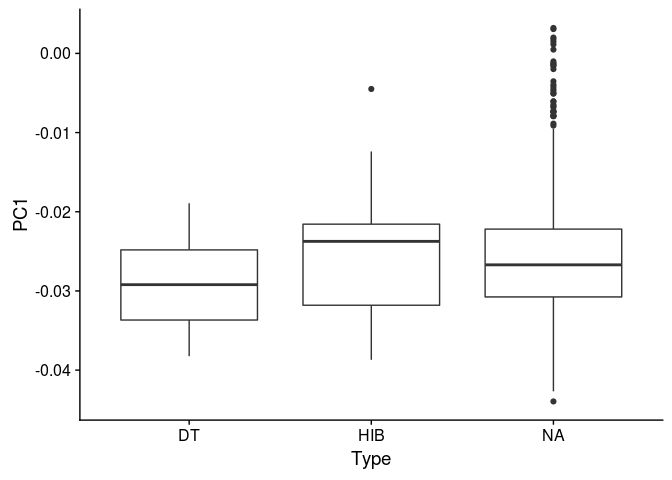

### MARSUPIALS, BATS... AGAIN NEED NORMAL TAXONOMY !!!!!!!!

``` r
Tax <- select(Hib, Taxon, Order) %>% distinct() %>% filter(Taxon != "Mar") %>% mutate(Order = str_to_title(Order))
Tab1 <- left_join(Test, Tax)
```

    ## Joining, by = "Order"

``` r
Tab1 %>% filter(is.na(Taxon)) %>% janitor::tabyl(Order)
```

    ##               Order   n      percent valid_percent
    ##    Acipenseriformes   5 0.0041528239   0.015243902
    ##      Anguilliformes   3 0.0024916944   0.009146341
    ##               Anura   4 0.0033222591   0.012195122
    ##        Artiodactyla  48 0.0398671096   0.146341463
    ##        Beloniformes   1 0.0008305648   0.003048780
    ##        Beryciformes   1 0.0008305648   0.003048780
    ##   Carcharhiniformes   2 0.0016611296   0.006097561
    ##             Caudata   9 0.0074750831   0.027439024
    ##             Cetacea  10 0.0083056478   0.030487805
    ##     Charadriiformes   2 0.0016611296   0.006097561
    ##           Cingulata   1 0.0008305648   0.003048780
    ##        Clupeiformes   5 0.0041528239   0.015243902
    ##          Crocodilia   8 0.0066445183   0.024390244
    ##       Cypriniformes  27 0.0224252492   0.082317073
    ##  Cyprinodontiformes   2 0.0016611296   0.006097561
    ##     Didelphimorphia   9 0.0074750831   0.027439024
    ##      Erinaceomorpha   2 0.0016611296   0.006097561
    ##         Esociformes   1 0.0008305648   0.003048780
    ##       Falconiformes   1 0.0008305648   0.003048780
    ##          Gadiformes   5 0.0041528239   0.015243902
    ##         Galliformes   4 0.0033222591   0.012195122
    ##   Gasterosteiformes   2 0.0016611296   0.006097561
    ##          Gruiformes   3 0.0024916944   0.009146341
    ##          Lagomorpha  10 0.0083056478   0.030487805
    ##         Lamniformes   1 0.0008305648   0.003048780
    ##        Lophiiformes   2 0.0016611296   0.006097561
    ##        Mugiliformes   1 0.0008305648   0.003048780
    ##        Osmeriformes   3 0.0024916944   0.009146341
    ##         Otidiformes   1 0.0008305648   0.003048780
    ##       Passeriformes  23 0.0191029900   0.070121951
    ##         Perciformes  39 0.0323920266   0.118902439
    ##      Perissodactyla   5 0.0041528239   0.015243902
    ##  Petromyzontiformes   3 0.0024916944   0.009146341
    ##   Pleuronectiformes   5 0.0041528239   0.015243902
    ##         Proboscidea   1 0.0008305648   0.003048780
    ##      Psittaciformes   1 0.0008305648   0.003048780
    ##       Salmoniformes  10 0.0083056478   0.030487805
    ##          Scandentia   2 0.0016611296   0.006097561
    ##     Scorpaeniformes   1 0.0008305648   0.003048780
    ##     Semionotiformes   2 0.0016611296   0.006097561
    ##        Siluriformes   4 0.0033222591   0.012195122
    ##        Soricomorpha  11 0.0091362126   0.033536585
    ##     Sphenisciformes   2 0.0016611296   0.006097561
    ##            Squamata  29 0.0240863787   0.088414634
    ##        Strigiformes   1 0.0008305648   0.003048780
    ##          Testudines  15 0.0124584718   0.045731707
    ##           Zeiformes   1 0.0008305648   0.003048780
    ##                <NA> 876 0.7275747508            NA

``` r
Marsupials <- c("Didelphimorphia")
Placental <- c("Artiodactyla", "Cetacea", "Cingulata", "Erinaceomorpha", "Lagomorpha", "Perissodactyla", "Pilosa", "Proboscidea", "Scandentia", "Soricomorpha")

Tab1 %>% mutate(Taxon = ifelse(is.na(Taxon), ifelse(Order %in% Placental, "Plac", "Mars"), Taxon)) %>% janitor::tabyl(Order, Taxon)
```

    ##               Order Mars Mono Plac
    ##    Acipenseriformes    5    0    0
    ##      Anguilliformes    3    0    0
    ##               Anura    4    0    0
    ##        Artiodactyla    0    0   48
    ##        Beloniformes    1    0    0
    ##        Beryciformes    1    0    0
    ##   Carcharhiniformes    2    0    0
    ##           Carnivora    0    0   48
    ##             Caudata    9    0    0
    ##             Cetacea    0    0   10
    ##     Charadriiformes    2    0    0
    ##          Chiroptera    0    0   21
    ##           Cingulata    0    0    1
    ##        Clupeiformes    5    0    0
    ##          Crocodilia    8    0    0
    ##       Cypriniformes   27    0    0
    ##  Cyprinodontiformes    2    0    0
    ##      Dasyuromorphia    1    0    0
    ##     Didelphimorphia    9    0    0
    ##      Erinaceomorpha    0    0    2
    ##         Esociformes    1    0    0
    ##       Falconiformes    1    0    0
    ##          Gadiformes    5    0    0
    ##         Galliformes    4    0    0
    ##   Gasterosteiformes    2    0    0
    ##          Gruiformes    3    0    0
    ##          Lagomorpha    0    0   10
    ##         Lamniformes    1    0    0
    ##        Lophiiformes    2    0    0
    ##         Monotremata    0    1    0
    ##        Mugiliformes    1    0    0
    ##        Osmeriformes    3    0    0
    ##         Otidiformes    1    0    0
    ##       Passeriformes   23    0    0
    ##         Perciformes   39    0    0
    ##      Perissodactyla    0    0    5
    ##  Petromyzontiformes    3    0    0
    ##   Pleuronectiformes    5    0    0
    ##            Primates    0    0   37
    ##         Proboscidea    0    0    1
    ##      Psittaciformes    1    0    0
    ##            Rodentia    0    0   59
    ##       Salmoniformes   10    0    0
    ##          Scandentia    0    0    2
    ##     Scorpaeniformes    1    0    0
    ##     Semionotiformes    2    0    0
    ##        Siluriformes    4    0    0
    ##        Soricomorpha    0    0   11
    ##     Sphenisciformes    2    0    0
    ##            Squamata   29    0    0
    ##        Strigiformes    1    0    0
    ##          Testudines   15    0    0
    ##           Zeiformes    1    0    0
    ##                <NA>  876    0    0

``` r
Tab1 <- Tab1 %>% mutate(Taxon = ifelse(is.na(Taxon), ifelse(Order %in% Placental, "Plac", "Mars"), Taxon))
ggplot(Tab1, aes(Taxon, PC1)) + geom_boxplot()
```

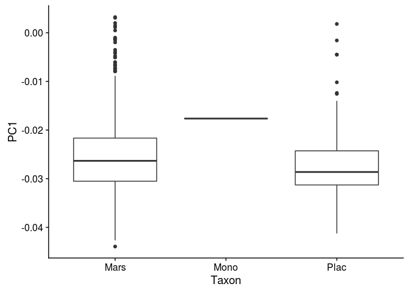

``` r
Tab2 <- Tab1 %>% arrange(GenerationLength_d) %>% group_by(Taxon) %>% mutate(GL_grops = ntile(GenerationLength_d, 5))


p_SpEmb1 <- ggplot(data = Tab2, aes(x = PC1, y = PC2, colour = GL_grops, alpha = .4)) + geom_point()
p_SpEmb2 <- ggplot(data = Tab2, aes(x = PC2, y = PC3, colour = GL_grops, alpha = .4)) + geom_point()

ggplot(data = Tab2, aes(x = PC2, y = GenerationLength_d, colour = GL_grops, alpha = .4, group = Taxon)) + geom_point() + geom_smooth(data = Tab2, mapping = aes(x = PC2, y = GenerationLength_d, linetype = Taxon)) + scale_y_log10()
```

    ## `geom_smooth()` using method = 'gam' and formula 'y ~ s(x, bs = "cs")'

    ## Warning: Removed 889 rows containing non-finite values (stat_smooth).

    ## Warning: Removed 889 rows containing missing values (geom_point).

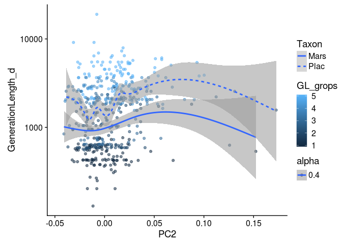

``` r
p_SpGL1 <- ggplot(data = Tab2, aes(x = PC2, y = GenerationLength_d, colour = GL_grops, alpha = .4)) + geom_point() + scale_y_log10(); cor.test(Tab2$PC2, Tab2$GenerationLength_d, method = 'spearman')
```

    ## Warning in cor.test.default(Tab2$PC2, Tab2$GenerationLength_d, method =
    ## "spearman"): Cannot compute exact p-value with ties

    ## 
    ##  Spearman's rank correlation rho
    ## 
    ## data:  Tab2$PC2 and Tab2$GenerationLength_d
    ## S = 14704000, p-value = 2.61e-06
    ## alternative hypothesis: true rho is not equal to 0
    ## sample estimates:
    ##       rho 
    ## 0.2121595

``` r
p_SpGL2 <- ggplot(data = Tab2, aes(x = PC3, y = GenerationLength_d, colour = GL_grops, alpha = .4)) + geom_point() + scale_y_log10(); cor.test(Tab2$PC3, Tab2$GenerationLength_d, method = 'spearman') 
```

    ## Warning in cor.test.default(Tab2$PC3, Tab2$GenerationLength_d, method =
    ## "spearman"): Cannot compute exact p-value with ties

    ## 
    ##  Spearman's rank correlation rho
    ## 
    ## data:  Tab2$PC3 and Tab2$GenerationLength_d
    ## S = 19400000, p-value = 0.3869
    ## alternative hypothesis: true rho is not equal to 0
    ## sample estimates:
    ##         rho 
    ## -0.03949494

``` r
pEco <- plot_grid(p_SpEmb1, p_SpEmb2, p_SpGL1, p_SpGL2, p_subs3, p_subs4, ncol = 2, nrow = 3)
```

    ## Warning: Removed 889 rows containing missing values (geom_point).

    ## Warning: Removed 889 rows containing missing values (geom_point).

``` r
save_plot('4_Figures/Ecology_PCA_full.pdf', pEco, base_height = 14)
```

### FIND DNA POLYMERAZE SIGNATURE (last PCs)!!!!!

``` r
p_SpEmb3 <- ggplot(data = Tab2, aes(x = PC3, y = PC4, colour = GL_grops, alpha = .4)) + geom_point()
p_SpEmb4 <- ggplot(data = Tab2, aes(x = PC4, y = PC5, colour = GL_grops, alpha = .4)) + geom_point()
p_SpEmb5 <- ggplot(data = Tab2, aes(x = PC5, y = PC6, colour = GL_grops, alpha = .4)) + geom_point()
p_SpEmb6 <- ggplot(data = Tab2, aes(x = PC6, y = PC7, colour = GL_grops, alpha = .4)) + geom_point()
p_SpEmb7 <- ggplot(data = Tab2, aes(x = PC7, y = PC8, colour = GL_grops, alpha = .4)) + geom_point()
p_SpEmb8 <- ggplot(data = Tab2, aes(x = PC8, y = PC9, colour = GL_grops, alpha = .4)) + geom_point()

pGamma <- plot_grid(p_SpEmb3, p_SpEmb4, p_SpEmb5, p_SpEmb6, p_SpEmb7, p_SpEmb8, ncol = 2, nrow = 3)
save_plot('4_Figures/DnaPolymerazeSignature_PCA_full.pdf', pGamma, base_height = 7)
```

``` r
# Original matrix
barplot(
    c(
        mean(mtx$AT), mean(mtx$AG), mean(mtx$AC),
        mean(mtx$TA), mean(mtx$TG), mean(mtx$TC),
        mean(mtx$CA), mean(mtx$CG), mean(mtx$CT),
        mean(mtx$GA), mean(mtx$GC), mean(mtx$GT)),
    names = c('AT', 'AG', 'AC',
              'TA', 'TG', 'TC',
              'CA', 'CG', 'CT',
              'GA', 'GC', 'GT'),
    main = "Original matrix"
)
```


``` r
# Reproduce original matrix of substitution
species.embeddings <- species.embeddings %>% as.data.frame() %>% column_to_rownames("Species") %>% as.matrix()
subs.loadings <- subs.loadings %>% as.data.frame() %>% column_to_rownames("Subs") %>% as.matrix()
repr <- t(species.embeddings %*% t(subs.loadings))
repr1 <- scale(repr, center = -1 * pcs$center, scale = FALSE)
repr1 <- as.data.frame(t(repr1))
barplot(
    c(
        mean(repr1$AT), mean(repr1$AG), mean(repr1$AC),
        mean(repr1$TA), mean(repr1$TG), mean(repr1$TC),
        mean(repr1$CA), mean(repr1$CG), mean(repr1$CT),
        mean(repr1$GA), mean(repr1$GC), mean(repr1$GT)),
    names = c('AT', 'AG', 'AC',
              'TA', 'TG', 'TC',
              'CA', 'CG', 'CT',
              'GA', 'GC', 'GT'),
    main = "Reproduce original matrix"
)
```

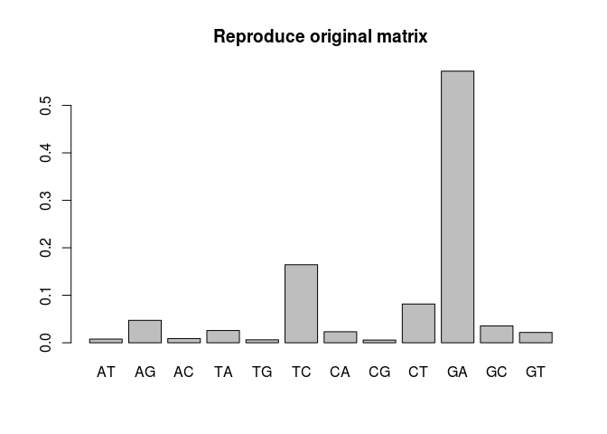

``` r
### IF I WANT TO DECREASE DIMENSIONALITY OF MY DATASET, I TRUNCATE IT, USING ONLY THE MOST IMPORTANT PCs:
pc.use <- 2
trunc <- t((as.matrix(species.embeddings[, 1:pc.use])) %*% t(as.matrix(subs.loadings[, 1:pc.use])))

# add the center (and re-scale) back to data
trunc <- scale(trunc, center = -1 * pcs$center, scale = FALSE)
trunc <- as.data.frame(t(trunc))

barplot(
    c(
        mean(trunc$AT), mean(trunc$AG), mean(trunc$AC),
        mean(trunc$TA), mean(trunc$TG), mean(trunc$TC),
        mean(trunc$CA), mean(trunc$CG), mean(trunc$CT),
        mean(trunc$GA), mean(trunc$GC), mean(trunc$GT)),
    names = c('AT', 'AG', 'AC',
              'TA', 'TG', 'TC',
              'CA', 'CG', 'CT',
              'GA', 'GC', 'GT'),
    main = "Matrix produced by PC1:PC3"
)
```

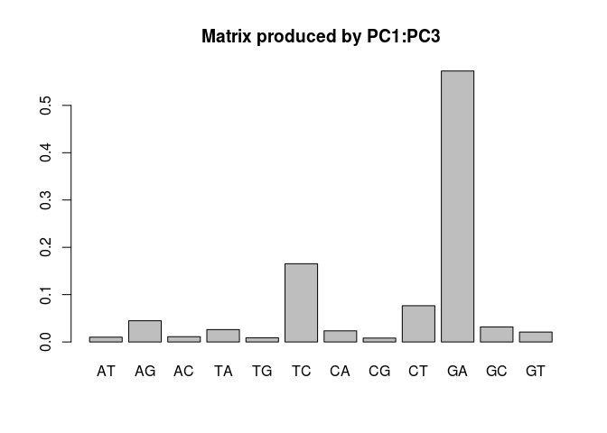

``` r
trunc <- rownames_to_column(trunc, "Species")
write_csv(trunc, "./3_Results/PCs1-2_Truncated_tab_full.csv")
```

``` r
### NOW - OPPOSITE EXERCISE: I WANT TO USE ONLY 4-10 PCs to reconstruct signature of gamma polymeraze:
start = 3
end = 10
gamma <- t(species.embeddings[, start:end] %*% t(subs.loadings[, start:end]))
gamma <- scale(gamma, center = -1 * pcs$center, scale = FALSE)
gamma <- as.data.frame(t(gamma))

barplot(
    c(
        mean(gamma$AT), mean(gamma$AG), mean(gamma$AC),
        mean(gamma$TA), mean(gamma$TG), mean(gamma$TC),
        mean(gamma$CA), mean(gamma$CG), mean(gamma$CT),
        mean(gamma$GA), mean(gamma$GC), mean(gamma$GT)),
    names = c('AT', 'AG', 'AC',
              'TA', 'TG', 'TC',
              'CA', 'CG', 'CT',
              'GA', 'GC', 'GT'),
    main = "Matrix produced by PC3:PC10"
    )
```

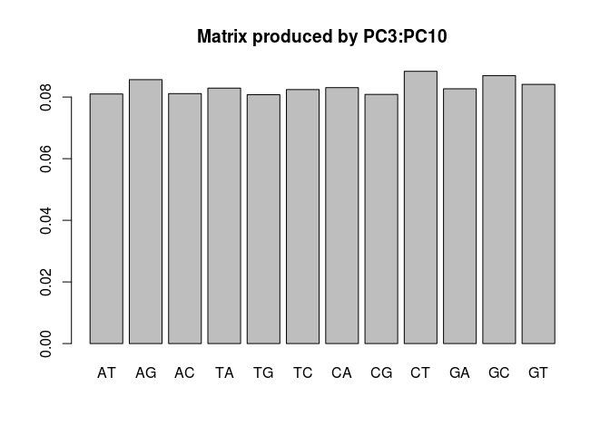

``` r
gamma <- rownames_to_column(gamma, "Species")
write_csv(gamma, "./3_Results/DnaPolymerazeSignature_tab_full.csv")
```

``` r
#### NAIVE CHECKS BELOW - work well
#### Here you shoud use predict.
NaivChk <- 
    TABLE %>% 
    select(AC:TG) %>% 
    map(~ lm(.x ~ PC1 + PC2, data = TABLE)) %>% 
    map_dfc(predict)

barplot(
    c(
        mean(NaivChk$AT), mean(NaivChk$AG), mean(NaivChk$AC),
        mean(NaivChk$TA), mean(NaivChk$TG), mean(NaivChk$TC),
        mean(NaivChk$CA), mean(NaivChk$CG), mean(NaivChk$CT),
        mean(NaivChk$GA), mean(NaivChk$GC), mean(NaivChk$GT)),
    names = c('AT', 'AG', 'AC',
              'TA', 'TG', 'TC',
              'CA', 'CG', 'CT',
              'GA', 'GC', 'GT'),
    main = "NAIVE CHECKS"
)
```

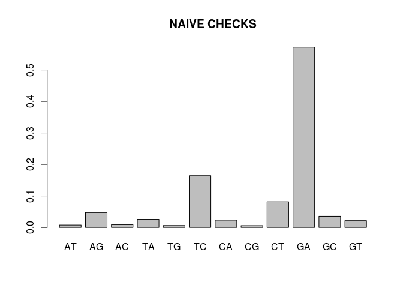
